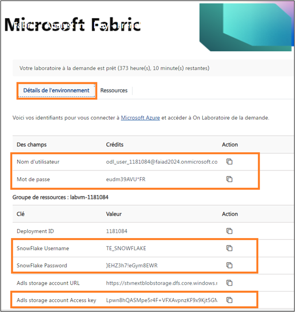

 

# Sommaire

- Introduction	

- Informations d’identification du labo :

- Importer un modèle Dataflow :

    Importation d’un modèle Dataflow	

- Conditions préalables de la démonstration	

- Environnement	

    Configuration d’un environnement de labo	

    Création d’un notebook à des fins de prévision	


# Introduction 

Ce document fournit un guide pour les fonctionnalités suivantes :

- Informations d’identification du labo

- Importation d’un modèle Dataflow

- Chargement de bibliothèques Spark et configuration d’un environnement

- Création d’un notebook

- Création de prévisions à l’aide d’un modèle de science des données

- Enregistrement de la sortie dans le modèle sémantique


**Avertissement **: comme le produit évolue quotidiennement, veuillez noter que certaines captures d’écran peuvent être obsolètes. Nous travaillerons pour les corriger dans la prochaine mise à jour.


# Informations d’identification du labo :

Si l’un des participants choisit de suivre les labos dans un autre environnement, voici les informations d’identification que vous devrez peut-être partager.

Les participants auront besoin du nom d’utilisateur et du mot de passe associés à leur compte de labo pour se connecter à Dataverse et SharePoint

Nom d’utilisateur Snowflake : **TE_SNOWFLAKE**

Mot de passe Snowflake : **8UpfRpExVDXv2AC**

Clé de compte ADLS Gen2 : **Lpwn8hQASMpe5r4F+VFXAvpnzKF9x9Kjt5GMvMCFWB0xCFuM4fyVwOW6rF200bTop3LpKpsIno/T+AStx6cz6w==**



 
# Importer un modèle Dataflow :

En tant que formateur, vous pouvez choisir de permettre aux participants d’importer des modèles Dataflow. Pour importer un modèle, procédez comme suit :

## Importation d’un modèle Dataflow

1. Accédez à l’**espace de travail Fabric que vous avez créé dans le labo 2, tâche 8 et nommé FAIAD_ <username>**. Nous avons nommé le nôtre FAIAD_demouser.

2. Accédez à la page d’**Accueil de Data Factory**.

3. Cliquez sur le menu **Nouveau, puis sélectionnez Flux de données Gen2**.

   

4. Une fenêtre Power Query s’ouvre alors. Dans le volet central, cliquez sur **Importer à partir d’un modèle Power Query**.

   

5. Accédez au dossier **Desktop -> Solutions** et sélectionnez le flux de données que vous souhaitez importer. Ici, nous importons  **df_People_SharePoint.pqt**.

6. Cliquez sur **Ouvrir**.

Une fois l’importation effectuée, notez que la requête et toutes les étapes de la requête sont importées. Cependant, la connexion doit être configurée. De plus, la destination des données doit être définie. Pour effectuer ces étapes, veuillez suivre les instructions du labo.


# Conditions préalables de la démonstration

Il est nécessaire que vous, le formateur, effectuiez les labos 1 à 6 et que toutes les données soient ingérées avant de passer aux étapes suivantes.

# Environnement

## Configuration d’un environnement de labo

**Remarque** : il est préférable de configurer l’environnement de labo avant la démonstration, car l’installation de la bibliothèque prend du temps. Vous pouvez guider les participants tout au long de ces étapes.

7. Accédez à l’**espace de travail Fabric que vous avez créé dans le labo 2, tâche 8 et nommé FAIAD_ <username>**.

8. Dans le menu supérieur, cliquez sur les **points de suspension (…)**.
 
9. Sélectionnez **Paramètres d’espace de travail**.


10. La boîte de dialogue Paramètres d’espace de travail s’ouvre alors. Dans le menu gauche, développez **Engineering données/Science**.

11. Cliquez sur **Paramètres Spark**.

12. Dans le menu Paramètres Spark, cliquez sur l’onglet **Environnement**.

13. Réglez le curseur **Définir l’environnement par défaut** sur **Activé**.

14. Cliquez sur la liste déroulante **Espace de travail par défaut**.

15. Cliquez sur **Nouvel environnement**.


 
16. La boîte de dialogue Nouvel environnement s’ouvre alors. Saisissez le nom sous la forme **FAIAD_<username>_env**.

    **Remarque** : le nom de l’espace de travail doit être unique. Nous utilisons FAIAD_demouser_env comme nom d’espace de travail pour ce document. Cependant, le nom de votre espace de travail doit être différent. Assurez-vous qu’une coche verte avec « **Ce nom est disponible** » s’affiche sous le champ Nom.

 
17. Cliquez sur **Créer**.


18. Vous êtes alors redirigé vers un écran vous permettant d’ajouter des bibliothèques publiques et personnalisées. Nous souhaitons ajouter la bibliothèque publique prophet. Dans le menu supérieur, cliquez sur **Bibliothèques publiques -> Ajouter à partir de PyPI**

19. Dans le volet central, dans la zone de texte sous Bibliothèque, saisissez **prophet**.

    **Remarque** : assurez-vous que la version est 1.1.5.

20. Dans le volet supérieur droit, cliquez sur **Publier**. 


 
21. La boîte de dialogue Modifications en attente s’ouvre alors. Cliquez sur **Publier tout**.

22. La boîte de dialogue Publier toutes les modifications ? s’ouvre alors. Cliquez sur **Publier**. La publication de la mise à jour prend quelques minutes.
 


23. Cliquez sur **Afficher la progression** pour vérifier la progression. La publication de la mise à jour prend quelques minutes.


 
24. Une fois l’installation effectuée, notez que l'**État** devient **Réussite**.


 
25. Maintenant que nous avons configuré l’environnement, nous devons l’enregistrer comme environnement par défaut pour l’espace de travail. Dans le volet gauche, cliquez sur **FAIAD_<username>**.

26. Dans le menu supérieur, cliquez sur **Paramètres d'espace de travail** (ou sur les points de suspension, puis sélectionnez Paramètres d'espace de travail).


 
27. La boîte de dialogue Paramètres d'espace de travail s’ouvre alors. Dans le menu gauche, développez **Engineering données/Science**.

28. Cliquez sur **Paramètres Spark**.

29. Dans le menu Paramètres Spark, cliquez sur l’onglet **Environnement**.

30. Réglez le curseur **Définir l’environnement par défaut** sur **Activé**.

31. Cliquez sur la liste déroulante **Espace de travail par défaut**.

32. Sélectionnez l’environnement que vous venez de créer dans la liste déroulante : **FAIAD_<username>_env**.

33. Cliquez sur **Enregistrer**.


 
## Création d’un notebook à des fins de prévision

34. Accédez à la page d’**Accueil Synapse Data Engineering**.

35. Cliquez sur **Nouveau -> Bloc-notes**.


 
36. Fournissez une **brève présentation** de la disposition : notebook, langage, environnement, création d’une cellule, etc.

37. Créez une **cellule**.

38. Saisissez le **code** suivant :

```
from pyspark.sql import SparkSession
from pyspark.sql.functions import month, year, col
from prophet import Prophet
import pandas as pd


# Initialize Spark session
spark = SparkSession.builder.appName("Prophet Forecasting").getOrCreate()

# Load data from your specific Spark table
df = spark.sql("SELECT * FROM lh_FAIAD.Sales")

# Aggregate data to monthly level
monthly_df = df.withColumn("Month", month("InvoiceDate"))\
               .withColumn("Year", year("InvoiceDate"))\
               .groupBy("Year", "Month")\
               .sum("Quantity")\
               .orderBy("Year", "Month")

# Convert to Pandas DataFrame and prepare for Prophet
pandas_df = monthly_df.toPandas()
pandas_df['ds'] = pd.to_datetime(pandas_df[['Year', 'Month']].assign(DAY=1))
pandas_df['y'] = pandas_df['sum(Quantity)']

# Fit the Prophet model
model = Prophet(yearly_seasonality=True, weekly_seasonality=False,daily_seasonality=False)
model.fit(pandas_df[['ds, 'y']])

# Create a DataFrame for future predictions (e.g., next 12 months)
future = model.make_future_dataframe(periods=12, freq='M')

# Forecast
forecast = model.predict(future)

# Plotting the forecast
model.plot(forecast)
model.plot_components(forecast)
```

39. Expliquez chaque étape du **code** (conseils fournis en commentaires).

40. Exécutez le code en cliquant sur le bouton **Lire** en regard de la cellule.


 
Guidez les participants à travers les trois graphiques créés (ci-dessous). Nous avons des chiffres réels jusqu’en avril 2023 et nous effectuons une prévision sur 12 mois. 

Notez que le **premier graphique** supprime la saisonnalité et effectue une prévision jusqu’en avril 2024.

Le **deuxième graphique** supprime la tendance et ajoute la saisonnalité pour effectuer une prévision jusqu’en avril 2024.


 
Le **troisième graphique** effectue une prévision à l’aide de la tendance et de la saisonnalité. Ce graphique fournit également les limites supérieure et inférieure.


 
41. Créez une **cellule**. 
 
42. Ajoutez le **code** suivant à la cellule :

```
display(forecast)
#écrire les données prévisionnelles dans une table
spark.createDataFrame(forecast).write.saveAsTable("Sales_Forecast", mode="overwrite")
```

43. Exécutez la cellule en cliquant sur le bouton **Lire**.


 
44. Guidez les participants à travers les **données qui s’affichent**.

45. Montrez aux utilisateurs qu’une table a été créée : **sales_forecast**.


 
46. **Interrogez** la table et montrez son contenu aux utilisateurs.
