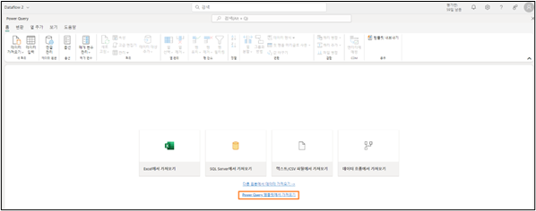
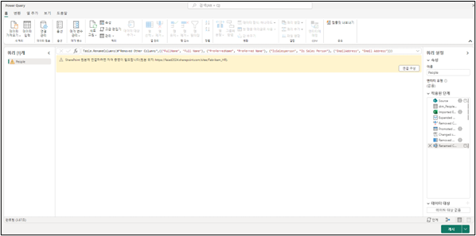
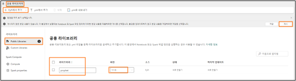
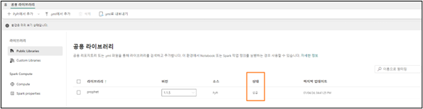
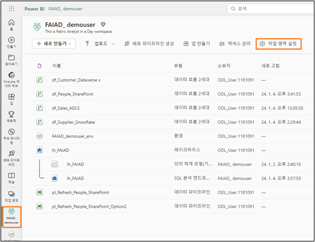
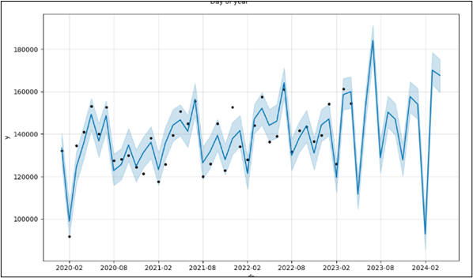

# Sumário 
- Introdução
- Credenciais do Laboratório:
- Importar modelo do Fluxo de Dados:
    - Como importar modelo do Fluxo de Dados
- Requisito para a demonstração
- Ambiente
    - Como configurar um ambiente de laboratório
    - Como criar um notebook para previsão

# Introdução
Este documento fornece uma diretriz para os seguintes recursos:
- Credenciais do Laboratório
- Como importar modelo do Fluxo de Dados
- Como carregar bibliotecas Spark e configurar um ambiente
- Como criar um notebook
- Como usar o modelo de ciência de dados para criar Previsão
- Como salvar a saída no modelo semântico

**Aviso de isenção de responsabilidade:** como o produto tem alterações diariamente, algumas capturas de tela podem estar desatualizadas. Trabalharemos para corrigi-las na próxima atualização.

# Credenciais do Laboratório:
Se algum dos participantes optar por concluir os laboratórios em um ambiente alternativo, aqui estão as credenciais que você pode precisar compartilhar.

Os participantes precisarão do nome de usuário e da senha associados à conta do Laboratório para conectar ao Dataverse e SharePoint.

Nome de usuário do Snowflake: **TE_SNOWFLAKE**

Senha do Snowflake: **8UpfRpExVDXv2AC**

Chave da conta ADLS Gen2: **Lpwn8hQASMpe5r4F+VFXAvpnzKF9x9Kjt5GMvMCFWB0xCFuM4fyVwOW6rF200bTop3LpKpsIno/T+AStx6cz6w==**

 
# Importar modelo do Fluxo de Dados:
Como instrutor, você pode permitir que os participantes tenham a opção de importar modelos do Fluxo de Dados. As etapas para importar um modelo são descritas a seguir.

## Como importar modelo do Fluxo de Dados
1. "Vá para o **espaço de trabalho do Fabric que você criou no Laboratório 2, Tarefa 8, e denominou FAIAD_ <nome de usuário>**. Chamamos o nosso de FAIAD_demouser
2. Vá para a **Página Inicial do Data Factory**.
3. No menu, selecione **Novo -> Fluxo de Dados Gen2**.

    
 
4. A janela do Power Query é aberta. No painel central, selecione **Importar de um modelo do Power Query**.

    
 
5. Procure a pasta **Área de Trabalho -> Soluções** e selecione o Fluxo de Dados que você deseja importar. Aqui estamos importando **df_People_SharePoint.pqt**.
6. Selecione **Abrir**.

Depois de importado, a consulta e todas as etapas da consulta são importadas. No entanto, é necessário configurar a conexão. Além disso, o Destino de dados precisa ser definido. Siga as instruções do laboratório para concluir estas etapas.

 

# Requisito para a demonstração
É necessário que você, o instrutor, conclua os Laboratórios 1 a 6 e todos os dados sejam ingeridos antes de avançar para as próximas etapas.
# Ambiente
## Como configurar um ambiente de laboratório

**Observação:** É melhor configurar o ambiente de laboratório antes da demonstração, pois a instalação da biblioteca é demorada. Você pode orientar os participantes nestas etapas.

7. Vá para o **espaço de trabalho do Fabric que você criou no Laboratório 2, Tarefa 8, e denominou FAIAD_ <nome de usuário>**.
8. No menu superior, selecione as **reticências (...)**.
9. Selecione **Configurações de workspace**.

    
 
10.	A caixa de diálogo Configurações de workspace será aberta. No menu esquerdo, expanda **Engenharia de Dados/Ciência**.
11. Selecione **Configurações do Spark**.
12. No menu Configurações do Spark, selecione a guia **Ambiente**.
13. Altere o controle deslizante **Definir ambiente padrão** para **Ativado**.
14. Selecione o menu suspenso **Espaço de trabalho padrão**.
15. Selecione **Novo Ambiente**.

    
 
16. A caixa de diálogo Novo Ambiente é aberta. Insira o nome como **FAIAD_<username>_env**

**Observação:** O nome do workspace deve ser exclusivo. Estamos usando FAIAD_demouser_env como nome do workspace para este documento. No entanto, o nome do seu workspace deve ser diferente. Verifique se uma marca de seleção verde com "Este nome está disponível" é exibida abaixo do campo Nome.

17.	Selecione **Criar**.

    
 
18. Você será direcionado para uma tela para adicionar bibliotecas públicas e personalizadas. Queremos adicionar o prophet que é uma biblioteca pública. No menu superior, selecione **Bibliotecas Públicas -> Adicionar do PyPI**.
19. No painel central, na caixa de texto em Biblioteca, insira **prophet**.

**Observação:** Verifique se a **versão é 1.1.5**.

20. No painel superior direito, selecione **Publicar**.

    
 
21. A caixa de diálogo Alterações pendentes é aberta. Selecione **Publicar tudo**.
22. A caixa de diálogo Publicar todas as alterações? é aberta. Selecione **Publicar**. Poderá levar alguns minutos para publicar a atualização.

    
 
23. Selecione **Exibir progresso** para verificar o progresso. Poderá levar alguns minutos para publicar a atualização.

    
 
24. Após a instalação, observe que o **Status** muda para **Êxito**.

    
 
25. Agora que configuramos o ambiente, devemos salvá-lo como o ambiente padrão para o workspace. No painel esquerdo, selecione **FAIAD_<nome de usuário>**.
26. No menu superior, selecione **Configurações de workspace** (ou reticências -> Configurações de workspace).

    
 
27. A caixa de diálogo Configurações de workspace será aberta. No menu esquerdo, expanda **Engenharia de Dados/Ciência**.
28. Selecione **Configurações do Spark**.
29. No menu Configurações do Spark, selecione a guia **Ambiente**.
30. Alterne o controle deslizante **Definir ambiente padrão para Ativado**.
31. Selecione o menu suspenso **Espaço de trabalho padrão**.
32. Selecione o ambiente que você acabou de criar no menu suspenso: **FAIAD_<nome de usuário>_env**
33. Selecione **Salvar**.

     

## Como criar um notebook para previsão
34. Navegue até a **Página Inicial Synapse Data Engineering**.
35.	Selecione **Novo -> Caderno**.

    
 
36.	Forneça uma **breve visão geral** do layout: Caderno, linguagem, ambiente, como criar uma nova célula, etc.
37. Crie uma **nova célula**.
38. Insira o seguinte **código**:

        from pyspark.sql import SparkSession
        from pyspark.sql.functions import month, year, col
        from prophet import Prophet
        import pandas as pd

        # Initialize Spark session
        spark = SparkSession.builder.appName("Prophet Forecasting").getOrCreate()

        # Load data from your specific Spark table
        df = spark.sql("SELECT * FROM lh_FAIAD.Sales")

        # Aggregate data to monthly level
        monthly_df = df.withColumn("Month", month("InvoiceDate"))\
                    .withColumn("Year", year("InvoiceDate"))\
                    .groupBy("Year", "Month")\
                    .sum("Quantity")\
                    .orderBy("Year", "Month")

        # Convert to Pandas DataFrame and prepare for Prophet
        pandas_df = monthly_df.toPandas()
        pandas_df['ds'] = pd.to_datetime(pandas_df[['Year', 'Month']].assign(DAY=1))
        pandas_df['y'] = pandas_df['sum(Quantity)']

        # Fit the Prophet model
        model = Prophet(yearly_seasonality=True, weekly_seasonality=False,daily_seasonality=False)
        model.fit(pandas_df[['ds, 'y']])

        # Create a DataFrame for future predictions (e.g., next 12 months)
        future = model.make_future_dataframe(periods=12, freq='M')

        # Forecast
        forecast = model.predict(future)

        # Plotting the forecast
        model.plot(forecast)
        model.plot_components(forecast)

39. Explique cada etapa do **código** (resultados fornecidos como comentários).
40. Execute o código selecionando o botão **Reproduzir** ao lado da célula.

    
 
Oriente os participantes pelos três gráficos criados (abaixo). Temos dados reais até abril de 2023 e estamos prevendo para 12 meses. 

O **primeiro gráfico** remove a sazonalidade e as previsões até abril de 2024.

O **segundo gráfico** remove a tendência e adiciona a sazonalidade às previsões até abril de 2024.

 
O **terceiro** gráfico prevê o uso de tendência e sazonalidade. Este gráfico também fornece os limites superior e inferior.

 
41. Crie uma **nova célula**. 
42. Adicione o **código** a seguir à célula:

        display(forecast)
        #escrever dados de previsão em uma tabela
        spark.createDataFrame(forecast).write.saveAsTable("Sales_Forecast", mode="overwrite")

43. Execute a célula selecionando o botão **Reproduzir**.

    
 
44. Oriente os participantes pelos **dados que são exibidos**.
45. Mostre aos usuários que uma nova tabela foi criada: **sales_forecast**

    
 
46. **Consulte** a tabela e mostre aos usuários o seu conteúdo.
