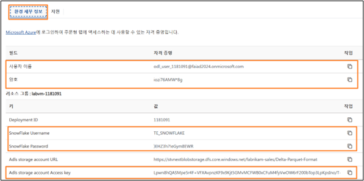
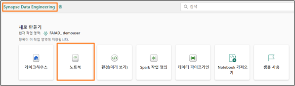
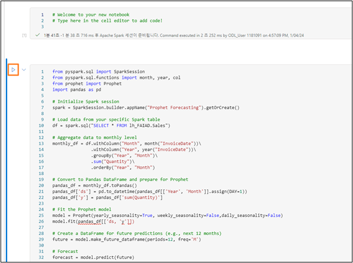

# Inhalt

- Einführung
- Anmeldeinformationen für Übungen:
- Importieren von Dataflow-Vorlagen:
   - So importieren Sie eine Dataflow-Vorlage
- Voraussetzungen für Deme
- Umgebung
  - So konfigurieren Sie eine Übungsumgebung
  - So fertigen Sie ein Notizbuch für Prognosen an

# Einführung

Dieses Dokument dient als Leitfaden bei folgenden Themen:

- Anmeldeinformationen für Übungen
- So importieren Sie eine Dataflow-Vorlage
- So laden Sie Spark-Bibliotheken und konfigurieren eine Umgebung
- So fertigen Sie ein Notizbuch an
- So erstellen Sie Prognosen mit einem Data-Science-Modell
- So speichern Sie die Ausgabe im semantischen Modell

**Haftungsausschluss:** Beachten Sie, dass täglich Änderungen am Produkt erfolgen und einige Screenshots daher mitunter veraltet sind. Es wird versucht, dies bei der nächsten Aktualisierung zu beheben.

# Anmeldeinformationen für Übungen:

Sollte einer der Teilnehmer die Übungen in einer anderen Umgebung durchführen wollen, finden Sie hier die Anmeldeinformationen, die ggf. weiterzugeben sind.

Zur Herstellung einer Verbindung mit Dataverse und SharePoint verwenden die Teilnehmer den Benutzernamen und das Kennwort ihres Übungskontos.

Snowflake-Benutzername: **TE_SNOWFLAKE**

Snowflake-Kennwort: **8UpfRpExVDXv2AC**

ADLS Gen2-Kontoschlüssel: **Lpwn8hQASMpe5r4F+VFXAvpnzKF9x9Kjt5GMvMCFWB0xCFuM4fyVwOW6rF200bTop3LpKpsIno/T+AStx6cz6w==**

# Importieren von Dataflow-Vorlagen:

Als Kursleiter können Sie den Teilnehmern die Möglichkeit geben, Dataflow-Vorlagen zu importieren. Vorlagen werden wie folgt importiert:

### So importieren Sie eine Dataflow-Vorlage

1. Wechseln Sie zum **Fabric-Arbeitsbereich mit dem Namen „FAIAD_<Benutzername>“, den Sie in Aufgabe 8 von Übung 2 erstellt haben**. Unser Arbeitsbereich heißt „FAIAD_demouser“.
2. Wechseln Sie zur Startseite von **Data Factory**.
3. Wählen Sie im Menü die Option **Neu -> Dataflow Gen2** aus.

    
 
4. Das Power Query-Fenster wird geöffnet. Wählen Sie in der Mitte die Option **Aus einer Power Query Vorlage importieren** aus.

    
 
5. Wechseln Sie zum Ordner **Desktop -> Lösungen**, und wählen Sie den Dataflow aus, den Sie importieren möchten. Wir importieren den Dataflow **df_People_SharePoint.pqt**.
6. Klicken Sie auf **Öffnen**.

Beachten Sie nach dem Import, dass die Abfrage und alle Schritte für die Abfrage importiert wurden. Die Verbindung hingegen muss konfiguriert werden. Außerdem muss das Datenziel festgelegt werden. Führen Sie diese Arbeiten mithilfe der Übungsanleitung durch.

 

## Voraussetzungen für Demo
Bevor Sie mit den nächsten Schritten fortfahren, müssen Sie als Kursleiter die Übungen 1 bis 6 erledigen und alle Daten erfassen.

## Umgebung
### So konfigurieren Sie eine Übungsumgebung

**Hinweis:** Es empfiehlt sich, die Übungsumgebung vor der Demo zu installieren, weil die Installation der Bibliothek etwas dauert. Sie können die Teilnehmer durch diese Schritte führen.

7. Wechseln Sie zum **Fabric-Arbeitsbereich mit dem Namen „FAIAD_<Benutzername>“, den Sie in Aufgabe 8 von Übung 2 erstellt haben**.
8. Wählen Sie im Menü oben die **Auslassungspunkte (...)** aus.
9. Klicken Sie auf **Arbeitsbereichseinstellungen**.

    
 
10. Das Dialogfeld „Arbeitsbereichseinstellungen“ wird angezeigt. Erweitern Sie im linken Menü die Option **Data Engineering/Science**.
11. Wählen Sie **Spark-Einstellungen** aus.
12. Wählen Sie im Menü mit den Spark-Einstellungen die Registerkarte **Umgebung** aus.
13. Stellen Sie den Schieberegler **Standardumgebung festlegen**  auf **Ein**.
14. Wählen Sie das Dropdown-Menü **Arbeitsbereichsstandard** aus.
15. Klicken Sie auf **Neue Umgebung**.

    
 
16. Das Dialogfeld „Neue Umgebung“ wird geöffnet. Geben Sie den Namen **FAIAD_<Benutzername>_env**
 ein.
**Hinweis:** Der Name des Arbeitsbereichs muss eindeutig sein. In diesem Dokument heißt der Arbeitsbereich „FAIAD_demouser_env“. Der Name Ihres Arbeitsbereichs lautet jedoch anders. Achten Sie darauf, dass unter dem Feld für den Namen ein grünes Häkchen mit dem Text **Dieser Name ist verfügbar** zu sehen ist.

17. Wählen Sie **Erstellen** aus.

    
 
18. Sie werden zu einem Bildschirm weitergeleitet, auf dem Sie öffentliche und benutzerdefinierte Bibliotheken hinzufügen können. Wir möchten die öffentliche Prophet-Bibliothek hinzufügen. Wählen Sie im Menü oben die Option **Öffentliche Bibliotheken -> Aus PyPI hinzufügen** aus.

19. Geben Sie in der Mitte im Textfeld unter „Bibliothek“ den Namen **prophet** ein.

**Hinweis:** Die erforderliche Version ist **1.1.5**.

20. Wählen Sie oben rechts die Option **Veröffentlichen** aus.

    
 
21. Das Dialogfeld „Ausstehende Änderungen“ wird angezeigt. Wählen Sie **Alle veröffentlichen** aus.

22. Das Dialogfeld „Alle Änderungen veröffentlichen?“ wird geöffnet. Wählen Sie **Veröffentlichen** aus. Die Veröffentlichung dauert ein paar Minuten.

    
 
23. Mit der Option **Fortschritt anzeigen** können Sie den Fortschritt ansehen. Die Veröffentlichung dauert ein paar Minuten.

    
 
24. Nach der Installation sehen Sie, dass sich der **Status** in **Erfolgreich** ändert.

    
 
25. Die konfigurierte Umgebung muss jetzt als Standardumgebung für den Arbeitsbereich gespeichert werden. Klicken Sie links auf **FAIAD_<Benutzername>**.
26. Wählen Sie im Menü oben die Option **Arbeitsbereichseinstellungen** (oder die Auslassungspunkte -> Arbeitsbereichseinstellungen) aus.

    
 
27. Das Dialogfeld „Arbeitsbereichseinstellungen“ wird angezeigt. Erweitern Sie im linken Menü die Option **Data Engineering/Science**.
28. Wählen Sie **Spark-Einstellungen** aus.
29. Wählen Sie im Menü mit den Spark-Einstellungen die Registerkarte **Umgebung** aus.
30. Stellen Sie den Schieberegler für die **Standardumgebung** auf Ein.
31. Wählen Sie das Dropdown-Menü **Arbeitsbereichsstandard** aus.
32. Wählen Sie im Dropdown-Menü die soeben erstellte Umgebung mit dem Namen **FAIAD_<Benutzername>_env** aus.
33. Klicken Sie auf **Speichern**.

    
 

### So fertigen Sie ein Notizbuch für Prognosen an
34. Wechseln Sie zur Startseite von **Synapse Data Engineering**.
35. Wählen Sie **Neu -> Notizbuch** aus.

    
 
36. Stellen Sie das Layout **kurz vor:** Notizbuch, Sprache, Umgebung, Erstellung neuer Zellen usw.
37. Erstellen Sie eine **neue Zelle**.
38. Geben Sie folgenden **Code(()) ein:

        from pyspark.sql import SparkSession
        from pyspark.sql.functions import month, year, col
        from prophet import Prophet
        import pandas as pd

        # Initialize Spark session
        spark = SparkSession.builder.appName("Prophet Forecasting").getOrCreate()

        # Load data from your specific Spark table
        df = spark.sql("SELECT * FROM lh_FAIAD.Sales")

        # Aggregate data to monthly level
        monthly_df = df.withColumn("Month", month("InvoiceDate"))\
                    .withColumn("Year", year("InvoiceDate"))\
                    .groupBy("Year", "Month")\
                    .sum("Quantity")\
                    .orderBy("Year", "Month")

        # Convert to Pandas DataFrame and prepare for Prophet
        pandas_df = monthly_df.toPandas()
        pandas_df['ds'] = pd.to_datetime(pandas_df[['Year', 'Month']].assign(DAY=1))
        pandas_df['y'] = pandas_df['sum(Quantity)']

        # Fit the Prophet model
        model = Prophet(yearly_seasonality=True, weekly_seasonality=False,daily_seasonality=False)
        model.fit(pandas_df[['ds, 'y']])

        # Create a DataFrame for future predictions (e.g., next 12 months)
        future = model.make_future_dataframe(periods=12, freq='M')

        # Forecast
        forecast = model.predict(future)

        # Plotting the forecast
        model.plot(forecast)
        model.plot_components(forecast)

39. Erklären Sie den **Code** schrittweise (Ergebnisse sind als Kommentare angegeben).
40. Führen Sie den Code aus, indem Sie neben der Zelle auf die Schaltfläche **Wiedergeben** klicken.

    
 
Erläutern Sie den Teilnehmern die drei erstellten Diagramme (unten). Es handelt sich um Ist-Werte bis April 2023, und danach erfolgt eine Prognose über zwölf Monate.

Beachten Sie, dass im **ersten Diagramm** Saisonalität und Prognosen bis April 2024 entfallen.

Beachten Sie, dass im **zweiten Diagramm** bis April 2024 der Trend wegfällt und die Prognosen mit Saisonalität ergänzt werden.

 
Im **dritten Diagramm** erfolgen die Prognosen anhand von Trend und Saisonalität. Dieses Diagramm gibt auch die Ober- und Untergrenze vor.

 
41. Erstellen Sie eine **neue Zelle**. 
42. Fügen Sie folgenden **Code** in die Zelle ein:

        display(forecast)
        #Prognosedaten in eine Tabelle schreiben
        spark.createDataFrame(forecast).write.saveAsTable("Sales_Forecast", mode="overwrite")

43. Führen Sie den Code durch Klicken auf die Schaltfläche **Wiedergeben** aus.

    
 
44. Erklären Sie den Teilnehmern die **angezeigten Daten**.
45. Zeigen Sie, dass eine neue Tabelle mit dem Namen **sales_forecast** erstellt wurde.

    
 
46. **Fragen Sie die Tabelle ab**, und zeigen Sie den Benutzern den Inhalt der Tabelle.

