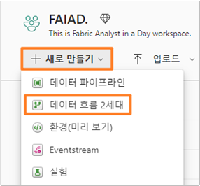
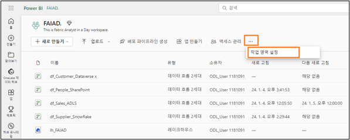
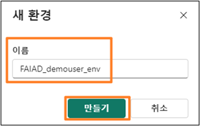
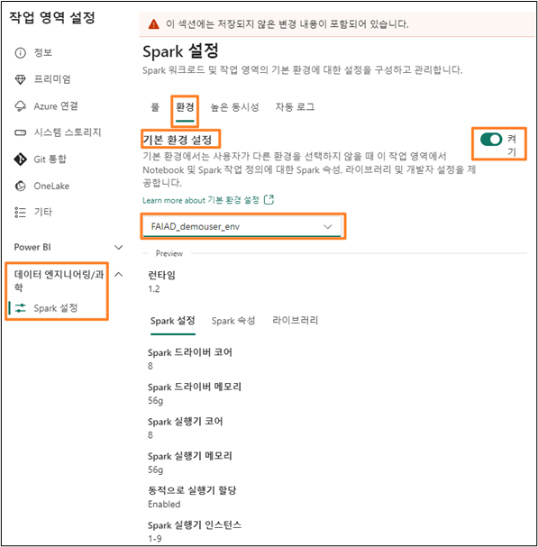
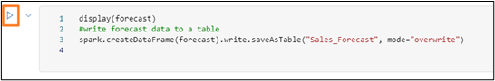
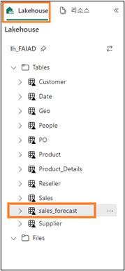

# Contenido

- Presentación
- Credenciales de laboratorio:
- Importar una plantilla de flujo de datos:
  - Cómo importar una plantilla de flujo de datos
- Requisito de la demostración
- Entorno
  - Cómo configurar un entorno de laboratorio
  - Cómo crear un bloc de notas para la previsión

# Presentación

Este documento proporciona una guía para las siguientes características:
- Credenciales de laboratorio
- Cómo importar una plantilla de flujo de datos
- Cómo cargar bibliotecas Spark y configurar un entorno
- Cómo crear un bloc de notas
- Cómo utilizar el modelo de ciencia de datos para crear previsiones
- Cómo guardar el resultado en el modelo semántico

**Descargo de responsabilidad:** tenga en cuenta que, dado que el producto cambia a diario, algunas capturas de pantalla pueden estar desactualizadas. Trabajaremos para solucionarlas en la próxima actualización.

# Credenciales de laboratorio:

Si alguno de los asistentes elige completar las prácticas de laboratorio en un entorno alternativo, estas son las credenciales que quizás deba compartir.

Los asistentes necesitarán el nombre de usuario y la contraseña asociados con su cuenta del laboratorio para conectarse a Dataverse y SharePoint.

Snowflake Username: **TE_SNOWFLAKE**

Snowflake Password: **8UpfRpExVDXv2AC**

ADLS Gen2 Account Key: **Lpwn8hQASMpe5r4F+VFXAvpnzKF9x9Kjt5GMvMCFWB0xCFuM4fyVwOW6rF200bTop3LpKpsIno/T+AStx6cz6w==**

# Importar una plantilla de flujo de datos:

Como instructor o instructora, puede permitir que los asistentes tengan la opción de importar plantillas de flujo de datos. Estos son los pasos para importar una plantilla.

## Cómo importar una plantilla de flujo de datos

1. Vaya al **área de trabajo de Fabric, FAIAD_<username>, que creó en el Laboratorio 2, Tarea 8**. El nuestro se llama FAIAD_Demouser.
2. Vaya a la **página principal de Data Factory**.
3. En el menú, seleccione **Nuevo -> Flujo de datos Gen2**.

    

4. Se abre la ventana de Power Query. En el panel central, seleccione **Importar desde una plantilla de Power Query**.

    
 
5. Vaya a **Escritorio -> Soluciones** y seleccione el flujo de datos que desea importar. Aquí vamos a importar **df_People_SharePoint.pqt**.
6. Seleccione **Abrir**.

Una vez importada, observe la consulta y se importan todos los pasos de la misma. Sin embargo, hay que configurar la conexión. Además, es necesario configurar el destino de los datos. Siga las instrucciones del laboratorio para completar estos pasos.

 

# Requisito de la demostración

Es necesario que el instructor o instructora complete los laboratorios 1 a 6 y que todos los datos se ingieran antes de avanzar a los siguientes pasos.

# Entorno

## Cómo configurar un entorno de laboratorio

**Nota:** Es mejor configurar el entorno de laboratorio antes de la demostración, ya que instalar la biblioteca lleva tiempo. Puede guiar a los asistentes a través de estos pasos.

7. Vaya al **área de trabajo de Fabric, FAIAD_<username>, que creó en el Laboratorio 2, Tarea 8**.
8. En el menú superior, seleccione los **puntos suspensivos (…)**.
9. Seleccione **Configuración del área de trabajo**.

    
 
10. Se abre el cuadro de diálogo de Configuración del área de trabajo. En el menú de la izquierda, expanda **Ciencia/Ingeniería de datos**.
11. Seleccione **Configuración de Spark**.
12. En el menú de configuración de Spark, seleccione la pestaña **Entorno**.
13. Cambie el control deslizante **Establecer entorno predeterminado** a **Activado**.
14. Seleccione el menú desplegable **predeterminado** del área de trabajo.
15. Seleccione **Nuevo entorno**.

    
 
16. Se abre un nuevo cuadro de diálogo de entorno. Escriba el nombre como **FAIAD_<username>_env**

**Nota:** El nombre del área de trabajo debe ser único. Vamos a usar FAIAD_demouser_env como nombre del área de trabajo para este documento. Sin embargo, el nombre de su área de trabajo debe ser diferente. Asegúrese de que aparezca una marca de verificación verde con **"Este nombre está disponible"** debajo del campo Nombre.

17. Seleccione **Crear**.
 
    

18. Se le dirigirá a una pantalla para agregar bibliotecas públicas y personalizadas. Queremos agregar prophet que es una biblioteca pública. En el menú superior, seleccione **Bibliotecas públicas -> Agregar desde PyPI**

19. En el panel central, en el cuadro de texto debajo de Biblioteca, introduzca **prophet**

**Nota:** Asegúrese de que la versión sea 1.1.5

20. En el panel derecho, seleccione **Publicar**. 

    
 
21. Se abre el cuadro de diálogo de cambios pendientes. Seleccione **Publicar todos**.
22. Se abre el cuadro de diálogo ¿Publicar todos los cambios? Seleccione **Publicar**. La actualización tardará unos minutos en publicarse.

    
 
23. Seleccione **Ver progreso** para comprobar el progreso. La actualización tardará unos minutos en publicarse.

    
 
24. Una vez instalada, observe que el **Estado** cambia a **Correcto**.

    
 
25. Ahora que hemos configurado el entorno, debemos guardarlo como entorno predeterminado para el área de trabajo. En el panel de la izquierda, seleccione **FAIAD_<username>**.
26. En el menú superior, seleccione **Configuración del área de trabajo** (o puntos suspensivos -> Configuración del área de trabajo).

    
 
27. Se abre el cuadro de diálogo de Configuración del área de trabajo. En el menú de la izquierda, expanda **Ciencia/Ingeniería de datos**.
28. Seleccione **Configuración de Spark**.
29. En el menú de configuración de Spark, seleccione la pestaña **Entorno**.
30. Cambie el control deslizante **entorno predeterminado** a **Activado**.
31. Seleccione el menú desplegable **predeterminado del área de trabajo**.
32. Seleccione el entorno que acaba de crear en el menú desplegable: **FAIAD_<username>_env**
33. Seleccione **Guardar**.

    
 

## Cómo crear un bloc de notas para la previsión
34. Vaya a la página **principal de Data Engineering** de **Synapse**.
35. Seleccione **Nuevo -> Bloc de notas**.

    
 
36. Proporcione una **breve descripción** del diseño: bloc de notas, idioma, entorno, cómo crear una nueva celda, etc.
37. Cree **una nueva celda**.
38. Introduzca el siguiente **código:**

        from pyspark.sql import SparkSession
        from pyspark.sql.functions import month, year, col
        from prophet import Prophet
        import pandas as pd

        # Initialize Spark session
        spark = SparkSession.builder.appName("Prophet Forecasting").getOrCreate()

        # Load data from your specific Spark table
        df = spark.sql("SELECT * FROM lh_FAIAD.Sales")

        # Aggregate data to monthly level
        monthly_df = df.withColumn("Month", month("InvoiceDate"))\
                    .withColumn("Year", year("InvoiceDate"))\
                    .groupBy("Year", "Month")\
                    .sum("Quantity")\
                    .orderBy("Year", "Month")

        # Convert to Pandas DataFrame and prepare for Prophet
        pandas_df = monthly_df.toPandas()
        pandas_df['ds'] = pd.to_datetime(pandas_df[['Year', 'Month']].assign(DAY=1))
        pandas_df['y'] = pandas_df['sum(Quantity)']

        # Fit the Prophet model
        model = Prophet(yearly_seasonality=True, weekly_seasonality=False,daily_seasonality=False)
        model.fit(pandas_df[['ds, 'y']])

        # Create a DataFrame for future predictions (e.g., next 12 months)
        future = model.make_future_dataframe(periods=12, freq='M')

        # Forecast
        forecast = model.predict(future)

        # Plotting the forecast
        model.plot(forecast)
        model.plot_components(forecast)

39. Explique cada paso del **código** (los resultados se proporcionan como comentarios).
40. Seleccione el botón **Reproducir** al lado de la celda para ejecutar el código.
 
    

Guíe a los asistentes a través de los tres gráficos que se crean (a continuación). Tenemos datos reales hasta abril de 2023 y estamos haciendo una previsión para 12 meses. 

Observe que el **primer gráfico** elimina la estacionalidad y las previsiones hasta abril de 2024.
El **segundo gráfico** elimina la tendencia y agrega estacionalidad a las previsiones hasta abril de 2024.

 
El **tercer gráfico** crea previsiones mediante la tendencia y la estacionalidad. Este gráfico también proporciona el límite superior e inferior.

 
41. Cree **una nueva celda**. 
42. Agregue el **código** siguiente a la celda:

        display(forecast)
        #write forecast data to a table
        spark.createDataFrame(forecast).write.saveAsTable("Sales_Forecast", mode="overwrite")

43. Seleccione el botón **Reproducir** para ejecutar la celda.
 
    

44. Guíe a los asistentes a través de los **datos que se muestran**.
45. Muestre a los usuarios que se ha creado una nueva tabla: **sales_forecast**.

    
 
46. **Consulte** la tabla y muestre a los usuarios el contenido de la misma.

