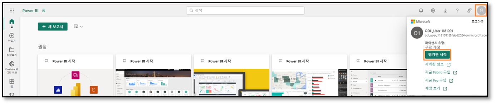
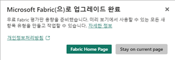
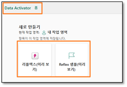
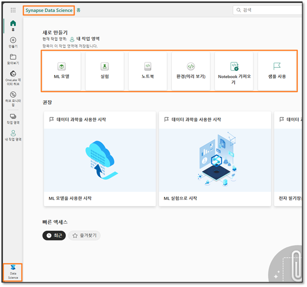
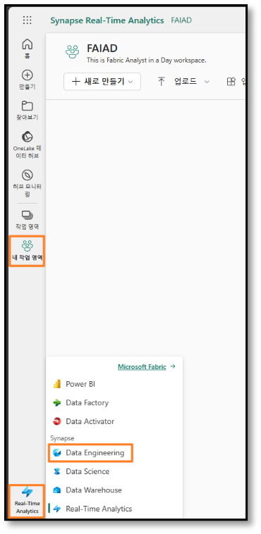
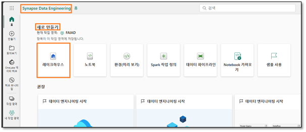
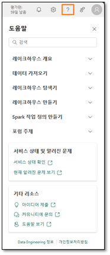

# Contenido	
- Presentación
- Licencia de Fabric
  - Tarea 1: Habilitar una licencia de prueba de Microsoft Fabric
- Información general de las experiencias de Fabric
    - Tarea 2: Experiencia de Data Factory
    - Tarea 3: Experiencia de Data Activator
    - Tarea 4: Experiencia de Synapse Data Engineering
    - Tarea 5: Experiencia de Synapse Data Science
    - Tarea 6: Experiencia de Data Warehouse de Synapse
    - Tarea 7: Experiencia de Real-Time Analytics
-  Área de trabajo de Fabric
    - Tarea 8: Crear un área de trabajo de Fabric
    - Tarea 9: Crear un lakehouse
- Referencias

# Presentación 
Hoy tendrá ocasión de aprender diversas características clave de Microsoft Fabric. Este es un taller introductorio destinado a presentarle las diversas experiencias de productos y artículos disponibles en Fabric. Al final de este taller, habrá aprendido a utilizar lakehouses, flujos de datos de segunda generación, canalizaciones de datos y la característica DirectLake.

Al final de este laboratorio, habrá aprendido: 

- Cómo crear un área de trabajo de Fabric
- Cómo crear un lakehouse  

# Licencia de Fabric
## Tarea 1: Habilitar una licencia de prueba de Microsoft Fabric

1. Abra el **explorador** y vaya a https://app.powerbi.com/. Se le llevará a la página de inicio de sesión.

**Nota:** Si tiene una cuenta de Power BI existente, es posible que desee utilizar el explorador en modo privado/incógnito.

2. Introduzca el **Correo electrónico** proporcionado por el instructor o instructora y haga clic en **Enviar**.

    
 
3. Esto le llevará a la pantalla de **Contraseña**. Introduzca la contraseña que el instructor o instructora le compartió. 
4. Haga clic en **Iniciar sesión** y siga las indicaciones para iniciar sesión en Fabric.

    
 
5. Se le dirigirá a la **página principal del servicio Power BI** que ya conoce.
6. Asumimos que está familiarizado con el diseño del servicio Power BI. Si tiene alguna pregunta, no dude en preguntar.

Actualmente, está en **Mi área de trabajo**. Para trabajar con elementos de Fabric, necesitará una licencia de prueba y un área de trabajo que tenga una licencia de Fabric. Pasemos a la práctica.

7. En la esquina superior derecha de la pantalla, seleccione el **icono** del **usuario**.
8. Seleccione **Iniciar período de prueba**.

    
 
9. Se abre el cuadro de diálogo Actualizar a una prueba Microsoft Fabric gratuita. Seleccione **Iniciar período de prueba**.
 
    

10. Se abre el cuadro de diálogo Actualizado correctamente a Microsoft Fabric. Seleccione **Fabric Home Page**.

    
 
11. Se le dirigirá a la **página principal de Microsoft Fabric**.
 
    

# Información general de las experiencias de Fabric

## Tarea 2: Experiencia de Data Factory
1. Seleccione el icono de **Microsoft Fabric** en la parte inferior izquierda de su pantalla. Se abrirá un cuadro de diálogo con la lista de experiencias de Fabric. Tenga en cuenta que Power BI, Data Factory y Data Activator son experiencias independientes. Data Engineering, Data Science, Data Warehouse y Real-Time Analytics son experiencias de Synapse y estas cuatro experiencias están impulsadas por Synapse. Exploremos.

2. Seleccione **Data Factory**.

    
 
3. Se le dirigirá a la **página principal de Data Factory**. Esta página tiene tres secciones principales.

    a. **Nuevo:** enumera los elementos disponibles en Data Factory: el flujo de datos de segunda generación y la canalización de datos.
    
    i.	El flujo de datos de segunda generación es la nueva generación de flujos de datos.
    
    ii.	La canalización de datos se utiliza para la orquestación de datos.
    
    b. **Recomendado:** esta sección proporciona acceso a documentación de aprendizaje de inicio rápido.
    
    c. **Acceso rápido:** esta sección enumera los elementos favoritos o usados recientemente.

    
 
## Tarea 3: Experiencia de Data Activator

1. Seleccione **Data Factory** en la parte inferior izquierda de su pantalla. Se abre el cuadro de diálogo de experiencia de Fabric.

    
 
2. Seleccione **Data Activator** en el cuadro de diálogo. Se le dirigirá a la **página principal de Data Activator**. Data Activator es una experiencia sin código en Microsoft Fabric para tomar acciones automáticamente cuando se detectan patrones o condiciones en los datos cambiantes. Observe que las tres secciones son como la experiencia de Data Factory. En la sección Nuevo, observe los elementos:

    a. **Reflejo:** se utiliza para supervisar conjuntos de datos, consultas y flujos de eventos en busca de patrones.
    
    b. **Ejemplo de reflejo:** solución de muestra.

    
 

## Tarea 4: Experiencia de Synapse Data Engineering

1. Seleccione **Data Activator** en la parte inferior izquierda de su pantalla. Se abre el cuadro de diálogo de experiencia de Fabric.
2. Seleccione **Data Engineering**. Se le dirigirá a la **página principal de Data Engineering**. De nuevo, la página tiene tres secciones principales. En la sección Nuevo, observe los elementos: 
    
    a. **Lakehouse:** se utiliza para almacenar macrodatos para limpiar, consultar, generar informes y compartir.
    
    b. **Bloc de notas:** se utiliza para ejecutar consultas sobre los datos para producir tablas y objetos visuales que se pueden compartir.
    
    c. **Definición de trabajo de Spark:** se utiliza para definir, programar y administrar trabajos de Apache.
    
    d. **Canalización de datos:** se usa para orquestar una solución de datos.
    
    e. **Importar bloc de notas:** se usa para importar blocs de notas desde la máquina local.
    
    f. **Usar una muestra:** se usa para crear una muestra.

    
 

## Tarea 5: Experiencia de Synapse Data Science

1. Seleccione **Data Engineering** en la parte inferior izquierda de su pantalla. Se abre el cuadro de diálogo de experiencia de Fabric.
2. Seleccione **Data Science**. Se le dirigirá a la **página principal de Data Science**. De nuevo, hay tres secciones. En la sección Nuevo, observe los elementos:

    a. **Modelos de ML:** se usa para crear modelos de aprendizaje automático.
    
    b. **Experimento:** se utiliza para crear, ejecutar y hacer un seguimiento del desarrollo de múltiples modelos.
    
    c. **Bloc de notas:** se utiliza para explorar datos y crear soluciones de aprendizaje automático.
    
    d. **Importar bloc de notas:** se usa para importar blocs de notas desde la máquina local.
    
    e. **Usar una muestra:** solución de muestra.

    
 

## Tarea 6: Experiencia de Data Warehouse de Synapse
1. Seleccione **Data Science** en la parte inferior izquierda de su pantalla. Se abre el cuadro de diálogo de experiencia de Fabric.
2. Seleccione **Data Warehouse**. Se le dirigirá a la **página principal de Data Warehouse**. De nuevo, hay tres secciones. En la sección Nuevo, observe los elementos. Vea que la canalización de datos y el flujo de datos de segunda generación también están disponibles aquí.

    a. **Almacén:** se utiliza para proporcionar información estratégica de múltiples orígenes.
    
    b. **Almacén de muestra:** solución de almacén de muestra.
    
    c. **Canalización de datos:** se usa para orquestar una solución de datos.

    
 

## Tarea 7: Experiencia de Real-Time Analytics
1. Seleccione **Data Warehouse** en la parte inferior izquierda de su pantalla. Se abre el cuadro de diálogo de experiencia de Fabric.
2. Seleccione **Real-Time Analytics**. Se le dirigirá a la **página principal de Real-Time Analytics**. De nuevo, hay tres secciones. En la sección Nuevo, observe los elementos: 

    a. **Base de datos KQL:** se utiliza para cargar rápidamente datos estructurados, no estructurados y de streaming para hacer consultas.
    
    b. **Conjunto de consultas KQL:** se utiliza para ejecutar consultas sobre los datos para producir tablas y objetos visuales que se pueden compartir.
    
    c. **Eventstream:** se utiliza para capturar, transformar y enrutar secuencias de eventos en tiempo real.
    
    d. **Usar una muestra:** se usa para crear una muestra.

    
 

# Área de trabajo de Fabric
## Tarea 8: Crear un área de trabajo de Fabric

1. Ahora creemos un área de trabajo con licencia de Fabric. Seleccione **Áreas de trabajo** en la barra de navegación de la izquierda. Se abre un cuadro de diálogo.
2. Seleccione **Nueva área de trabajo**.
 
    

3. **El cuadro de diálogo Crear un área de trabajo** se abre en el lado derecho del explorador.
4. En el campo **Nombre**, introduzca **FAIAD_<username>**.

**Nota:** El nombre del área de trabajo debe ser único. Vamos a usar FAIAD como nombre del área de trabajo para este documento. Sin embargo, el nombre de su área de trabajo debe ser diferente. Asegúrese de que aparezca una marca de verificación verde con "**Este nombre está disponible**" debajo del campo Nombre.

5.	Si lo desea, puede escribir una **Descripción** para el área de trabajo. Este campo es opcional.
6.	Haga clic para expandir la sección **Avanzado**.

    
 
7. En **Modo de licencia**, asegúrese de que **Prueba** esté seleccionado. (Debería estar seleccionado por defecto).
8. Seleccione **Aplicar** para crear un nuevo área de trabajo.

    
 
Se crea un nuevo área de trabajo y se nos dirige hasta ella. Traeremos datos de los diferentes orígenes de datos a un lakehouse y utilizaremos los datos del lakehouse para crear nuestro modelo y generar informes en él. El primer paso es crear un lakehouse.

## Tarea 9: Crear un lakehouse
1. Seleccione **Real-Time Analytics** en la parte inferior izquierda de su pantalla. Se abre el cuadro de diálogo de experiencia de Fabric.
2. Seleccione **Data Engineering** para navegar a la página principal de Data Engineering.

    
 
3. Seleccione **Lakehouse**.
 
    

4. Se abre un nuevo cuadro de diálogo de lakehouse. Escriba **lh_FAIAD** en el cuadro de texto Nombre.

**Nota:** lh aquí se refiere a Lakehouse. Vamos a anteponer lh para que sea fácil de identificar y buscar.

5.	Seleccione **Crear**.

    
 
En unos momentos, se crea un lakehouse y se le dirigirá a la interfaz del mismo.
En el **panel izquierdo**, observe que debajo de su área de trabajo tendrá el icono del lakehouse. Puede navegar fácilmente hasta el lakehouse si hace clic en este icono en cualquier momento.

Dentro del explorador del lakehouse, verá **Tables y Files**. Lakehouse podría exponer archivos Azure Data Lake Storage Gen2 en la sección de archivos o un flujo de datos podría cargar datos en las tablas del lakehouse. Existen varias opciones disponibles. Le mostraremos algunas de las opciones como en las siguientes prácticas de laboratorio.

 
En esta práctica de laboratorio, exploramos la interfaz de Fabric, creamos un área de trabajo de Fabric y un lakehouse. En la siguiente práctica de laboratorio, aprenderemos cómo usar el flujo de datos de segunda generación para conectarnos a ADLS Gen2 para extraer, transformar e ingerir datos en el lakehouse.

## Referencias
Fabric Analyst in a Day (FAIAD) le presenta algunas funciones clave disponibles en Microsoft Fabric. En el menú del servicio, la sección Ayuda (?) tiene vínculos a algunos recursos excelentes.
 

Estos son algunos recursos más que podrán ayudarle a seguir avanzando con Microsoft Fabric.

- Vea la publicación del blog para leer el [anuncio de disponibilidad general de Microsoft Fabric](https://aka.ms/Fabric-Hero-Blog-Ignite23) completo.
- Explore Fabric a través de la [Visita guiada](https://aka.ms/Fabric-GuidedTour)
- Regístrese en la [prueba gratuita de Microsoft Fabric](https://aka.ms/try-fabric)
- Visite el [sitio web de Microsoft Fabric](https://aka.ms/microsoft-fabric)
- Adquiera nuevas capacidades mediante la exploración de[ los módulos de aprendizaje de Fabric](https://aka.ms/learn-fabric)
- Explore la [documentación técnica de Fabric](https://aka.ms/fabric-docs)
- Lea el [libro electrónico gratuito sobre cómo empezar a usar Fabric](https://aka.ms/fabric-get-started-ebook)
- Únase a la [comunidad de Fabric](https://aka.ms/fabric-community) para publicar sus preguntas, compartir sus comentarios y aprender de otros.

Obtenga más información en los blogs de anuncios de la experiencia Fabric:

- [Experiencia de Data Factory en el blog de Fabric](https://aka.ms/Fabric-Data-Factory-Blog) 
- [Experiencia de Synapse Data Engineering en el blog de Fabric ](https://aka.ms/Fabric-DE-Blog)
- [Experiencia de Synapse Data Science en el blog de Fabric ](https://aka.ms/Fabric-DS-Blog)
- [Experiencia de Synapse Data Warehousing en el blog de Fabric ](https://aka.ms/Fabric-DW-Blog)
- [Experiencia de Synapse Real-Time Analytics en el blog de Fabric](https://aka.ms/Fabric-RTA-Blog)
- [Blog de anuncios de Power BI](https://aka.ms/Fabric-PBI-Blog)
- [Experiencia de Data Activator en el blog de Fabric ](https://aka.ms/Fabric-DA-Blog)
- [Administración y gobernanza en el blog de Fabric](https://aka.ms/Fabric-Admin-Gov-Blog)
- [OneLake en el blog de Fabric](https://aka.ms/Fabric-OneLake-Blog)
- [Blog de integración de Dataverse y Microsoft Fabric](https://aka.ms/Dataverse-Fabric-Blog)

© 2023 Microsoft Corporation. Todos los derechos reservados.

Al participar en esta demostración o laboratorio práctico, acepta las siguientes condiciones:

Microsoft Corporation pone a su disposición la tecnología o funcionalidad descrita en esta demostración/laboratorio práctico con el fin de obtener comentarios por su parte y de facilitarle una experiencia de aprendizaje. Esta demostración/laboratorio práctico solo se puede usar para evaluar las características de tal tecnología o funcionalidad y para proporcionar comentarios a Microsoft. No se puede usar para ningún otro propósito. Ninguna parte de esta demostración/laboratorio práctico se puede modificar, copiar, distribuir, transmitir, mostrar, realizar, reproducir, publicar, licenciar, transferir ni vender, ni tampoco crear trabajos derivados de ella.

LA COPIA O REPRODUCCIÓN DE ESTA DEMOSTRACIÓN/LABORATORIO PRÁCTICO (O PARTE DE ELLA) EN CUALQUIER OTRO SERVIDOR O UBICACIÓN PARA SU REPRODUCCIÓN O DISTRIBUCIÓN POSTERIOR QUEDA EXPRESAMENTE PROHIBIDA.

ESTA DEMOSTRACIÓN/LABORATORIO PRÁCTICO PROPORCIONA CIERTAS FUNCIONES Y CARACTERÍSTICAS DE PRODUCTOS O TECNOLOGÍAS DE SOFTWARE (INCLUIDOS POSIBLES NUEVOS CONCEPTOS Y CARACTERÍSTICAS) EN UN ENTORNO SIMULADO SIN INSTALACIÓN O CONFIGURACIÓN COMPLEJA PARA EL PROPÓSITO ARRIBA DESCRITO. LA TECNOLOGÍA/CONCEPTOS DESCRITOS EN ESTA DEMOSTRACIÓN/LABORATORIO PRÁCTICO NO REPRESENTAN LA FUNCIONALIDAD COMPLETA DE LAS CARACTERÍSTICAS Y, EN ESTE SENTIDO, ES POSIBLE QUE NO FUNCIONEN DEL MODO EN QUE LO HARÁN EN UNA VERSIÓN FINAL. ASIMISMO, PUEDE QUE NO SE PUBLIQUE UNA VERSIÓN FINAL DE TALES CARACTERÍSTICAS O CONCEPTOS. DE IGUAL MODO, SU EXPERIENCIA CON EL USO DE ESTAS CARACTERÍSTICAS Y FUNCIONALIDADES EN UN ENTORNO FÍSICO PUEDE SER DIFERENTE.

**COMENTARIOS.** Si envía comentarios a Microsoft sobre las características, funcionalidades o conceptos de tecnología descritos en esta demostración/laboratorio práctico, acepta otorgar a Microsoft, sin cargo alguno, el derecho a usar, compartir y comercializar sus comentarios de cualquier modo y para cualquier fin. También concederá a terceros, sin cargo alguno, los derechos de patente necesarios para que sus productos, tecnologías y servicios usen o interactúen con cualquier parte específica de un software o servicio de Microsoft que incluya los comentarios. No enviará comentarios que estén sujetos a una licencia que obligue a Microsoft a conceder su software o documentación bajo licencia a terceras partes porque incluyamos sus comentarios en ellos. Estos derechos seguirán vigentes después del vencimiento de este acuerdo.

MICROSOFT CORPORATION RENUNCIA POR LA PRESENTE A TODAS LAS GARANTÍAS Y CONDICIONES RELATIVAS A LA DEMOSTRACIÓN/LABORATORIO PRÁCTICO, INCLUIDA CUALQUIER GARANTÍA Y CONDICIÓN DE COMERCIABILIDAD (YA SEA EXPRESA, IMPLÍCITA O ESTATUTARIA), DE IDONEIDAD PARA UN FIN DETERMINADO, DE TITULARIDAD Y DE AUSENCIA DE INFRACCIÓN. MICROSOFT NO DECLARA NI GARANTIZA LA EXACTITUD DE LOS RESULTADOS, EL RESULTADO DERIVADO DE LA REALIZACIÓN DE LA DEMOSTRACIÓN/LABORATORIO PRÁCTICO NI LA IDONEIDAD DE LA INFORMACIÓN CONTENIDA EN ELLA CON NINGÚN PROPÓSITO.

**DECLINACIÓN DE RESPONSABILIDADES**

Esta demostración/laboratorio práctico contiene solo una parte de las nuevas características y mejoras realizadas en Microsoft Power BI. Puede que algunas de las características cambien en versiones futuras del producto. En esta demostración/laboratorio práctico, conocerá algunas de estas nuevas características, pero no todas.

