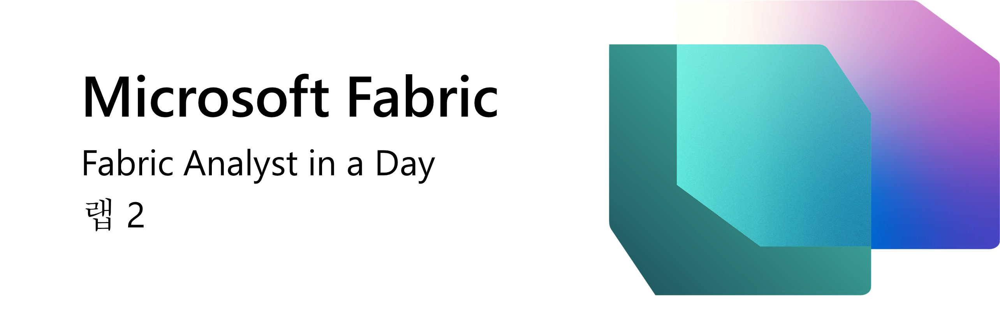
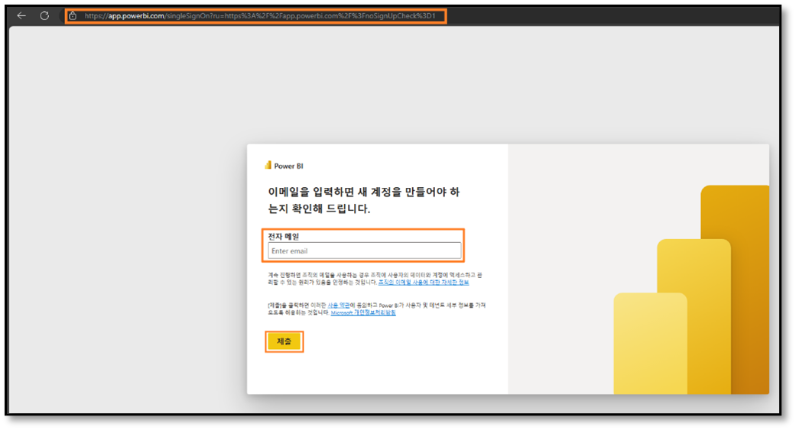
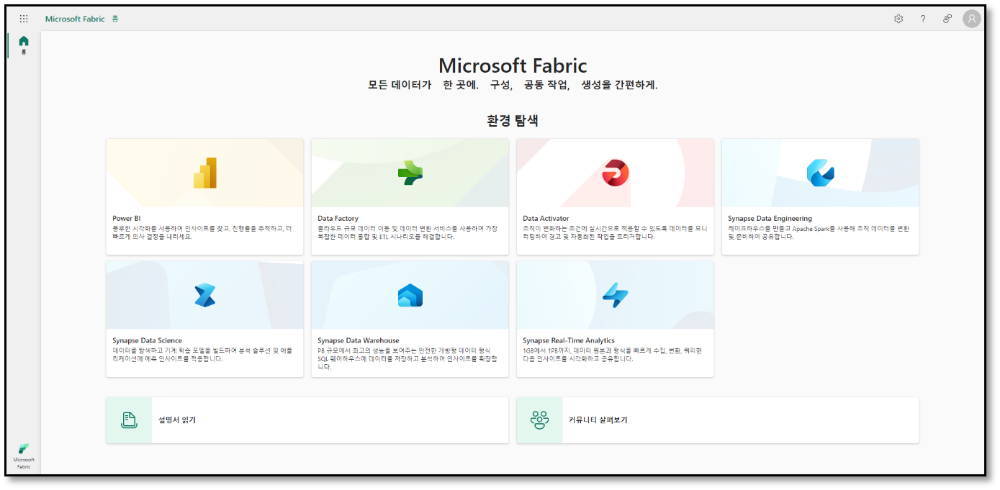
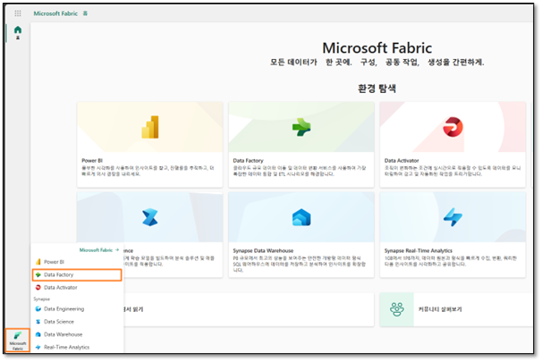
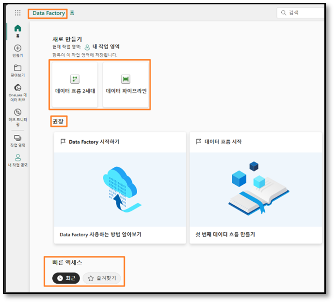
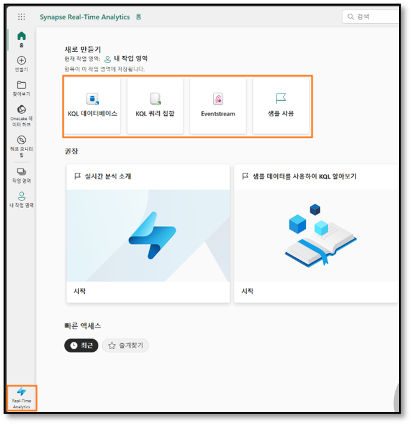
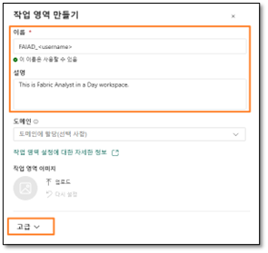
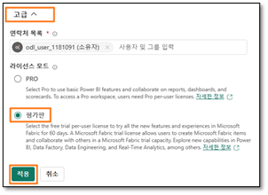
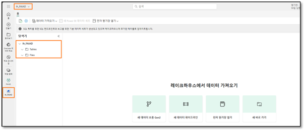

# Inhalt	
- Einführung
- Fabric-Lizenz
    - Aufgabe 1: Lizenz für Testversion von Microsoft Fabric aktivieren
- Übersicht über die Funktionsbereiche in Fabric	
    - Aufgabe 2: Data Factory-Funktionsbereich	
    - Aufgabe 3: Data Activator-Funktionsbereich
    - Aufgabe 4: Data Engineering-Funktionsbereich von Synapse
    - Aufgabe 5: Data Science-Funktionsbereich von Synapse
    - Aufgabe 6: Data Warehouse-Funktionsbereich von Synapse
    - Aufgabe 7: Real-Time Analytics-Funktionsbereich
- Fabric-Arbeitsbereich
    - Aufgabe 8: Fabric-Arbeitsbereich erstellen
    - Aufgabe 9: Lakehouse erstellen
- Referenzen

# Einführung 
Heute geht es um die verschiedenen Hauptfunktionen von Microsoft Fabric. In diesem Einführungsworkshop werden die verschiedenen Funktionsbereiche und Bestandteile von Fabric vorgestellt. Am Ende des Workshops erfahren Sie zudem, wie Sie Lakehouse, Dataflow Gen2, Data Pipeline und DirectLake verwenden.

Inhalt dieser Übung:

- So erstellen Sie einen Fabric-Arbeitsbereich
- So erstellen Sie ein Lakehouse  

# Fabric-Lizenz

## Aufgabe 1: Lizenz für Testversion von Microsoft Fabric aktivieren

1. Öffnen Sie den **Browser**, und rufen Sie https://app.powerbi.com/ auf. Die Anmeldeseite wird angezeigt.

**Hinweis:** Wenn Sie bereits ein Power BI-Konto haben, können Sie den Browser im privaten Modus/Inkognito-Modus verwenden.

2. Geben Sie die vom Kursleiter genannte **E-Mail-Adresse** ein, und klicken Sie auf **Senden**.

   
 
3. Die Seite **Kennwort** wird angezeigt. Geben Sie das Kennwort ein, das Sie vom Kursleiter erhalten haben. 

4. Klicken Sie auf **Anmelden**, und folgen Sie den Anweisungen, um sich bei Fabric anzumelden.

    

5. Sie werden zur bereits bekannten **Startseite des Power BI-Dienstes** geleitet.
6. Es wird angenommen, dass Ihnen der Aufbau des Power BI-Dienstes bekannt ist. Bei Fragen wenden Sie sich einfach an den Kursleiter.

Derzeit sind Sie in **Mein Arbeitsbereich**. Wenn Sie mit Fabric-Elementen arbeiten möchten, benötigen Sie eine Testlizenz und einen Arbeitsbereich mit einer Fabric-Lizenz. Gehen Sie wie folgt vor:

7. Klicken Sie oben rechts auf dem Bildschirm auf das **Benutzersymbol**.

8. Wählen Sie **Test starten** aus.

    

9. Das Dialogfeld „Upgrade auf eine kostenlose Testversion auf Microsoft Fabric“ wird geöffnet. Wählen Sie **Test starten** aus.

    
 

10. Das Dialogfeld „Erfolgreiches Upgrade auf Microsoft Fabric“ wird geöffnet. Wählen Sie **Fabric Home Page** aus.

    
 
11. Sie werden zur **Startseite von Microsoft Fabric** geleitet.

    
 

# Übersicht über die Funktionsbereiche in Fabric

## Aufgabe 2: Data Factory-Funktionsbereich

1. Wählen Sie links unten das Symbol für **Microsoft Fabric** aus. Ein Dialogfeld mit einer Liste der Funktionsbereiche von Fabric wird geöffnet. Beachten Sie, dass Power BI, Data Factory und Data Activator unabhängige Funktionsbereiche sind. Data Engineering, Data Science, Data Warehouse und Real-Time Analytics sind Synapse-Funktionsbereiche und werden mit Technologien von Synapse bereitgestellt. Sehen wir uns die Funktionsbereiche nun gesondert an.

2. Wählen Sie **Data Factory** aus.

    
 
3. Sie werden zur **Startseite von Data Factory** weitergeleitet. Der Seite ist in drei Hauptbereiche unterteilt.

    a. **Neu:** Hier werden die Bestandteile von Data Factory angezeigt. Das sind Dataflow Gen2 und Data Pipeline.
    
    i. Dataflow Gen2 ist die nächste Generation von Dataflow.
        
    ii. Data Pipeline dient zur Datenorchestrierung.
    
    b. **Empfohlen:** In diesem Abschnitt können Sie die Schnellstart-Lerndokumentation aufrufen.

    c. **Schnellzugriff:** Hier finden Sie die zuletzt verwendeten oder bevorzugten Elemente.

    
 
## Aufgabe 3: Data Activator-Funktionsbereich

1. Wählen Sie links unten **Data Factory** aus. Das Dialogfeld „Fabric-Funktionsbereich“ wird geöffnet.

    
 
2. Wählen Sie dort die Option **Data Activator** aus. Sie werden zur **Startseite von Data Activator** weitergeleitet. Data Activator ist ein codefreier Funktionsbereich in Microsoft Fabric, mit dem automatisch Maßnahmen durchgeführt werden können, wenn in sich ändernden Daten Muster oder Bedingungen erkannt werden. Beachten Sie, dass die drei Abschnitte dem Data Factory-Funktionsbereich ähneln. Unter „Neu“ sehen Sie diese Elemente:

    a. **Reflex:** Dient zur Überwachung von Datensätzen, Abfragen und Ereignisströmen auf Muster.

    b. **Reflex-Beispiel:** Beispiellösung
 
    

## Aufgabe 4: Data Engineering-Funktionsbereich von Synapse

1. Wählen Sie links unten **Data Activator** aus. Das Dialogfeld „Fabric-Funktionsbereich“ wird geöffnet.

2. Klicken Sie auf **Data Engineering**. Sie werden zur **Startseite von Data Engineering** weitergeleitet. Auch diese Seite ist in drei Hauptabschnitte unterteilt. Unter „Neu“ sehen Sie diese Elemente:

    a. **Lakehouse:** Dient zum Speichern großer Datenmengen, die bereinigt, abgefragt, in Berichten verwendet und freigegeben werden können.

    b. **Notizbuch:** Dient zum Abfragen der Daten, um gemeinsam nutzbare Tabellen und Grafiken zu erstellen.
    
    c. **Spark-Auftragsdefinition:** Dient zum Definieren, Planen und Verwalten von Apache-Aufträgen.
    
    d. **Datenpipeline:** Hiermit wird die Datenlösung orchestriert.
    
    e. **Notebook importieren:** Hiermit werden Notizbücher vom lokalen Computer importiert.
    
    f. **Beispiel verwenden:** Dies dient zur Anfertigung eines Beispiels.

    
    

## Aufgabe 5: Data Science-Funktionsbereich von Synapse

1. Wählen Sie links unten **Data Engineering** aus. Das Dialogfeld „Fabric-Funktionsbereich“ wird geöffnet.

2. Wählen Sie **Data Science** aus. Sie werden zur **Startseite von Data Science** weitergeleitet. Auch hier gibt es drei Abschnitte: Unter „Neu“ sehen Sie diese Elemente:

    a. **ML-Modell:** Hiermit werden Machine-Learning-Modelle erstellt.

    b. **Experiment:** Dies dient zum Entwickeln und Ausführen von Modellen und zur Nachverfolgung der Modellentwicklung.
    
    c. **Notizbuch:** Hiermit werden Daten ausgewertet und Machine-Learning-Lösungen entwickelt.
    
    d. **Notebook importieren:** Hiermit werden Notizbücher vom lokalen Computer importiert.
    
    e. **Beispiel:** Beispiellösung

    
 

## Aufgabe 6: Data Warehouse-Funktionsbereich von Synapse

1. Wählen Sie links unten **Data Science** aus. Das Dialogfeld „Fabric-Funktionsbereich“ wird geöffnet.

2. Klicken Sie auf **Data Warehouse**. Sie werden zur **Startseite von Data Warehouse** weitergeleitet. Auch hier gibt es drei Abschnitte: Sehen Sie sich die Elemente unter „Neu“ an. Beachten Sie, dass Datenpipeline und Dataflow Gen2 auch hier vorhanden sind.

    a. **Warehouse:** Hiermit werden strategische Erkenntnisse aus diversen Quellen gewonnen.

    b. **Beispiel-Warehouse:** Warehouse-Beispiellösung
    
    c. **Datenpipeline:** Hiermit wird die Datenlösung orchestriert.

    

## Aufgabe 7: Real-Time Analytics-Funktionsbereich

1. Wählen Sie links unten **Data Warehouse** aus. Das Dialogfeld „Fabric-Funktionsbereich“ wird geöffnet.
2. Klicken Sie auf **Real-Time Analytics**. Sie werden zur **Startseite von Real-Time Analytics** weitergeleitet. Auch hier gibt es drei Abschnitte: Unter „Neu“ sehen Sie diese Elemente:

    a. **KQL-Datenbank:** Diese dient zum schnellen Laden strukturierter und unstrukturierter Daten sowie von Streaming-Daten für Abfragen.

    b. **KQL-Abfragesatz:** Dient zum Abfragen der Daten, um gemeinsam verwendbare Tabellen und Grafiken zu erstellen.

    c. **Eventstream:** Hiermit werden Ereignisströme in Echtzeit erfasst, umgewandelt und weitergeleitet.

    d. **Beispiel verwenden:** Dies dient zur Anfertigung eines Beispiels.

    
 

# Fabric-Arbeitsbereich

## Aufgabe 8: Fabric-Arbeitsbereich erstellen
1. Erstellen wir jetzt einen Arbeitsbereich mit Fabric-Lizenz. Wählen Sie in der Navigationsleiste links die Option **Arbeitsbereiche** aus. Ein Dialogfeld wird geöffnet.

2. Klicken Sie auf **Neuer Arbeitsbereich**.

    
 
3. Rechts im Browser wird das Dialogfeld **Arbeitsbereich erstellen** geöffnet.

4. Geben Sie im Feld Name den Text **FAIAD_<Benutzername>** ein.

**Hinweis:** Der Name des Arbeitsbereichs muss eindeutig sein. In diesem Dokument heißt der Arbeitsbereich „FAIAD“. Der Name Ihres Arbeitsbereichs lautet jedoch anders. Achten Sie darauf, dass unter dem Feld für den Namen ein grünes Häkchen mit dem Text Dieser Name ist verfügbar zu sehen ist.

5. Wenn Sie möchten, können Sie eine **Beschreibung** des Arbeitsbereichs eingeben. Dieses Feld ist optional.
6. Erweitern Sie den Abschnitt mit **Erweitert**.

    
 
7. Überprüfen Sie unter **Lizenzmodus**, dass die Option **Testversion** ausgewählt ist. (Standardmäßig ist dies der Fall.)
8. Erstellen Sie den neuen Arbeitsbereich durch Klicken auf **Übernehmen**.

    
 
Ein neuer Arbeitsbereich wird erstellt, und Sie werden zu diesem weitergeleitet. Als Nächstes importieren wir Daten aus verschiedenen Quellen in das Lakehouse, entwickeln damit ein Modell und nutzen die Daten für Berichte. Erstellen wir zunächst ein Lakehouse.

## Aufgabe 9: Lakehouse erstellen

1. Wählen Sie links unten **Real-Time Analytics** aus. Das Dialogfeld „Fabric-Funktionsbereich“ wird geöffnet.
2. Klicken Sie auf **Data Engineering**, um die Startseite von Data Engineering zu öffnen.

    
 
3. Wählen Sie **Lakehouse** aus.

    
  
4. Das Dialogfeld „Neues Lakehouse“ wird geöffnet. Geben Sie im Textfeld für den Namen die Bezeichnung **lh_FAIAD** ein. 

**Hinweis:** „lh“ bezieht sich hier auf Lakehouse. Die Buchstaben „lh“ werden vorangestellt, damit das Lakehouse leichter erkannt und gefunden werden kann.

5. Wählen Sie **Erstellen** aus.

    
 
Das Lakehouse wird in kurzer Zeit erstellt, und Sie werden zur Lakehouse-Oberfläche weitergeleitet.
Beachten Sie, dass **links** unter dem Arbeitsbereich jetzt das Lakehouse-Symbol zu sehen ist. Durch Klicken auf dieses Symbol können Sie das Lakehouse jederzeit aufrufen.

Im Lakehouse-Explorer werden **Tables** und **Files** angezeigt. In einem Lakehouse können im Abschnitt mit den Dateien auch Dateien von Azure Data Lake Storage Gen2 stehen, oder mit einem Dataflow können Daten in Lakehouse-Tabellen geladen werden. Es stehen mehrere Möglichkeiten zur Auswahl. In den folgenden Übungen werden einige dieser Möglichkeiten vorgestellt.

 
In dieser Übung haben wir die Fabric-Oberfläche kennengelernt sowie einen Fabric-Arbeitsbereich und ein Lakehouse erstellt. In der nächsten Übung lernen Sie, wie Sie mit Dataflow Gen2 eine Verbindung zu ADLS Gen2 herstellen, um Daten abzurufen, umzuwandeln und im Lakehouse zu erfassen.

## Referenzen

Bei Fabric Analyst in a Day (FAIAD) lernen Sie einige der wichtigsten Funktionen von Microsoft Fabric kennen. Im Menü des Dienstes finden Sie in der Hilfe (?) Links zu praktischen Informationen.

Nachfolgend finden Sie weitere Angebote zur weiteren Arbeit mit Microsoft Fabric.

- Die vollständige https://aka.ms/Fabric-Hero-Blog-Ignite23 finden Sie im Blogbeitrag.
- Fabric bei einer https://aka.ms/Fabric-GuidedTour kennenlernen
- Zur https://aka.ms/try-fabric anmelden
- https://aka.ms/microsoft-fabric besuchen
- Mit Modulen von https://aka.ms/learn-fabric neue Qualifikationen erwerben
- Thttps://aka.ms/fabric-docs lesen
- https://aka.ms/fabric-get-started-ebook lesen
- Mitglied der https://aka.ms/fabric-community werden, um Fragen zu stellen, Feedback zu geben und sich mit anderen auszutauschen

Lesen Sie die detaillierteren Blogs zur Ankündigung der Fabric-Umgebung:

- https://aka.ms/Fabric-Data-Factory-Blog
- https://aka.ms/Fabric-DE-Blog
- https://aka.ms/Fabric-DS-Blog
- https://aka.ms/Fabric-DW-Blog
- https://aka.ms/Fabric-RTA-Blog
- https://aka.ms/Fabric-PBI-Blog
- https://aka.ms/Fabric-DA-Blog
- https://aka.ms/Fabric-Admin-Gov-Blog
- https://aka.ms/Fabric-OneLake-Blog
- https://aka.ms/Dataverse-Fabric-Blog

© 2023 Microsoft Corporation. Alle Rechte vorbehalten.

Durch die Verwendung der vorliegenden Demo/Übung stimmen Sie den folgenden Bedingungen zu:

Die in dieser Demo/Übung beschriebene Technologie/Funktionalität wird von der Microsoft Corporation bereitgestellt, um Feedback von Ihnen zu erhalten und Ihnen Wissen zu vermitteln. Sie dürfen die Demo/Übung nur verwenden, um derartige Technologiefeatures und Funktionen zu bewerten und Microsoft Feedback zu geben. Es ist Ihnen nicht erlaubt, sie für andere Zwecke zu verwenden. Es ist Ihnen nicht gestattet, diese Demo/Übung oder einen Teil derselben zu ändern, zu kopieren, zu verbreiten, zu übertragen, anzuzeigen, auszuführen, zu vervielfältigen, zu veröffentlichen, zu lizenzieren, zu transferieren oder zu verkaufen oder aus ihr abgeleitete Werke zu erstellen.

DAS KOPIEREN ODER VERVIELFÄLTIGEN DER DEMO/ÜBUNG (ODER EINES TEILS DERSELBEN) AUF EINEN/EINEM ANDEREN SERVER ODER SPEICHERORT FÜR DIE WEITERE VERVIELFÄLTIGUNG ODER VERBREITUNG IST AUSDRÜCKLICH UNTERSAGT.

DIESE DEMO/ÜBUNG STELLT BESTIMMTE SOFTWARE-TECHNOLOGIE-/PRODUKTFEATURES UND FUNKTIONEN, EINSCHLIESSLICH POTENZIELLER NEUER FEATURES UND KONZEPTE, IN EINER SIMULIERTEN UMGEBUNG OHNE KOMPLEXE EINRICHTUNG ODER INSTALLATION FÜR DEN OBEN BESCHRIEBENEN ZWECK BEREIT. DIE TECHNOLOGIE/KONZEPTE IN DIESER DEMO/ÜBUNG ZEIGEN MÖGLICHERWEISE NICHT DAS VOLLSTÄNDIGE FUNKTIONSSPEKTRUM UND FUNKTIONIEREN MÖGLICHERWEISE NICHT WIE DIE ENDGÜLTIGE VERSION. UNTER UMSTÄNDEN VERÖFFENTLICHEN WIR AUCH KEINE ENDGÜLTIGE VERSION DERARTIGER FEATURES ODER KONZEPTE. IHRE ERFAHRUNG BEI DER VERWENDUNG DERARTIGER FEATURES UND FUNKTIONEN IN EINER PHYSISCHEN UMGEBUNG KANN FERNER ABWEICHEND SEIN.

**FEEDBACK.** Wenn Sie Feedback zu den Technologiefeatures, Funktionen und/oder Konzepten geben, die in dieser Demo/Übung beschrieben werden, gewähren Sie Microsoft das Recht, Ihr Feedback in jeglicher Weise und für jeglichen Zweck kostenlos zu verwenden, zu veröffentlichen und gewerblich zu nutzen. Außerdem treten Sie Dritten kostenlos sämtliche Patentrechte ab, die erforderlich sind, damit deren Produkte, Technologien und Dienste bestimmte Teile einer Software oder eines Dienstes von Microsoft, welche/welcher das Feedback enthält, verwenden oder eine Verbindung zu dieser/diesem herstellen können. Sie geben kein Feedback, das einem Lizenzvertrag unterliegt, aufgrund dessen Microsoft Drittparteien eine Lizenz für seine Software oder Dokumentation gewähren muss, weil wir Ihr Feedback in diese aufnehmen. Diese Rechte bestehen nach Ablauf dieser Vereinbarung fort.
DIE MICROSOFT CORPORATION LEHNT HIERMIT JEGLICHE GEWÄHRLEISTUNGEN UND GARANTIEN IN BEZUG AUF DIE DEMO/ÜBUNG AB, EINSCHLIESSLICH ALLER AUSDRÜCKLICHEN, KONKLUDENTEN ODER GESETZLICHEN GEWÄHRLEISTUNGEN UND GARANTIEN DER HANDELSÜBLICHKEIT, DER EIGNUNG FÜR EINEN BESTIMMTEN ZWECK, DES RECHTSANSPRUCHS UND DER NICHTVERLETZUNG VON RECHTEN DRITTER. MICROSOFT MACHT KEINERLEI ZUSICHERUNGEN BZW. ERHEBT KEINERLEI ANSPRÜCHE IM HINBLICK AUF DIE RICHTIGKEIT DER ERGEBNISSE UND DES AUS DER VERWENDUNG DER DEMO/ÜBUNG RESULTIERENDEN ARBEITSERGEBNISSES BZW. BEZÜGLICH DER EIGNUNG DER IN DER DEMO/ÜBUNG ENTHALTENEN INFORMATIONEN FÜR EINEN BESTIMMTEN ZWECK.

**HAFTUNGSAUSSCHLUSS**

Diese Demo/Übung enthält nur einen Teil der neuen Features und Verbesserungen in Microsoft Power BI. Einige Features können sich unter Umständen in zukünftigen Versionen des Produkts ändern. In dieser Demo/Übung erhalten Sie Informationen über einige, aber nicht über alle neuen Features.
