## Content 

Presentación
Flujo de datos Gen2
- Tarea 1: Crear flujo de datos Gen2
- Tarea 2: Crear una conexión a ADLS Gen2
- Tarea 3: Crear consulta de carpeta base de ADLS Gen2
- Tarea 4: Crear consulta Cities
- Tarea 5: Crear consulta Countries
- Tarea 6: Crear States mediante Copiar: opción 1
- Tarea 7: Crear una consulta Geo mediante Copiar: opción 2
- Tarea 8: Configurar el destino de datos para la consulta Geo
- Tarea 9: Publicar el flujo de datos
- Tarea 10: Cambio del nombre del flujo de datos
- Tarea 11: Crear consultas restantes en el flujo de datos
- Tarea 12: Configurar el destino de datos para las consultas restantes
Referencias

## Presentación 

En nuestro escenario, Datos de ventas provienen del sistema ERP y se almacenan en una base de datos ADLS Gen2. Se actualiza a mediodía/12:00 todos los días. Necesitamos transformar e ingerir estos datos en un lakehouse y usarlos en nuestro modelo. 

Hay varias formas de ingerir estos datos. 

- **Accesos directos:** esto no proporciona una forma de transformar datos. 
- **Notebooks:** esto requiere que escribamos código. Es un enfoque amigable para los desarrolladores.
- **Flujo de datos Gen2:** probablemente esté familiarizado con Power Query o el flujo de datos de primera generación. El flujo de datos Gen2, como su nombre indica, es la versión más nueva del flujo de datos. Proporciona todas las capacidades de Power Query y el flujo de datos de primera generación con la capacidad adicional de transformar e ingerir datos en múltiples orígenes de datos. Presentaremos esto en los próximos laboratorios.
- **Canalización de datos:** esta es una herramienta de orquestación. Se pueden orquestar actividades para extraer, transformar e ingerir datos. Usaremos la canalización de datos para ejecutar la actividad del flujo de datos Gen2, que, a su vez, hará la extracción, transformación e ingestión.

Comenzaremos con el flujo de datos Gen2 para crear una conexión con el origen de datos y las transformaciones necesarias. Luego usaremos la canalización de datos para orquestar o ejecutar el flujo de datos Gen2.

Al final de este laboratorio, habrá aprendido: 

- Cómo crear flujo de datos Gen2
- Cómo conectarse a ADLS Gen2 mediante flujo de datos Gen2 y transformar datos
- Cómo ingerir datos en un lakehouse

## Flujo de datos Gen2

## Tarea 1: Crear flujo de datos Gen2

1. 	Volvamos **al área de trabajo de Fabric** que creó en el Laboratorio 2, Tarea 8.

2. 	Si no ha salido de la práctica de laboratorio anterior, estará en la pantalla del lakehouse. Si ha salido, no pasa nada. Seleccione **Data Engineering** en la parte inferior izquierda de su pantalla.

3. 	Seleccione **Data Factory** en el cuadro de diálogo abierto de la experiencia Fabric. Data Factory tiene cargas de trabajo necesarias para extraer, transformar e ingerir datos.

 
 
4. 	Se le dirigirá a la página principal de Data Factory. En Nuevo, seleccione **Flujo de datos Gen2**.

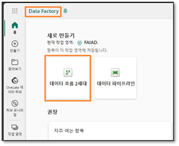
 
Se le dirigirá de vuelta a la **página de del flujo de datos**. Esta pantalla le resultará familiar, ya que es como la del flujo de datos de primera generación o Power Query. Notará que están disponibles las opciones para conectarse a varios orígenes de datos, junto con la capacidad de transformar datos. Conectémonos al origen de datos ADLS Gen2 y hagamos algunas transformaciones.

## Tarea 2: Crear una conexión a ADLS Gen2

1. 	En la cinta de opciones, seleccione **Inicio -> Obtener datos -> Más…**
   
 
 
2. 	Se le dirigirá al cuadro de diálogo **Obtener datos Elegir origen de datos**. Puede buscar el origen de datos si escribe en el cuadro de búsqueda. Observe que en el panel izquierdo hay opciones para usar una tabla en blanco o una consulta en blanco. También encontrará una nueva opción para Cargar archivo. Exploraremos esta opción en una práctica de laboratorio posterior. Por ahora, hagamos clic en **Ver más ->** en la esquina derecha de la pantalla. 

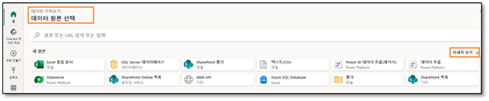
 
Ahora puede ver todos los orígenes de datos disponibles. Tiene la opción de filtrar los orígenes de datos por Archivo, Base de datos, Microsoft Fabric, Power Platform, Azure, etc.

 
 
3. 	Seleccione **Azure** entre las opciones de filtro superiores para filtrar por orígenes de datos de Azure. 
4. 	Seleccione **Azure Data Lake Storage Gen2**.

 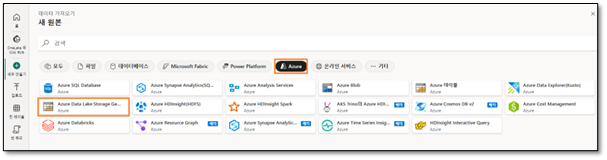
 
5. 	Se le dirigirá al cuadro de diálogo Conectarse a un origen de datos. Debe crear una conexión al origen de datos ADLS Gen2. En **Configuración de conexión -> Dirección URL**, introduzca este vínculo [https://stvnextblobstorage.dfs.core.windows.net/fabrikam-sales/Delta-Parquet-Format](https://stvnextblobstorage.dfs.core.windows.net/)

 
 
6. 	Seleccione **Clave de cuenta** en el menú desplegable Tipo de autenticación.
7. 	Copie la clave de cuenta de la pestaña Variables de entorno (al lado de la pestaña Guía de laboratorio) y péguela en el **cuadro de texto Clave de cuenta**.

8. 	Seleccione **Siguiente** en la esquina inferior derecha de la pantalla.

## Tarea 3: Crear consulta de carpeta base de ADLS Gen2

1. 	Una vez establecida la conexión, se le dirigirá a la pantalla de la **Vista previa de los datos de la carpeta**. Hay muchos archivos en la carpeta ADLS Gen2. Necesitamos datos de algunos de ellos. Seleccione **Crear** para crear una conexión a la carpeta.

 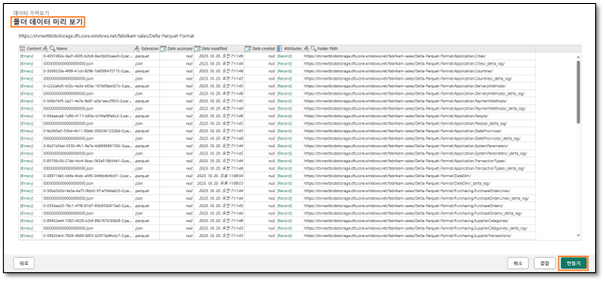
 
2. 	Ha vuelto al cuadro de diálogo de **Power Query**. Esta será la conexión a la carpeta raíz de ADLS Gen2. Haremos referencia a esta consulta en consultas posteriores. Vamos a cambiar el nombre de la consulta. En el **panel derecho**, bajo **Configuración de consulta -> Propiedades -> Nombre**, cambie el nombre a **ADLS Base Folder**

3. 	Todas las consultas del flujo de datos Gen2 se cargan en un lakehouse de almacenamiento provisional de forma predeterminada. Como parte de este laboratorio, no almacenaremos provisionalmente datos. Para deshabilitar esta carga, en el **panel izquierdo, haga clic derecho en la consulta ADLS Base Folder**. 

**Nota:** El almacenamiento provisional se utiliza cuando necesitamos preparar datos para usarlos en una mayor transformación antes de que estén listos para el consumo. 

4. 	**Desmarque la opción Habilitar el almacenamiento provisional**.

 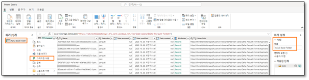
  
Observe que hay dos formatos de archivo en la carpeta, **json** y **Parquet**.

- **Parquet:** es un formato de archivo de código abierto creado para gestionar formatos de datos de almacenamiento de columnas planas. Parquet funciona bien con datos complejos en grandes volúmenes y es conocido por su excelente compresión de datos y su capacidad para gestionar una amplia variedad de tipos de codificación.
- **Json:** el archivo contiene metadatos como esquema, tipo de datos del archivo Parquet.

5. 	Solo necesitamos el archivo Parquet, ya que este tiene los datos que necesitamos. Seleccione la **flecha desplegable de la columna Extensión**.
6. 	**Desmarque .json** para que se filtre por archivos .parquet.
7. 	Seleccione **Aceptar**.

   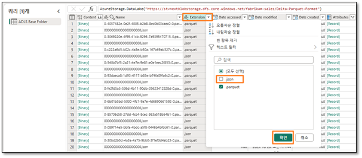
   
Ahora tenemos la consulta base configurada. Podemos hacer referencia a esto para todas las consultas del origen ADLS Gen2.

## Tarea 4: Crear consulta Cities

Los datos de Sales están disponibles por granularidad Geography, Product, SalesPerson y Date. Primero creemos una consulta para obtener la dimensión Geo. Los datos de Geo están disponibles en tres archivos diferentes ubicados en las siguientes subcarpetas:

- Cities: Application.Cities
- Countries: Application.Countries
- State: Application.StateProvinces
- 
Necesitamos combinar datos de City, State y Country de estos tres archivos para crear la dimensión Geo.

1. 	Comencemos por City. En el panel izquierdo, **haga clic derecho en ADLS Base Folder**. Seleccione **Referencia** para crear una nueva consulta que haga referencia a la consulta ADLS Base Folder.

   
   
2. 	Seleccione la **flecha desplegable de la columna Folder Path**. 
3. 	Seleccione **Filtros de texto -> Contiene…**

 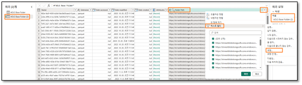 
 
4. 	En el cuadro de diálogo **Filtrar filas**, introduzca **Application.Cities** 

**Nota**: Distingue mayúsculas de minúsculas.

5. 	Seleccione **Aceptar**.

6. 	Los datos se filtrarán en una fila única. Seleccione **Binary** en la **columna Content**.

   
 
7. 	Observe que verá todos los detalles de la ciudad. En el **panel derecho**, en **Configuración de consulta -> Propiedades -> Nombre**, cambie el nombre a **Cities**

**Nota:** en la esquina inferior derecha de la captura de pantalla, asegúrese de que la consulta tiene cuatro pasos aplicados y espere a que termine de cargarse. Puede tardar varios minutos.

   
 
En el panel derecho, en **Pasos aplicados**, observe que todos los pasos están registrados. Este comportamiento es similar al de Power Query. Ahora sigamos un proceso similar para crear la consulta **Country**.

## Tarea 5: Crear consulta Countries

1. 	En el panel izquierdo, **haga clic derecho en ADLS Base Folder**. Seleccione **Referencia** para crear una nueva consulta que haga referencia a la consulta ADLS Base Folder.

   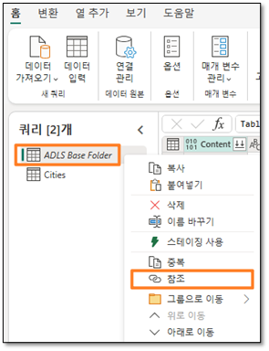

2. 	Seleccione la **flecha desplegable** de la **columna Folder Path**. 
3. 	Seleccione **Filtros de texto -> Contiene…**

    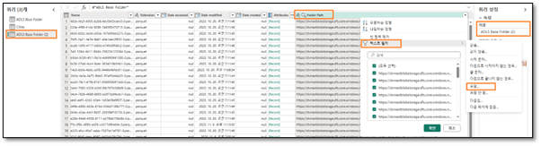
 
4. 	En el cuadro de diálogo **Filtrar filas**, introduzca **Application.Countries** 

**Nota:** Distingue mayúsculas de minúsculas.

5. 	Seleccione **Aceptar**.

   
 
6. 	Los datos se filtrarán en una fila única. Seleccione **Binary** en la **columna Content**.
 
   

7. 	Observe que verá todos los detalles del país. En el **panel derecho**, en **Configuración de consulta -> Propiedades -> Nombre**, cambie el nombre a **Countries**

**Nota:** en la esquina inferior derecha de la captura de pantalla, asegúrese de que la consulta tiene cuatro pasos aplicados y espere a que termine de cargarse. Puede tardar varios minutos.

   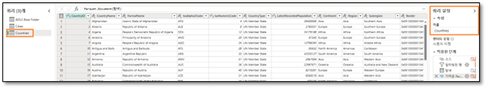
    
Lo siguiente que debemos hacer es incorporar State, pero los pasos se están volviendo repetitivos. Ya tenemos las consultas en el archivo de Power BI Desktop. Veamos si podemos copiar las consultas desde allí.

## Tarea 6: Crear States mediante Copiar: opción 1

1. 	Si aún no lo ha abierto, abra **FAIAD.pbix**, que se encuentra en la carpeta **Report** en el **Escritorio** de su entorno de laboratorio. 
2. 	En la cinta de opciones, seleccione **Inicio -> Transformar datos**. Se abre la ventana de Power Query. Como habrá notado en la práctica de laboratorio anterior, las consultas en el panel izquierdo están organizadas por orígenes de datos.

    

3. 	En el panel izquierdo, en la carpeta ADLSData, **haga clic derecho en la consulta States** y seleccione **Copiar**.
 
    

4. 	Vuelva al **explorador**. Debería estar en el flujo de datos en el que estábamos trabajando.
5. 	En el panel izquierdo, seleccione el panel **Consultas** e introduzca **Ctrl+V** (actualmente, hacer clic con el botón derecho en Pegar no es compatible).

     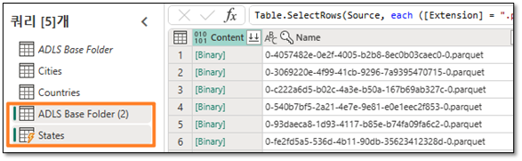
   	
Observe que ADLS Base Folder (2) también se copia. Esto se debe a que States hace referencia a ADLS Base Folder en Power BI Desktop, pero ya tenemos ADLS Base Folder. Vamos a resolver esto.

6. 	Seleccione la consulta **States**.
7. 	Desde el **panel derecho**, en **Pasos aplicados**, seleccione **Source**.
8. 	En la barra de fórmulas, cambie de #"ADLS Base Folder (2)" a **#"ADLS Base Folder"**

       

9. 	Haga clic en la **marca de verificación** al lado de la barra de fórmulas o pulse **Enter**.
    

10. Ahora podemos eliminar ADLS Base Folder(2). En el panel izquierdo, en la sección **Consultas, haga clic con el botón derecho en la consulta ADLS Base Folder(2)** y seleccione **Eliminar**.
 

11. Aparece el cuadro de diálogo Eliminar consulta. Seleccione **Eliminar** para confirmar.

**Nota:** asegúrese de que la consulta tenga cuatro pasos aplicados y espere a que termine de cargarse. Puede tardar varios minutos.

## Tarea 7: Crear una consulta Geo mediante Copiar: opción 2

Ahora necesitamos fusionar estas consultas para crear la dimensión Geo. Copiemos la consulta nuevamente desde el archivo de Power BI Desktop. Esta vez copiemos el código del Editor avanzado.

1. 	Vuelva a la **ventana de Power Query** del archivo de Power BI Desktop.
2. 	En el panel izquierdo, en **Consultas**, seleccione la consulta **Geo** en la carpeta de ADLSData.
3. 	En la cinta de opciones, seleccione **Inicio -> Editor avanzado**.
 

4. 	Se abre la ventana del Editor avanzado. **Resalte todo el texto** en el Editor avanzado.
5. 	**Haga clic derecho** y seleccione **Copy**.

 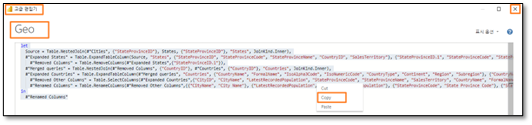

6. 	Seleccione **X** en la esquina superior derecha de la ventana o seleccione Listo para cerrar la ventana del Editor avanzado.
7. 	Vuelva a la ventana **Flujo de datos** en el explorador. 
8. 	En la cinta de opciones, seleccione **Obtener datos -> Consulta en blanco**.

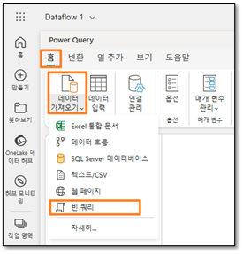 

9. 	Obtener datos, se abre el cuadro de diálogo del Editor avanzado Conectarse a origen de datos. **Resalte todo el texto** en el editor.
10. Seleccione **Eliminar** en su teclado para borrar todo el texto.
11. El Editor avanzado debe estar en blanco. Ahora introduzca **Ctrl+V** para pegar el contenido que había copiado del Editor avanzado de Power BI Desktop.
12. Seleccione **Siguiente**.

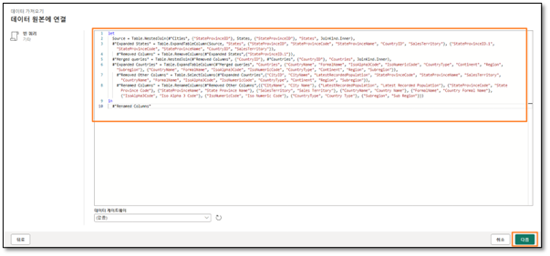 

13. Ahora tenemos la dimensión Geo. Vamos a cambiar el nombre de la consulta. En el **panel derecho**, en **Configuración de consulta -> Propiedades -> Nombre**, cambie el nombre a **Geo**

**Nota:** Espere a que la consulta termine de cargarse. Puede tardar varios minutos.
Repasemos los pasos para comprender cómo se creó Geo. Desde el panel derecho, en Pasos aplicados, seleccione **Source**. Si observa la barra de fórmulas o hace clic en Configuración, notará que el origen de esta consulta es una unión entre Cities y States. A medida que siga los pasos, notará que el resultado de la primera unión a su vez se une a Countries. Entonces, las tres consultas se utilizan para crear la dimensión Geo.
 

## Tarea 8: Configurar el destino de datos para la consulta Geo

Ahora que tenemos una dimensión, incorporemos estos datos a un lakehouse. Esta nueva característica está disponible en el flujo de datos Gen2.

1. 	Como se mencionó anteriormente, no vamos a almacenar provisionalmente ninguno de estos datos. Así que **haga clic derecho** en la consulta **Cities** y seleccione **Habilitar el almacenamiento provisional** para eliminar la marca de verificación.

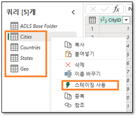
 
2. 	Siga los mismos pasos para las consultas **Countries y Geo** para **eliminar la marca de verificación junto a Habilitar el almacenamiento provisional**.
3. 	Seleccione la consulta **Geo**.
4. 	En la esquina inferior derecha, seleccione "+" junto a **Destino de datos**.
5. 	Seleccione **lakehouse** en el cuadro de diálogo.

 
6. 	Se abre el cuadro de diálogo Conectarse a un destino de datos. Necesitamos crear una nueva conexión con el lakehouse. Con **Crear nueva conexión** seleccionado en el **menú desplegable Conexión y Tipo de autenticación** configurado en **Cuenta de organización**, seleccione **Siguiente**.
 
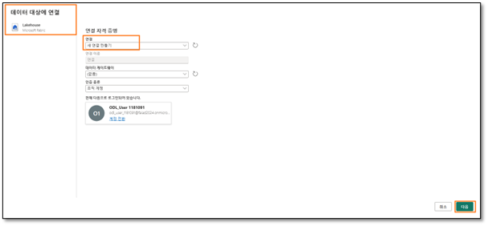

7. 	Una vez creada la conexión, se abre el cuadro de diálogo Elegir el objetivo de destino. Asegúrese de que el **botón de opción Nueva tabla** esté seleccionado, ya que estamos creando una nueva tabla.
8. 	Queremos crear la tabla en el lakehouse que creamos anteriormente. En el panel izquierdo, navegue hasta **Lakehouse -> FAIAD_<username>**.
9. 	Seleccione **lh_FAIAD**.
10. Deje el nombre de la tabla como **Geo**.
11. Seleccione **Siguiente**.
 
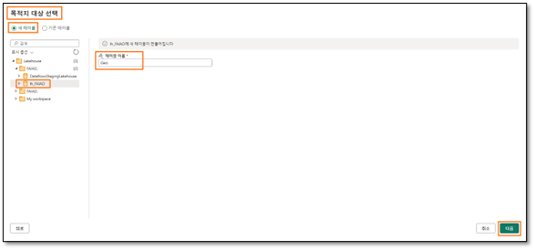

12. Se abre el cuadro de diálogo de configuración de Elegir la configuración de destino. Cada vez que se actualiza el flujo de datos Gen2, nos gustaría hacer una carga completa. Asegúrese de que el **Método de actualización** esté configurado en **Reemplazar**.
13. Observe que hay una advertencia que dice "Algunos nombres de columna contienen caracteres no admitidos. ¿Quiere que los corrijamos por usted?". Lakehouse no admite nombres de columnas con espacios. Seleccione **Reparar** para eliminar la advertencia.

**Nota:** También tiene la opción de Anexar datos. Si selecciona esta opción, cada vez que se actualiza el flujo de datos, se agregan datos nuevos a los existentes.

14. La asignación de columnas se puede utilizar para asignar columnas de flujo de datos a columnas existentes. En nuestro caso, es una tabla nueva. Por lo tanto, podemos usar la opción predeterminada. Seleccione **Guardar configuración**.
 

**Nota:** Si no desea algunas de las columnas en el lakehouse, use la casilla a la derecha de la columna Origen para desmarcar las columnas que no necesita.

## Tarea 9: Publicar el flujo de datos

1. 	Volverá a la **ventana de Power Query**. Observe que en la esquina inferior derecha, **el destino de los datos está configurado en el lakehouse**.
2. 	Publiquemos estas consultas para que podamos revisar el lakehouse. Volveremos para agregar más consultas. En la esquina inferior derecha, seleccione **Publicar**.
 

3. 	Se le dirigirá de nuevo a la **pantalla de Data Factory**. Es posible que el flujo de datos tarde unos minutos en publicarse. Una vez hecho esto, seleccione **el lakehouse lh_FAIAD**.
 

4. 	Esto le llevará a la **pantalla del explorador del lakehouse**. En el panel izquierdo, expanda **lh_FAIAD -> Tables**.
5. 	Observe que ahora tenemos la tabla **Geo** en el lakehouse. Expanda Geo y observe todas las columnas. 
6. 	**Seleccione la tabla Geo** y se abrirá la versión preliminar de los datos en el panel derecho.

 

También hay un punto de conexión de SQL que se puede utilizar para consultar esta tabla. Veremos esta opción en una práctica de laboratorio posterior. Ahora que sabemos que los datos de Geo llegaron al lakehouse, incorporemos el resto de los datos de ADLS Gen2.

## Tarea 10: Cambio del nombre del flujo de datos

1. 	En la barra de menú de la izquierda, seleccione **FAIAD_<username>** para volver al **área de trabajo**.
2. 	Estamos trabajando con el Dataflow 1. Cambiémosle el nombre antes de continuar. Haga clic en los **puntos suspensivos (…)** junto a Dataflow 1. Seleccione **Propiedades**.
 

3. 	Se abre el cuadro de diálogo de propiedades del flujo de datos. Cambie el nombre a **df_Sales_ADLS**

**Nota:** anteponemos el nombre del flujo de datos con "**df**". Esto hará que sea más fácil buscar y ordenar.

4. 	En el cuadro de texto **Descripción**, agregue **Dataflow to ingest Sales Data from ADLS to Lakehouse**.
5. 	Seleccione **Guardar**.
 

## Tarea 11: Crear consultas restantes en el flujo de datos

1. 	Se le dirigirá de nuevo a la pantalla de Data Factory. Seleccione el flujo de datos **df_Sales_ADLS** para volver al flujo de datos.

Para hacer el proceso más fácil, veamos si podemos copiar las consultas desde Power BI Desktop.
2. 	Si aún no lo ha abierto, abra **FAIAD.pbix**, que se encuentra en la carpeta **Report** en el **Escritorio** de su entorno de laboratorio.
3. 	En la cinta de opciones, seleccione **Inicio -> Transformar**. Se abre la ventana de Power Query.
4. 	Desde el panel **Consultas** de la izquierda, pulse **Ctrl+Seleccionar** mientras sigue las consultas de **ADLSData**.
a.	Product
b.	Product Groups
c.	Product Item Group
d.	Product Details
e.	Invoice
f.	InvoiceLineItems
g.	Sales
h.	BuyingGroup
i.	Reseller
j.	Date
5. 	**Haga clic derecho** y seleccione **Copiar**.

 
 
6. 	Vuelva a la ventana del explorador del flujo de datos **df_Sales_ADLS**.
7. 	En el panel izquierdo, seleccione el panel **Consultas** e introduzca **Ctrl+V** (actualmente, hacer clic con el botón derecho en Pegar no es compatible).

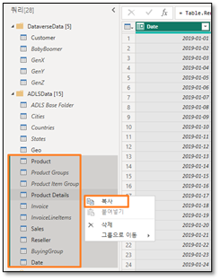
 
8. 	Como se mencionó anteriormente, no vamos a almacenar provisionalmente ninguno de estos datos. Así que haga **clic derecho** en las siguientes consultas y seleccione **Habilitar el almacenamiento provisional** para eliminar la marca de verificación.
a.	Product
b.	Product Details
c.	Reseller
d.	Date
e.	Sales

**Nota:** Si la carga está deshabilitada en Power BI Desktop, no tenemos que deshabilitar el almacenamiento provisional en el flujo de datos. Por lo tanto, no tenemos que deshabilitar el almacenamiento provisional para Product Item Group, Product Groups, etc.

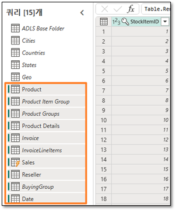
 
Asegúrese de que **todas las consultas se procesen**. Una vez hecho esto, incorporemos estos datos al lakehouse. 

## Tarea 12: Configurar el destino de datos para las consultas restantes

1. 	Seleccione la consulta de **Product**.
2. 	En la esquina inferior derecha, seleccione "**+**" junto a **Destino de datos**.
3. 	Seleccione **lakehouse** en el cuadro de diálogo.

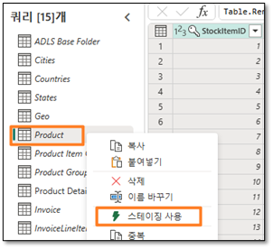 

4. 	Se abre el cuadro de diálogo Conectarse a un destino de datos. Desde el **menú desplegable de Conexión**, seleccione **Lakehouse (ninguno)**.
5. 	Seleccione **Siguiente**.

 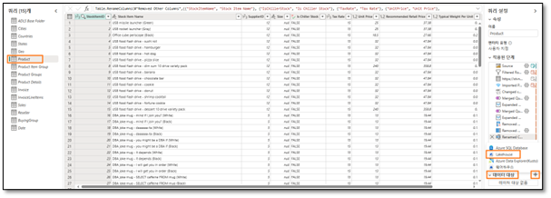

6. 	Se abre el cuadro de diálogo de Elegir el objetivo de destino. Asegúrese de que el **botón de opción Nueva tabla** esté seleccionado, ya que estamos creando una nueva tabla.
7. 	Queremos crear la tabla en el lakehouse que creamos anteriormente. En el panel izquierdo, navegue hasta **Lakehouse -> FAIAD_<username>**.
8. 	Seleccione **lh_FAIAD**.
9. 	Deje el nombre de la tabla como Product.
10. Seleccione **Siguiente**.
 
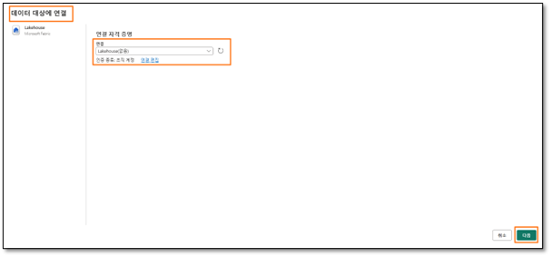

11. Se abre el cuadro de diálogo de configuración de Elegir la configuración de destino. Cada vez que se actualiza el flujo de datos Gen2, nos gustaría hacer una carga completa. Asegúrese de que el **Método de actualización** esté configurado en **Reemplazar**.
12. Observe que hay una advertencia que dice "Algunos nombres de columna contienen caracteres no admitidos. ¿Quiere que los corrijamos por usted?". Lakehouse no admite nombres de columnas con espacios. Seleccione **Reparar** para eliminar la advertencia.
13. La asignación de columnas se puede utilizar para asignar columnas de flujo de datos a columnas existentes. En nuestro caso, es una tabla nueva. Por lo tanto, podemos usar la opción predeterminada. Seleccione **Guardar configuración**.

 
14. Volverá a la **ventana de Power Query**. Observe que en la **esquina inferior derecha**, el destino de los datos está configurado en el **lakehouse**.
15. De manera similar, configure el **Destino de datos** para las siguientes consultas:
a.	Product Details
b.	Reseller
c.	Date
d.	Sales
16. Tenemos un flujo de datos que ingiere datos de ADLS en el lakehouse. Sigamos adelante y publiquemos este flujo de datos. Seleccione **Publicar** en la esquina inferior derecha.

 
Se le dirigirá de nuevo a la página principal de Data Factory. El flujo de datos puede tardar unos minutos en actualizarse.
En la próxima práctica de laboratorio, ingeriremos datos de otros orígenes de datos.

## Referencias
Fabric Analyst in a Day (FAIAD) le presenta algunas funciones clave disponibles en Microsoft Fabric. En el menú del servicio, la sección Ayuda (?) tiene vínculos a algunos recursos excelentes.

   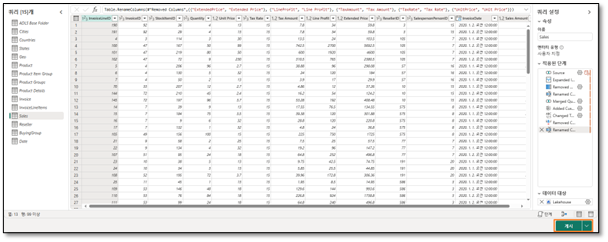
 
Estos son algunos recursos más que podrán ayudarle a seguir avanzando con Microsoft Fabric.
- Vea la publicación del blog para leer el [anuncio de disponibilidad general de Microsoft Fabric](https://aka.ms/Fabric-Hero-Blog-Ignite23) completo.
- Explore Fabric a través de la [Visita guiada](https://aka.ms/Fabric-GuidedTour)
- Regístrese en la [prueba gratuita de Microsoft Fabric](https://aka.ms/microsoft-fabric)
- Visite el [sitio web de Microsoft Fabric](https://aka.ms/microsoft-fabric)
- Adquiera nuevas capacidades mediante la exploración de los [módulos de aprendizaje de Fabric](https://aka.ms/learn-fabric)
- Explore la [documentación técnica de Fabric](https://aka.ms/fabric-docs)
- Lea el libro [electrónico gratuito sobre cómo empezar a usar Fabric](https://aka.ms/fabric-get-started-ebook)
- Únase a la [comunidad de Fabric](https://aka.ms/fabric-community) para publicar sus preguntas, compartir sus comentarios y aprender de otros.

Obtenga más información en los blogs de anuncios de la experiencia Fabric:

- [Experiencia de Data Factory en el blog de Fabric ](https://aka.ms/Fabric-Data-Factory-Blog)
- [Experiencia de Synapse Data Engineering en el blog de Fabric ](https://aka.ms/Fabric-DE-Blog)
- [Experiencia de Synapse Data Science en el blog de Fabric ](https://aka.ms/Fabric-DS-Blog)
- [Experiencia de Synapse Data Warehousing en el blog de Fabric ](https://aka.ms/Fabric-DW-Blog)
- [Experiencia de Synapse Real-Time Analytics en el blog de Fabric](https://aka.ms/Fabric-RTA-Blog)
- [Blog de anuncios de Power BI](https://aka.ms/Fabric-PBI-Blog)
- [Experiencia de Data Activator en el blog de Fabric](https://aka.ms/Fabric-DA-Blog) 
- [Administración y gobernanza en el blog de Fabric](https://aka.ms/Fabric-Admin-Gov-Blog)
- [OneLake en el blog de Fabric](https://aka.ms/Fabric-OneLake-Blog)
- [Blog de integración de Dataverse y Microsoft Fabric](https://aka.ms/Dataverse-Fabric-Blog)

© 2023 Microsoft Corporation. Todos los derechos reservados.

Al participar en esta demostración o laboratorio práctico, acepta las siguientes condiciones:

Microsoft Corporation pone a su disposición la tecnología o funcionalidad descrita en esta demostración/laboratorio práctico con el fin de obtener comentarios por su parte y de facilitarle una experiencia de aprendizaje. Esta demostración/laboratorio práctico solo se puede usar para evaluar las características de tal tecnología o funcionalidad y para proporcionar comentarios a Microsoft. No se puede usar para ningún otro propósito. Ninguna parte de esta demostración/laboratorio práctico se puede modificar, copiar, distribuir, transmitir, mostrar, realizar, reproducir, publicar, licenciar, transferir ni vender, ni tampoco crear trabajos derivados de ella.

LA COPIA O REPRODUCCIÓN DE ESTA DEMOSTRACIÓN/LABORATORIO PRÁCTICO (O PARTE DE ELLA) EN CUALQUIER OTRO SERVIDOR O UBICACIÓN PARA SU REPRODUCCIÓN O DISTRIBUCIÓN POSTERIOR QUEDA EXPRESAMENTE PROHIBIDA.

ESTA DEMOSTRACIÓN/LABORATORIO PRÁCTICO PROPORCIONA CIERTAS FUNCIONES Y CARACTERÍSTICAS DE PRODUCTOS O TECNOLOGÍAS DE SOFTWARE (INCLUIDOS POSIBLES NUEVOS CONCEPTOS Y CARACTERÍSTICAS) EN UN ENTORNO SIMULADO SIN INSTALACIÓN O CONFIGURACIÓN COMPLEJA PARA EL PROPÓSITO ARRIBA DESCRITO. LA TECNOLOGÍA/CONCEPTOS DESCRITOS EN ESTA DEMOSTRACIÓN/LABORATORIO PRÁCTICO NO REPRESENTAN LA FUNCIONALIDAD COMPLETA DE LAS CARACTERÍSTICAS Y, EN ESTE SENTIDO, ES POSIBLE QUE NO FUNCIONEN DEL MODO EN QUE LO HARÁN EN UNA VERSIÓN FINAL. ASIMISMO, PUEDE QUE NO SE PUBLIQUE UNA VERSIÓN FINAL DE TALES CARACTERÍSTICAS O CONCEPTOS. DE IGUAL MODO, SU EXPERIENCIA CON EL USO DE ESTAS CARACTERÍSTICAS Y FUNCIONALIDADES EN UN ENTORNO FÍSICO PUEDE SER DIFERENTE.

**COMENTARIOS**. Si envía comentarios a Microsoft sobre las características, funcionalidades o conceptos de tecnología descritos en esta demostración/laboratorio práctico, acepta otorgar a Microsoft, sin cargo alguno, el derecho a usar, compartir y comercializar sus comentarios de cualquier modo y para cualquier fin. También concederá a terceros, sin cargo alguno, los derechos de patente necesarios para que sus productos, tecnologías y servicios usen o interactúen con cualquier parte específica de un software o servicio de Microsoft que incluya los comentarios. No enviará comentarios que estén sujetos a una licencia que obligue a Microsoft a conceder su software o documentación bajo licencia a terceras partes porque incluyamos sus comentarios en ellos. Estos derechos seguirán vigentes después del vencimiento de este acuerdo.
MICROSOFT CORPORATION RENUNCIA POR LA PRESENTE A TODAS LAS GARANTÍAS Y CONDICIONES RELATIVAS A LA DEMOSTRACIÓN/LABORATORIO PRÁCTICO, INCLUIDA CUALQUIER GARANTÍA Y CONDICIÓN DE COMERCIABILIDAD (YA SEA EXPRESA, IMPLÍCITA O ESTATUTARIA), DE IDONEIDAD PARA UN FIN DETERMINADO, DE TITULARIDAD Y DE AUSENCIA DE INFRACCIÓN. MICROSOFT NO DECLARA NI GARANTIZA LA EXACTITUD DE LOS RESULTADOS, EL RESULTADO DERIVADO DE LA REALIZACIÓN DE LA DEMOSTRACIÓN/LABORATORIO PRÁCTICO NI LA IDONEIDAD DE LA INFORMACIÓN CONTENIDA EN ELLA CON NINGÚN PROPÓSITO.

**DECLINACIÓN DE RESPONSABILIDADES**
Esta demostración/laboratorio práctico contiene solo una parte de las nuevas características y mejoras realizadas en Microsoft Power BI. Puede que algunas de las características cambien en versiones futuras del producto. En esta demostración/laboratorio práctico, conocerá algunas de estas nuevas características, pero no todas.

