# Inhalt 

- Einführung
- Dataflow Gen2
   - Aufgabe 1: Dataflow Gen2 erstellen
   - Aufgabe 2: Verbindung zu ADLS Gen2 herstellen
   - Aufgabe 3: Die Abfrage für den Ordner „Base ADLS Gen2“ erstellen
   - Aufgabe 4: Abfrage „Cities“ erstellen
   - Aufgabe 5: Abfrage „Countries“ erstellen
   - Aufgabe 6: States mit Kopieren – Option 1 erstellen	
   - Aufgabe 7: Abfrage „Geo“ mit Kopieren erstellen – Option 2
   - Aufgabe 8: Datenziel für die Abfrage „Geo“ konfigurieren
   - Aufgabe 9: Dataflow veröffentlichen
   - Aufgabe 10: Dataflow umbenennen
   - Aufgabe 11: Verbleibende Abfragen im Dataflow erstellen
   - Aufgabe 12: Datenziel für verbleibende Abfragen konfigurieren
- Referenzen

# Einführung  

In unserem Szenario stammen die Verkaufsdaten aus dem ERP-System und werden in einer ADLS Gen2-Datenbank gespeichert. Jeden Tag um 12 Uhr mittags werden die Daten aktualisiert. Wir müssen diese Daten transformieren, in Lakehouse erfassen und in unserem Modell verwenden. 

Es gibt mehrere Möglichkeiten, diese Daten zu erfassen.

- **Verknüpfungen:** Hiermit können keine Daten transformiert werden.  

- **Notebooks:** Dafür müssen wir Code schreiben. Es handelt sich um einen entwicklerfreundlichen Ansatz. 

- **Dataflow Gen2:** Sie sind wahrscheinlich mit Power Query oder Dataflow Gen1 vertraut. Dataflow Gen2 ist, wie der Name schon sagt, die neuere Version von Dataflow. Es bietet alle Funktionen von Power Query/Dataflow Gen1 und ermöglicht zusätzlich die Transformation und Erfassung von Daten in mehreren Datenquellen. Wir werden dies in den nächsten Übungen vorstellen. 

- **Datenpipeline:** Dies ist ein Orchestrierungstool. Aktivitäten können orchestriert werden, um Daten zu extrahieren, zu transformieren und zu erfassen. Wir werden Data Pipeline verwenden, um Dataflow Gen2-Aktivitäten auszuführen, die wiederum Extraktion, Transformation und Aufnahme durchführen.  

Wir beginnen mit Dataflow Gen2, um eine Verbindung zur Datenquelle und den notwendigen Transformationen herzustellen. Dann werden wir Dataflow Gen2 mit Data Pipeline orchestrieren/ausführen. 

Inhalt dieser Übung:  

- So erstellen Sie Dataflow Gen2 

- So stellen Sie mithilfe von Dataflow Gen2 eine Verbindung zu ADLS Gen2 her und transformieren Daten 

- So erfassen Sie Daten in Lakehouse

## Dataflow Gen2

## Aufgabe 1: Dataflow Gen2 erstellen 

1. Navigieren wir zurück zum **Fabric-Arbeitsbereich**, den Sie in Übung 2, Aufgabe 8, erstellt haben. 

2. Wenn Sie nach der vorherigen Übung nicht zu einem anderen Bereich navigiert sind, befinden Sie sich im Lakehouse-Bildschirm. Wenn Sie zu einem anderen Bereich navigiert sind, ist das in Ordnung. Wählen Sie unten links auf dem Bildschirm **Data Engineering** aus.

3. Wählen Sie im geöffneten Dialogfeld für den Fabric-Funktionsbereich Data Factory aus. **Data Factory** verfügt über Workloads, die zum Extrahieren, Transformieren und Erfassen von Daten erforderlich sind. 

    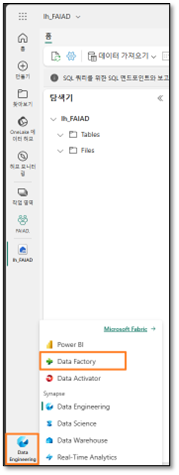

4. Sie werden zur Data Factory-Startseite weitergeleitet. Wählen Sie unter „Neu“ die Option **Datenfluss Gen2** aus.

    

  Sie werden zur **Dataflow-Seite** weitergeleitet. Dieser Bildschirm wird Ihnen bekannt vorkommen, da er Dataflow Gen1 oder Power Query ähnelt. Sie werden feststellen, dass die Optionen zum Herstellen einer Verbindung zu verschiedenen Datenquellen sowie die Möglichkeit zur Datentransformation verfügbar sind. Stellen wir eine Verbindung zur ADLS Gen2-Datenquelle her und führen einige Transformationen durch. 

## Aufgabe 2: Verbindung zu ADLS Gen2 herstellen 

1. Wählen Sie im Menüband **Start -> Daten abrufen -> Mehr…**

    

2. Sie werden zum Dialogfeld **Daten abrufen Datenquelle auswählen** weitergeleitet. Sie können nach der Datenquelle suchen, indem Sie sie in das Suchfeld eingeben. Beachten Sie, dass im linken Bereich Optionen zur Verwendung einer Blank-Tabelle oder Blank-Abfrage vorhanden ist. Es ist außerdem eine neue Option zum Hochladen von Dateien verfügbar. Wir werden diese Option in einer späteren Übung untersuchen. Klicken wir zunächst oben rechts im Bildschirm auf **Mehr anzeigen ->**.

    

Jetzt können Sie alle verfügbaren Datenquellen anzeigen. Sie haben die Möglichkeit, die Datenquellen nach Datei, Datenbank, Microsoft Fabric, Power Platform, Azure usw. zu filtern.

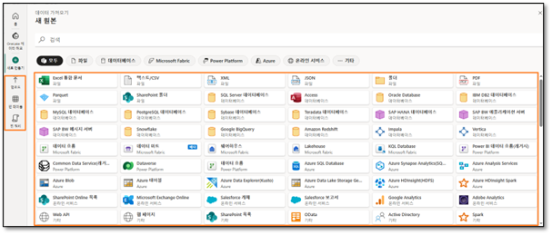

3. Wählen Sie **Azure** aus den oberen Filteroptionen aus, um nach Azure-Datenquellen zu filtern.  
4. Wählen Sie **Azure Data Lake Storage Gen2** aus.

    

5. Sie werden zum Dialogfeld „Mit Datenquelle verbinden“ weitergeleitet. Sie müssen eine Verbindung zur ADLS Gen2-Datenquelle herstellen. Geben Sie unter **Verbindungseinstellungen -> URL** diesen Link https://stvnextblobstorage.dfs.core.windows.net/fabrikam-sales/Delta-Parquet-Format ein.

    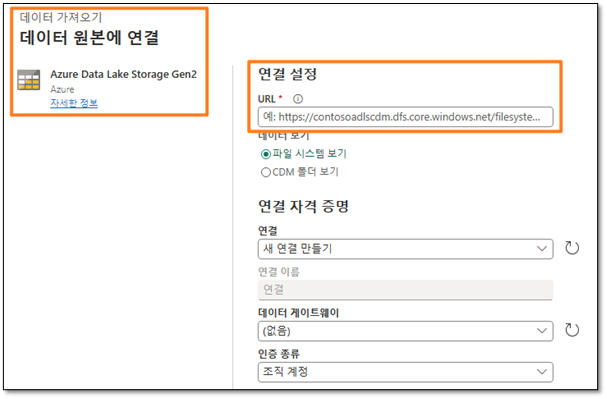
 
6. Wählen Sie **Kontoschlüssel** aus der Dropdown-Liste „Authentifizierungsart“ aus.

7. Kopieren Sie den Kontoschlüssel von der Registerkarte „Environment Variables“ (neben der Registerkarte „Lab-Anleitung“) und fügen Sie ihn in das Textfeld **Kontoschlüssel** ein.

   

8. Wählen Sie unten rechts auf dem Bildschirm **Weiter** aus.

## Aufgabe 3: Die Abfrage für den Ordner „Base ADLS Gen2“ erstellen 

1. Sobald die Verbindung hergestellt ist, werden Sie zum Bildschirm **Vorschau der Ordnerdaten anzeigen** weitergeleitet. Im ADLS Gen2-Ordner sind viele Dateien enthalten. Wir benötigen Daten aus einigen von ihnen. Wählen Sie **Erstellen** aus, um eine Verbindung zum Ordner herzustellen.

   

2. Sie befinden sich wieder im Dialogfeld **Power Query**. Dies ist die Verbindung zum Stammordner von ADLS Gen2. Wir werden in nachfolgenden Abfragen auf diese Abfrage verweisen. Wir benennen die Abfrage um. Ändern Sie im **rechten Bereich** unter **Abfrageeinstellungen -> Eigenschaften -> Name** den Namen in **ADLS Base Folder**.
3. Alle Abfragen von Dataflow Gen2 werden standardmäßig in ein Staging Lakehouse geladen. Im Rahmen dieser Übung werden wir keine Daten bereitstellen. Klicken Sie im **linken Bereich mit der rechten Maustaste auf die Abfrage „ADLS Base Folder“,** um diesen Ladevorgang zu deaktivieren.

**Hinweis:** Staging wird verwendet, wenn wir Daten für die weitere Transformation bereitstellen müssen, bevor sie für die Nutzung bereit sind.

4. **Deaktivieren Sie die Option „Staging aktivieren“.**

   

Beachten Sie, dass der Ordner zwei Dateiformate enthält: **JSON** und **Parquet**. 

- **Parquet:** ist ein Open-Source-Dateiformat, das für die Verarbeitung einfacher spaltenorientierter Speicherdatenformate entwickelt wurde. Parquet funktioniert gut mit komplexen Daten in großen Mengen und ist sowohl für seine leistungsstarke Datenkomprimierung als auch für seine Fähigkeit bekannt, eine Vielzahl von Codierungstypen zu verarbeiten. 
- **JSON:** Diese Datei enthält Metadaten wie Schema, Datentyp der Parquet-Datei. 
 
5. Wir benötigen lediglich die Parquet-Datei, da diese die von uns benötigten Daten enthält. Wählen Sie den **Dropdown-Pfeil Extension aus**.
6. **Deaktivieren Sie .json**, sodass sie nach .parquet-Dateien gefiltert wird.
7. Wählen Sie **OK** aus.

    

Jetzt haben wir die Abfrage „Base“ eingerichtet. Wir können dies für alle Abfragen aus der ADLS Gen2-Quelle referenzieren. 

## Aufgabe 4: Abfrage „Cities“ erstellen 

Verkaufsdaten sind nach Geografie, Produkt, Verkäufer und Datengranularität verfügbar. Erstellen wir zunächst eine Abfrage, um die Geo-Dimension zu erhalten. Geodaten sind in drei verschiedenen Dateien verfügbar, die sich in den folgenden Unterordnern befinden: 

- **Cities:** Application.Cities 
- **Countries:** Application.Countries 
- **State:** Application.StateProvinces 

Wir müssen City-, State- und Country-Daten aus diesen drei Dateien kombinieren, um die Geo-Dimension zu erstellen. 

1. Beginnen wir mit „City“. Klicken Sie im linken Bereich **mit der rechten Maustaste auf „ADLS Base Folder“**. Wählen Sie **Verweis** aus, um eine neue Abfrage zu erstellen, die auf die Abfrage „ADLS Base Folder“ verweist.

    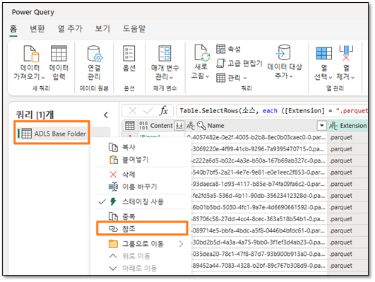

2.  Wählen Sie den **Dropdown-Pfeil der Spalte Folder Path** aus.
3.  Wählen Sie **Textfilter -> Enthält…** aus.

    

4.  Geben Sie im Dialog **Zeilen filtern Application.Cities** ein.

    **Hinweis:** Hier müssen Sie die  Groß- und Kleinschreibung beachten.

5. 	Wählen Sie **OK** aus.

    

6. 	Daten werden in einer einzelne Zeile gefiltert. Wählen Sie **Binary** unter der Spalte **Content** aus.

    

7. 	Beachten Sie, dass alle City-Details angezeigt werden. Ändern Sie im **rechten Bereich** unter **Abfrageeinstellungen -> Eigenschaften -> Name** den Namen in **Cities**. 
 
    **Hinweis:** Stellen Sie unten rechts im Screenshot sicher, dass die Abfrage über vier angewendete Schritte verfügt, und warten Sie, bis sie vollständig geladen ist. Dies kann einige Minuten dauern. 

    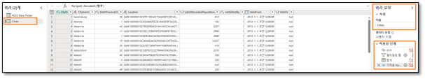

Beachten Sie im rechten Bereich unter **Angewendete Schritte**, dass alle Schritte registriert sind. Dieses Verhalten ist mit dem von Power Query identisch. Folgen wir nun einem ähnlichen Prozess, um die Abfrage **Country** zu erstellen. 

## Aufgabe 5: Abfrage „Countries“ erstellen 

1. 	Klicken Sie im linken Bereich **mit der rechten Maustaste auf „ADLS Base Folder“**. Wählen Sie **Verweis** aus, um eine neue Abfrage zu erstellen, die auf die Abfrage „ADLS Base Folder“ verweist. 

    

2. 	Wählen Sie den **Dropdown-Pfeil** der **Spalte Folder Path** aus.
3. 	Wählen Sie **Textfilter -> Enthält…** aus.

    

4. 	Geben Sie im **Dialogfeld „Zeilen filtern“ Application.Countries** ein.
    **Hinweis:** Hierbei muss die Groß-/Kleinschreibung beachtet werden.
5. 	Wählen Sie **OK** aus. 

    

6. 	Daten werden in einer einzelne Zeile gefiltert. Wählen Sie **Binary** unter der Spalte **Content** aus.

    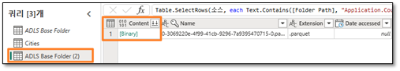

7. 	Beachten Sie, dass alle Country-Details angezeigt werden. Ändern Sie im **rechten Bereich** unter **Abfrageeinstellungen -> Eigenschaften -> Name** den Namen in **Countries**.
   **Hinweis:** Stellen Sie unten rechts im Screenshot sicher, dass die Abfrage über vier angewendete Schritte verfügt, und warten Sie, bis sie vollständig geladen ist. Dies kann einige Minuten dauern.

    

Als Nächstes müssen wir „State“ einfügen, aber die Schritte wiederholen sich immer mehr. Wir verfügen bereits über die Abfragen in der Power BI Desktop-Datei. Jetzt prüfen wir, ob wir die Abfragen von dort kopieren können. 

## Aufgabe 6: States mit Kopieren – Option 1 erstellen 

1. 	Öffnen Sie **FAIAD.pbix** im Ordner **Report** auf dem **Desktop** Ihrer Übungsumgebung, falls dies noch nicht erfolgt ist.  

2. 	Wählen Sie im Menüband **Start > Daten transformieren** aus. Das Power Query-Fenster wird geöffnet. Wie Sie in der vorherigen Übung festgestellt haben, sind die Abfragen im linken Bereich nach Datenquelle organisiert.

    

3. 	Klicken Sie im linken Bereich unter dem ADLSData-Ordner **mit der rechten Maustaste auf die Abfrage „States“**, und wählen Sie **Kopieren** aus.

    

4. 	Navigieren Sie zurück zum **Browser**. Sie sollten sich im Dataflow befinden, an dem wir gearbeitet haben.
5. 	Wählen Sie im linken Bereich den Bereich **Abfragen** aus, und geben Sie **STRG+V** ein (derzeit wird das Einfügen mit der rechten Maustaste nicht unterstützt).

    
 
 Beachten Sie, dass „ADLS Base Folder (2)“ ebenfalls kopiert wird. Dies liegt daran, dass sich „States“ auf „ADLS Base Folder“ in Power BI Desktop bezieht, wir aber bereits über „ADLS Base Folder“ verfügen. Lassen Sie uns dies lösen.

6. 	Wählen Sie die Abfrage **States** aus.
7. 	Wählen Sie im **rechten Bereich** unter **Angewendete Schritte** die Option **Source** aus.
8. 	Ändern Sie in der Formelleiste #”ADLS Base Folder (2)” in **#”ADLS Base Folder”**.

    

9. 	Klicken Sie auf das **Häkchen** neben der Bearbeitungsleiste, oder drücken Sie die **Eingabetaste**.

    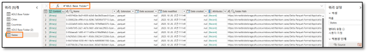

10. Jetzt können wir „ADLS Base Folder (2)“ entfernen. Klicken Sie im linken Bereich unter dem Abschnitt **Abfragen mit der rechten Maustaste auf die Abfrage ADLS Base Folder (2)**, und wählen Sie **Löschen** aus.

    

11. Das Dialogfeld „Abfrage löschen“ wird angezeigt. Wählen Sie zur Bestätigung **Löschen** aus.

**Hinweis:** Stellen Sie sicher, dass die Abfrage über vier angewendete Schritte verfügt, und warten Sie, bis die Abfrage vollständig geladen ist. Dies kann einige Minuten dauern. 

 ## Aufgabe 7: Abfrage „Geo“ mit Kopieren erstellen – Option 2 

Jetzt müssen wir diese Abfragen zusammenführen, um die Geo-Dimension zu erstellen. Wir kopieren die Abfrage erneut aus der Datei Power BI Desktop. Dieses Mal kopieren wir den Code aus dem erweiterten Editor. 

 1. Navigieren Sie zurück zum **Power Query-Fenster** der Power BI Desktop-Datei.
 2. Wählen Sie im linken Bereich unter **Abfragen** die Abfrage **Geo** im Ordner „ADLSData“ aus.
 3. Wählen Sie im Menüband die Registerkarte **Start -> Erweiterter Editor** aus.

    

 4. Das Fenster „Erweiterter Editor“ wird geöffnet. **Heben Sie den gesamten Text** im erweiterten Editor hervor. 
 5. **Klicken Sie mit der rechten Maustaste**, und wählen Sie **Kopieren** aus. 

    

 6. Klicken Sie oben rechts im Fenster auf **X**, oder wählen Sie die Option **Fertig** aus, um das Fenster „Erweiterter Editor“ zu schließen. 
 7. Navigieren Sie im Browser zurück zum Fenster **Dataflow**.  
 8. Klicken Sie im Menüband auf **Daten abrufen > Leere Abfrage**.

    

 9. Rufen Sie die Daten ab. Der Dialog „Erweiterter Editor“ mit der Option „Mit Datenquelle verbinden“ wird geöffnet. **Heben Sie den gesamten Text** im Editor hervor.
 10. Wählen Sie auf Ihrer Tastatur **Löschen** aus, um den gesamten Text zu löschen.
 11. Der erweiterte Editor sollte leer sein. Geben Sie nun **STRG+V** ein, um den Inhalt einzufügen, den Sie aus dem erweiterten Editor von Power BI Desktop kopiert haben.
 12. Wählen Sie **Weiter** aus.

     

 13. Jetzt verfügen wir über die Geo-Dimension. Wir benennen die Abfrage um. Ändern Sie im **rechten Bereich** unter **Abfrageeinstellungen -> Eigenschaften -> Name** den Namen in **Geo**. 
 
**Hinweis:** Warten Sie, bis die Abfrage vollständig geladen ist. Dies kann einige Minuten dauern. 

Gehen wir die Schritte durch, um zu verstehen, wie Geo erstellt wurde. Wählen Sie im rechten Bereich unter „Angewendete Schritte“ die Option **Quelle** aus. Wenn Sie sich die Bearbeitungsleiste ansehen oder auf „Einstellungen“ klicken, stellen Sie fest, dass die Quelle dieser Abfrage eine Verknüpfung zwischen Cities und States ist. Wenn Sie die Schritte durchgehen, stellen Sie fest, dass das Ergebnis der ersten Verknüpfung wiederum mit „Countries“ verknüpft wird. Daher werden alle drei Abfragen verwendet, um eine Geo-Dimension zu erstellen. 

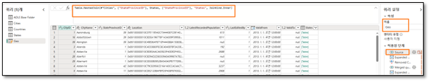

## Aufgabe 8: Datenziel für die Abfrage „Geo“ konfigurieren 

Jetzt verfügen wir über eine Dimension. Lassen Sie uns diese Daten in Lakehouse erfassen. Dies ist die neue Funktion, die in Dataflow Gen2 verfügbar ist. 

 1. Wie bereits erwähnt, stellen wir keine dieser Daten bereit. Klicken Sie also **mit der rechten Maustaste** auf die Abfrage **Cities**, und wählen Sie **Staging aktivieren** aus, um das Häkchen zu entfernen. 

    

 2. Befolgen Sie dieselben Schritte für die Abfrage **Countries und Geo**, um **das Häkchen neben** Staging aktivieren zu entfernen. 
 3. Wählen Sie die Abfrage **Geo** aus. 
 4. Wählen Sie unten rechts „+“ neben **Datenziel** aus. 
 5. Wählen Sie im Dialogfeld die Option **Lakehouse** aus. 

    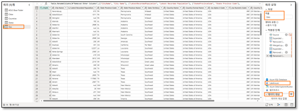

 6. Das Dialogfeld „Herstellen einer Verbindung mit dem Datenziel“ wird geöffnet. Wir müssen eine neue Verbindung zu Lakehouse herstellen. Wenn **Neue Verbindung erstellen** im **Dropdown-Menü „Verbindung“** ausgewählt und **Authentifizierungsart** auf **Organisationskonto** festgelegt ist, wählen Sie **Weiter** aus. 

    

 7. Nachdem die Verbindung hergestellt wurde, wird das Dialogfeld „Ziel auswählen“ geöffnet. Stellen Sie sicher, dass das **Optionsfeld „Neue Tabelle“** ausgewählt ist, da wir eine neue Tabelle erstellen.
 8. Wir möchten die zuvor erstellte Tabelle in Lakehouse erstellen. Navigieren Sie im linken Bereich zu  **Lakehouse -> FAIAD_<Benutzername>**.
 9. Wählen Sie lh_FAIAD aus.
 10. Behalten Sie den Tabellennamen **Geo** bei.
 11. Wählen Sie **Weiter** aus. 

     

 12. Das Dialogfeld „Zieleinstellungen auswählen“ wird geöffnet. Bei jeder Aktualisierung von Dataflow Gen2 möchten wir einen vollständigen Ladevorgang durchführen. Stellen Sie sicher, dass **Updatemethode** auf **Ersetzen** festgelegt ist.
 13. Beachten Sie, dass die Warnung „Einige Spaltennamen enthalten nicht unterstützte Zeichen. Sollen wir das Problem für Sie beheben?“ Lakehouse unterstützt keine Spaltennamen mit Leerzeichen. Wählen Sie **Korrigieren** aus, um die Warnung zu entfernen. 
 
**Hinweis:** Sie haben auch die Möglichkeit, Daten anzufügen. Wenn Sie diese Option auswählen, werden bei jeder Dataflow-Aktualisierung neue Daten an die vorhandenen Daten angefügt. 
 
 14. Mithilfe der Spaltenzuordnung können Dataflow-Spalten vorhandenen Spalten zugeordnet werden. In unserem Fall handelt es sich um eine neue Tabelle. Daher können wir die Standardwerte verwenden. Wählen Sie **Einstellungen speichern** aus. 

     

**Hinweis:** Wenn Sie einige der Spalten in Lakehouse nicht benötigen, verwenden Sie das Kontrollkästchen rechts neben der Quellspalte, um die nicht benötigten Spalten zu deaktivieren. 

## Aufgabe 9: Dataflow veröffentlichen 

 1. Sie werden zum **Power Query-Fenster** weitergeleitet. Beachten Sie, dass unten rechts das **Datenziel auf Lakehouse festgelegt ist**.
 2. Lassen Sie uns diese Abfragen veröffentlichen, damit wir Lakehouse überprüfen können. Wir werden darauf zurückkommen, um weitere Abfragen hinzuzufügen. Wählen Sie unten rechts **Veröffentlichen** aus. 

    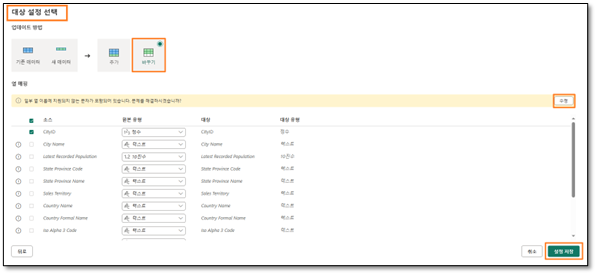

 3. Sie werden zum **Bildschirm „Data Factory“** weitergeleitet. Es kann einige Momente dauern, bis der Dataflow veröffentlicht wird. Wählen Sie abschließend **lh_FAIAD Lakehouse** aus. 

    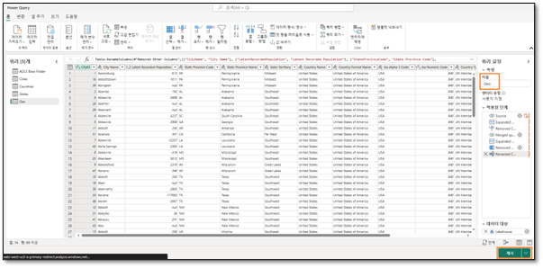

 4. Sie werden zum **Bildschirm „Lakehouse-Explorer“** weitergeleitet. Erweitern Sie im linken Bereich die Option **lh_FAIAD -> Tables**.
 5. Beachten Sie, dass jetzt eine Geo-Tabelle in Lakehouse vorhanden ist. Erweitern Sie **Geo**, und beachten Sie alle Spalten.
 6. **Wählen Sie die Geo**-Tabelle aus, sodass die Datenvorschau im rechten Bereich geöffnet wird. 

    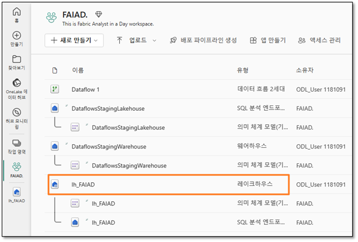

Es ist auch ein SQL-Endpunkt vorhanden, der zum Abfragen dieser Tabelle verwendet werden kann. Wir sehen uns diese Option in einer späteren Übung an. Da wir nun wissen, dass die Geodaten in Lakehouse vorhanden sind, fügen wir die restlichen Daten von ADLS Gen2 ein. 

 

## Aufgabe 10: Dataflow umbenennen 

 1. Wählen Sie in der linken Menüleiste **FAIAD_<Benutzername>** aus, um zum Arbeitsbereich zurückzukehren.
 2. Wir arbeiten mit Dataflow 1. Benennen wir es um, bevor wir fortfahren. Klicken Sie auf die **Auslassungspunkte (…)** neben Dataflow 1. Wählen Sie **Eigenschaften** aus. 

    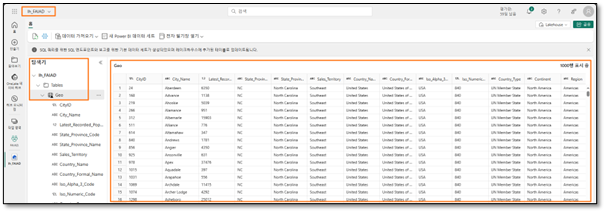

 3. Das Dialogfeld „Dataflow-Eigenschaften“ wird geöffnet. Ändern Sie den Namen in **df_Sales_ADLS**. 
 
**Hinweis:** Wir stellen dem Dataflow-Namen „df“ voran. Dadurch kann er einfacher gesucht und sortiert werden. 
 
 4. Fügen Sie im Textfeld **Beschreibung den Text Dataflow to ingest Sales Data from ADLS to Lakehouse hinzu**. 
 5. Wählen Sie **Speichern** aus. 

    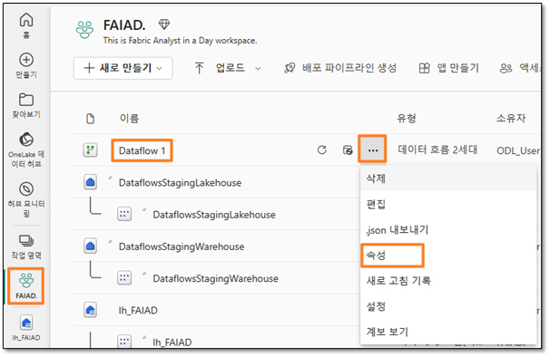

## Aufgabe 11: Verbleibende Abfragen im Dataflow erstellen 

 1. Sie werden zum Bildschirm „Data Factory“ weitergeleitet. Wählen Sie den Dataflow **df_Sales_ADLS** aus, um zum Dataflow zurückzukehren. 

    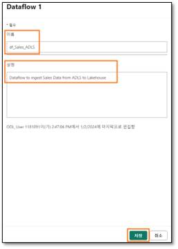

Zur Vereinfachung prüfen wir jetzt, ob wir die Abfragen aus Power BI Desktop kopieren können. 

 2. Öffnen Sie **FAIAD.pbix** im Ordner **Report** auf dem **Desktop** Ihrer Übungsumgebung, falls dies noch nicht erfolgt ist.
 3. Wählen Sie im Menüband **Start > Transformieren** aus. Das Power Query-Fenster wird geöffnet.
 4. Wählen Sie im Bereich **Abfragen** auf der linken Seite mit **STRG+Auswahl** die folgenden Abfragen aus **ADLSData** aus. 

    a. Product

    b. Product Groups 
    
    c. Product Item Group 
    
    d. Product Details 
    
    e. Invoice 
    
    f. InvoiceLineItems 
    
    g. Sales 
    
    h. BuyingGroup 
    
    i. Reseller 
    
    j. Date 

 5. **Klicken Sie mit der rechten Maustaste**, und wählen Sie Kopieren aus. 

    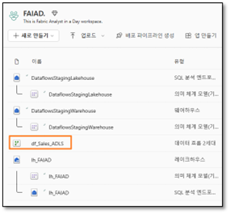

 6. Navigieren zum Dataflow-Fenster des Browsers zurück zu **df_Sales_ADLS**.
 7. Wählen Sie im linken Bereich den Bereich **Abfragen** aus, und geben Sie STRG+V ein (derzeit wird das Einfügen mit der rechten Maustaste nicht unterstützt). . 

    

 8. Wie bereits erwähnt, stellen wir keine dieser Daten bereit. Klicken Sie also **mit der rechten Maustaste** auf die folgenden Abfragen, und wählen Sie **Staging aktivieren** aus, um das Häkchen zu entfernen. 

    a. Product 
    
    b. Product Details 
    
    c. Reseller 
    
    d. Date 
    
    e. Sales 

 
**Hinweis:** Wenn das Laden in Power BI Desktop deaktiviert ist, müssen wir das Staging in Dataflow nicht deaktivieren. Daher müssen wir das Staging für „Product Item Group“, „Product Groups“ usw. nicht deaktivieren. 

Stellen Sie sicher, dass **alle Abfragen verarbeitet werden**. Lassen Sie uns diese Daten abschließend in Lakehouse erfassen.  

## Aufgabe 12: Datenziel für verbleibende Abfragen konfigurieren 

 1. Wählen Sie die Abfrage **Product** aus.
 2. Wählen Sie unten rechts „+“ neben **Datenziel** aus.
 3. Wählen Sie im Dialogfeld die Option **Lakehouse** aus. 

    

4. Das Dialogfeld „Herstellen einer Verbindung mit dem Datenziel“ wird geöffnet. Wählen Sie im **Dropdown-Menü „Verbindung“** die Option **Lakehouse (keine)** aus.
5. Wählen Sie **Weiter** aus. 

    

6. Das Dialogfeld „Ziel auswählen“ wird geöffnet. Stellen Sie sicher, dass das **Optionsfeld „Neue Tabelle“** ausgewählt ist, da wir eine neue Tabelle erstellen.
7. Wir möchten die zuvor erstellte Tabelle in Lakehouse erstellen. Navigieren Sie im linken Bereich zu  **Lakehouse -> FAIAD_<Benutzername>**.
8. Wählen Sie **lh_FAIAD** aus.
9. Behalten Sie den Tabellennamen **Product** bei.
10. Wählen Sie **Weiter** aus. 

    

11. Das Dialogfeld „Zieleinstellungen auswählen“ wird geöffnet. Bei jeder Aktualisierung von Dataflow Gen2 möchten wir einen vollständigen Ladevorgang durchführen. Stellen Sie sicher, dass **Updatemethode** auf **Ersetzen** festgelegt ist.
12. Beachten Sie, dass die Warnung „Einige Spaltennamen enthalten nicht unterstützte Zeichen. Sollen wir das Problem für Sie beheben?“ Lakehouse unterstützt keine Spaltennamen mit Leerzeichen. Wählen Sie **Korrigieren** aus, um die Warnung zu entfernen.
13. Mithilfe der Spaltenzuordnung können Dataflow-Spalten vorhandenen Spalten zugeordnet werden. In unserem Fall handelt es sich um eine neue Tabelle. Daher können wir die Standardwerte verwenden. Wählen Sie **Einstellungen speichern** aus. 

    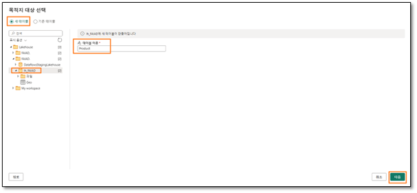

14. Sie werden zum Power **Query-Fenster** weitergeleitet. Beachten Sie, dass unten rechts das Datenziel auf **Lakehouse** festgelegt ist.
15. Legen Sie ebenso das **Datenziel** für die folgenden Abfragen fest: 
a. Product Details 
b. Reseller 
c. Date 
d. Sales 

16. Wir haben einen Dataflow, der Daten aus ADLS in Lakehouse erfasst. Fahren wir fort und veröffentlichen diesen Dataflow. Wählen Sie unten rechts Veröffentlichen aus. 

    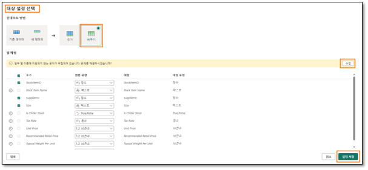

Sie werden zurück zur Data Factory-Startseite weitergeleitet. Es dauert einige Minuten, bis der Dataflow aktualisiert wird. 

In der nächsten Übung werden wir Daten aus den anderen Datenquellen erfassen. 

 ## Referenzen 

Bei Fabric Analyst in a Day (FAIAD) lernen Sie einige der wichtigsten Funktionen von Microsoft Fabric kennen. Im Menü des Dienstes finden Sie in der Hilfe (?) Links zu praktischen Informationen. 

Nachfolgend finden Sie weitere Angebote zur weiteren Arbeit mit Microsoft Fabric. 
- Die vollständige [Ankündigung der allgemeinen Verfügbarkeit von Microsoft Fabric](https://aka.ms/Fabric-Hero-Blog-Ignite23) finden Sie im Blogbeitrag. 
- Fabric bei einer [interaktiven Vorstellung](https://aka.ms/Fabric-GuidedTour) kennenlernen 
- Zur [kostenlosen Testversion von Microsoft Fabric](https://aka.ms/try-fabric) anmelden 
- [Website von Microsoft Fabric](https://aka.ms/microsoft-fabric) besuchen 
- Mit Modulen von [Fabric Learning](https://aka.ms/learn-fabric) neue Qualifikationen erwerben 
- [Technische Dokumentation zu Fabric](https://aka.ms/fabric-docs) lesen 
- [Kostenloses E-Book zum Einstieg in Fabric](https://aka.ms/fabric-get-started-ebook) lesen 
- Mitglied der [Fabric-Community](https://aka.ms/fabric-community) werden, um Fragen zu stellen, Feedback zu geben und sich mit anderen auszutauschen 

Lesen Sie die detaillierteren Blogs zur Ankündigung der Fabric-Umgebung: 
- [Blog zum Data Factory-Funktionsbereich in Fabric  ](https://aka.ms/Fabric-Data-Factory-Blog)
- [Blog zum Data Engineering-Funktionsbereich von Synapse in Fabric](https://aka.ms/Fabric-DE-Blog)  
- [Blog zum Data Science-Funktionsbereich von Synapse in Fabric ](https://aka.ms/Fabric-DS-Blog) 
- [Blog zum Data Warehousing-Funktionsbereich von Synapse in Fabric ](https://aka.ms/Fabric-DW-Blog) 
- [Blog zum Real-Time Analytics-Funktionsbereich von Synapse in Fabric](https://aka.ms/Fabric-RTA-Blog) 
- [Blog zur Power BI-Ankündigung](https://aka.ms/Fabric-PBI-Blog) 
- [Blog zum Data Activator-Funktionsbereich in Fabric](https://aka.ms/Fabric-DA-Blog)  
- [Blog zu Verwaltung und Governance in Fabric  ](https://aka.ms/Fabric-Admin-Gov-Blog)
- [Blog zu OneLake in Fabric ](https://aka.ms/Fabric-OneLake-Blog)
- [Blog zur Dataverse- und Microsoft Fabric-Integration ](https://aka.ms/Dataverse-Fabric-Blog)

 
© 2023 Microsoft Corporation. Alle Rechte vorbehalten. 

Durch die Verwendung der vorliegenden Demo/Übung stimmen Sie den folgenden Bedingungen zu: 

Die in dieser Demo/Übung beschriebene Technologie/Funktionalität wird von der Microsoft Corporation bereitgestellt, um Feedback von Ihnen zu erhalten und Ihnen Wissen zu vermitteln. Sie dürfen die Demo/Übung nur verwenden, um derartige Technologiefeatures und Funktionen zu bewerten und Microsoft Feedback zu geben. Es ist Ihnen nicht erlaubt, sie für andere Zwecke zu verwenden. Es ist Ihnen nicht gestattet, diese Demo/Übung oder einen Teil derselben zu ändern, zu kopieren, zu verbreiten, zu übertragen, anzuzeigen, auszuführen, zu vervielfältigen, zu veröffentlichen, zu lizenzieren, zu transferieren oder zu verkaufen oder aus ihr abgeleitete Werke zu erstellen. 

DAS KOPIEREN ODER VERVIELFÄLTIGEN DER DEMO/ÜBUNG (ODER EINES TEILS DERSELBEN) AUF EINEN/EINEM ANDEREN SERVER ODER SPEICHERORT FÜR DIE WEITERE VERVIELFÄLTIGUNG ODER VERBREITUNG IST AUSDRÜCKLICH UNTERSAGT. 

DIESE DEMO/ÜBUNG STELLT BESTIMMTE SOFTWARE-TECHNOLOGIE-/PRODUKTFEATURES UND FUNKTIONEN, EINSCHLIESSLICH POTENZIELLER NEUER FEATURES UND KONZEPTE, IN EINER SIMULIERTEN UMGEBUNG OHNE KOMPLEXE EINRICHTUNG ODER INSTALLATION FÜR DEN OBEN BESCHRIEBENEN ZWECK BEREIT. DIE TECHNOLOGIE/KONZEPTE IN DIESER DEMO/ÜBUNG ZEIGEN MÖGLICHERWEISE NICHT DAS VOLLSTÄNDIGE FUNKTIONSSPEKTRUM UND FUNKTIONIEREN MÖGLICHERWEISE NICHT WIE DIE ENDGÜLTIGE VERSION. UNTER UMSTÄNDEN VERÖFFENTLICHEN WIR AUCH KEINE ENDGÜLTIGE VERSION DERARTIGER FEATURES ODER KONZEPTE. IHRE ERFAHRUNG BEI DER VERWENDUNG DERARTIGER FEATURES UND FUNKTIONEN IN EINER PHYSISCHEN UMGEBUNG KANN FERNER ABWEICHEND SEIN. 

**FEEDBACK**. Wenn Sie Feedback zu den Technologiefeatures, Funktionen und/oder Konzepten geben, die in dieser Demo/Übung beschrieben werden, gewähren Sie Microsoft das Recht, Ihr Feedback in jeglicher Weise und für jeglichen Zweck kostenlos zu verwenden, zu veröffentlichen und gewerblich zu nutzen. Außerdem treten Sie Dritten kostenlos sämtliche Patentrechte ab, die erforderlich sind, damit deren Produkte, Technologien und Dienste bestimmte Teile einer Software oder eines Dienstes von Microsoft, welche/welcher das Feedback enthält, verwenden oder eine Verbindung zu dieser/diesem herstellen können. Sie geben kein Feedback, das einem Lizenzvertrag unterliegt, aufgrund dessen Microsoft Drittparteien eine Lizenz für seine Software oder Dokumentation gewähren muss, weil wir Ihr Feedback in diese aufnehmen. Diese Rechte bestehen nach Ablauf dieser Vereinbarung fort. 

DIE MICROSOFT CORPORATION LEHNT HIERMIT JEGLICHE GEWÄHRLEISTUNGEN UND GARANTIEN IN BEZUG AUF DIE DEMO/ÜBUNG AB, EINSCHLIESSLICH ALLER AUSDRÜCKLICHEN, KONKLUDENTEN ODER GESETZLICHEN GEWÄHRLEISTUNGEN UND GARANTIEN DER HANDELSÜBLICHKEIT, DER EIGNUNG FÜR EINEN BESTIMMTEN ZWECK, DES RECHTSANSPRUCHS UND DER NICHTVERLETZUNG VON RECHTEN DRITTER. MICROSOFT MACHT KEINERLEI ZUSICHERUNGEN BZW. ERHEBT KEINERLEI ANSPRÜCHE IM HINBLICK AUF DIE RICHTIGKEIT DER ERGEBNISSE UND DES AUS DER VERWENDUNG DER DEMO/ÜBUNG RESULTIERENDEN ARBEITSERGEBNISSES BZW. BEZÜGLICH DER EIGNUNG DER IN DER DEMO/ÜBUNG ENTHALTENEN INFORMATIONEN FÜR EINEN BESTIMMTEN ZWECK. 

**HAFTUNGSAUSSCHLUSS**

Diese Demo/Übung enthält nur einen Teil der neuen Features und Verbesserungen in Microsoft Power BI. Einige Features können sich unter Umständen in zukünftigen Versionen des Produkts ändern. In dieser Demo/Übung erhalten Sie Informationen über einige, aber nicht über alle neuen Features. 
