# Contenido 
- Presentación

- Flujo de datos Gen2

    - Tarea 1: Copiar consultas de Snowflake al flujo de datos
    - Tarea 2: Crear una conexión a Snowflake
    - Tarea 3: Configurar el destino de datos para las consultas de Supplier y PO
    - Tarea 4: Cambiar el nombre y publicar el flujo de datos de Snowflake
    - Tarea 5: Copiar consultas de Dataverse al flujo de datos
    - Tarea 6: Crear una conexión a Dataverse
    - Tarea 7: Crear un destino de datos para la consulta Customer
    - Tarea 8: Publicar y cambiar el nombre del flujo de datos de Dataverse
    - Tarea 9: Copiar consultas de SharePoint al flujo de datos
    - Tarea 10: Crear una conexión a SharePoint
    - Tarea 11: Configurar el destino de datos para la consulta People
    - Tarea 12: Publicar y cambiar el nombre del flujo de datos de SharePoint

- Referencias

# Presentación 

En nuestro escenario, los datos del proveedor están en Snowflake, los datos del cliente están en Dataverse y los datos de los empleados están en SharePoint. Todos estos orígenes de datos se actualizan en diferentes momentos. Para minimizar la cantidad de actualizaciones de datos de los flujos de datos, crearemos flujos de datos individuales para cada uno de estos orígenes de datos.

**Nota:** Se admiten varios orígenes de datos en un único flujo de datos.
Al final de este laboratorio, habrá aprendido: 
- Cómo conectarse a Snowflake mediante el flujo de datos Gen2 e ingerir datos en lakehouse
- Cómo conectarse a SharePoint mediante el flujo de datos Gen2 e ingerir datos en lakehouse
- Cómo conectarse a Dataverse mediante el flujo de datos Gen2 e ingerir datos en lakehouse

# Flujo de datos Gen2
## Tarea 1: Copiar consultas de Snowflake al flujo de datos
1. Volvamos al área de trabajo de Fabric, **FAIAD_<username>**, que creó en el Laboratorio 2, Tarea 8.
2. En el menú superior, seleccione **Nuevo -> Flujo de datos Gen2**.

    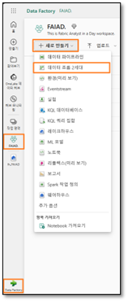
 
Se le dirigirá de vuelta a la **página de del flujo de datos**. Ahora que estamos familiarizados con el flujo de datos, sigamos adelante y copiemos las consultas de Power BI Desktop en el flujo de datos.

3. Si aún no lo ha abierto, abra **FAIAD.pbix**, que se encuentra en la carpeta **Report** en el **Escritorio** de su entorno de laboratorio. 
4.	En la cinta de opciones, seleccione **Inicio -> Transformar datos**. Se abre la ventana de Power Query. Como habrá notado en la práctica de laboratorio anterior, las consultas en el panel izquierdo están organizadas por orígenes de datos.
5.	Se abre la ventana de Power Query. Desde el panel izquierdo, en la carpeta SnowflakeData **Ctrl+Seleccionar** o Mayús+Seleccionar las siguientes consultas:

    a.	SupplierCategories
    
    b.	Suppliers
    
    c.	Supplier
    
    d.	PO
    
    e.	PO Line Items

6.	**Haga clic derecho** y seleccione **Copiar**.
 
    

7.	Vuelva al **explorador**.
8.	En el **panel del flujo de datos**, seleccione el **panel central**, introduzca **Ctrl+V** (actualmente, hacer clic con el botón derecho en Pegar no es compatible).

## Tarea 2: Crear una conexión a Snowflake
Observe que las cinco consultas están pegadas y ahora tiene el panel Consultas a la izquierda. Como no tenemos una conexión creada para Snowflake, verá un mensaje de advertencia que le solicitará que configure la conexión.
1.	Seleccione **Configurar conexión**.

    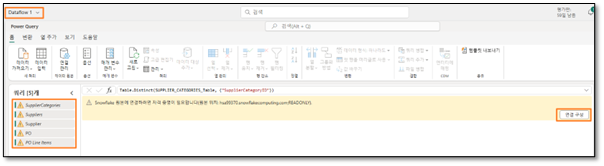
 
2.	Se abre el cuadro de diálogo del origen de datos. En el menú desplegable **Conexión**, asegúrese de que Crear nueva conexión esté seleccionado.
3.	**El tipo de autenticación** debe ser **Snowflake**.
4.	Introduzca el **Nombre de usuario y contraseña de Snowflake** disponibles en la pestaña Variables de entorno (al lado de la pestaña Guía de laboratorio).
5.	Seleccione **Conectar**.

    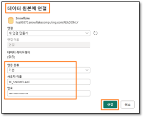
 
Se establece la conexión y puede ver los datos en el panel de versión preliminar. Siéntase libre de navegar por los pasos aplicados de las consultas. Básicamente, la consulta Suppliers tiene los detalles de los proveedores y SupplierCategories, como su nombre indica, tiene categorías de proveedores. Estas dos tablas se unen para crear la dimensión Supplier, con las columnas que necesitamos. De manera similar, tenemos PO Line Items combinada con pedidos de compra para crear el dato de PO. Ahora necesitamos incorporar los datos del proveedor y de PO en el lakehouse.

6.	Como se mencionó anteriormente, no vamos a almacenar provisionalmente ninguno de estos datos. Así que **haga clic derecho** en la consulta **Supplier** en el panel Consultas y seleccione **Habilitar el almacenamiento provisional** para eliminar la marca de verificación.

    
 
7.	De manera similar, haga clic derecho en la consulta **PO**. Seleccione **Habilitar el almacenamiento provisional** para eliminar la marca de verificación.

**Nota:** No tenemos que deshabilitar el almacenamiento provisional para las otras tres consultas porque Habilitar carga se deshabilitó en Power BI Desktop (desde donde se copiaron estas consultas).

## Tarea 3: Configurar el destino de datos para las consultas de Supplier y PO

1.	Seleccione la consulta de **Supplier**.
2.	En la esquina inferior derecha, seleccione "+" junto a **Destino de datos**.
3.	Seleccione **Lakehouse** en el cuadro de diálogo.

    
 
4.	Se abre el cuadro de diálogo Conectarse al destino de datos. Desde el **menú desplegable de Conexión**, seleccione **Lakehouse (ninguno)**.
5.	Seleccione **Siguiente**.

    
 
6.	Se abre el cuadro de diálogo de Elegir el objetivo de destino. Asegúrese de que el botón de opción **Nueva tabla** esté **seleccionado**, ya que estamos creando una nueva tabla.
7.	Queremos crear la tabla en el lakehouse que creamos anteriormente. En el panel izquierdo, navegue hasta **Lakehouse -> FAIAD_<username>**. 
8.	Seleccione **lh_FAIAD**.
9.	Deje el nombre de la tabla como **Supplier**.
10.	Seleccione **Siguiente**.

    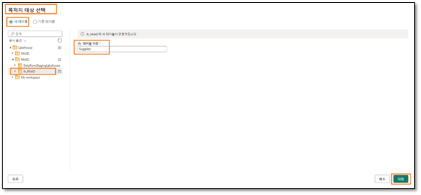
 
11.	Se abre el cuadro de diálogo de configuración de Elegir la configuración de destino. Cada vez que se actualiza el flujo de datos Gen2, nos gustaría hacer una carga completa. Asegúrese de que el **Método de actualización** esté configurado en **Reemplazar**.
12.	Observe que hay una advertencia que dice "Algunos nombres de columna contienen caracteres no admitidos. ¿Quiere que los corrijamos por usted?". Lakehouse no admite nombres de columnas con espacios. Seleccione **Reparar** para eliminar la advertencia.
13.	La asignación de columnas se puede utilizar para asignar columnas de flujo de datos a columnas existentes. En nuestro caso, es una tabla nueva. Por lo tanto, podemos usar la opción predeterminada. Seleccione **Guardar configuración**.

    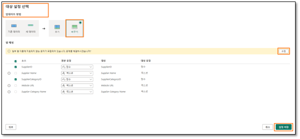
 
14.	Volverá a la **ventana de Power Query**. Observe que en la **esquina inferior derecha, el destino de los datos** está configurado en el **lakehouse**. De manera similar, **configure el destino de datos para la consulta de PO**. Una vez hecho esto, su consulta de PO debe tener Destino de datos establecido en **Lakehouse** como se muestra en la siguiente captura de pantalla.

    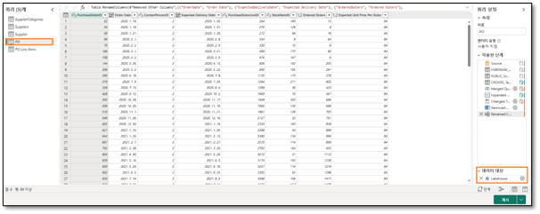
 

## Tarea 4: Cambiar el nombre y publicar el flujo de datos de Snowflake

1. En la parte superior de la pantalla, seleccione la **flecha junto a Dataflow 1** para cambiar el nombre.
2.	En el cuadro de diálogo, cambie el nombre a **df_Supplier_Snowflake**.
3.	Haga clic en **Introducir** para guardar el cambio de nombre.

    
 
4.	En la esquina inferior derecha, seleccione **Publicar**.

    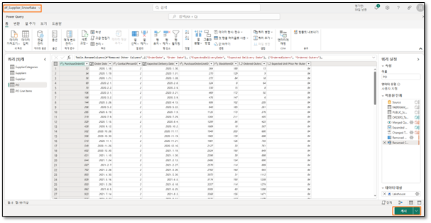
 
Se le dirigirá de nuevo a la **pantalla de Data Factory**. Es posible que el flujo de datos tarde unos minutos en publicarse. 

**Nota:** A veces, el nombre del flujo de datos no se actualiza. En este caso, siga los pasos a continuación. Si se ha cambiado el nombre del flujo de datos, puede pasar a la siguiente tarea.

5.	Una vez que el Dataflow 1 termine de publicarse, cambiaremos su nombre. Haga clic en los **puntos suspensivos (…)** junto a Dataflow 1. Seleccione **Propiedades**.

    
 
6.	Se abre el cuadro de diálogo de propiedades del flujo de datos. Cambie el nombre a **df_Supplier_Snowflake**.
7.	En el cuadro de texto **Descripción**, agregue **Dataflow to ingest Supplier data from Snowflake to Lakehouse**.
8.	Seleccione **Guardar**.

    
 
Se le dirigirá de nuevo a la **pantalla de Data Factory**. Ahora creemos un flujo de datos para traer datos de Dataverse.

## Tarea 5: Copiar consultas de Dataverse al flujo de datos

1.	En el menú superior, seleccione **Nuevo -> Flujo de datos Gen2**.

    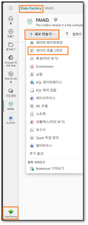
 
Se le dirigirá de vuelta a la **página del flujo de datos**. Ahora que estamos familiarizados con el flujo de datos, sigamos adelante y copiemos las consultas de Power BI Desktop en el flujo de datos.

2.	Si aún no lo ha abierto, abra **FAIAD.pbix**, que se encuentra en la carpeta **Report** en el **Escritorio** de su entorno de laboratorio. 
3.	En la cinta de opciones, seleccione **Inicio -> Transformar datos**. Se abre la ventana de Power Query. Como habrá notado en la práctica de laboratorio anterior, las consultas en el panel izquierdo están organizadas por orígenes de datos.
4.	Se abre la ventana de Power Query. Desde el panel izquierdo, en la carpeta DataverseData, **Ctrl+Seleccionar** las siguientes consultas:

    a.	BabyBoomer
    
    b.	GenX
    
    c.	GenY
    
    d.	GenZ
    
    e.	Customer

5.	**Haga clic derecho** y seleccione **Copiar**.

    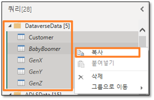
 
6.	Vuelva a la ventana **Página del flujo de datos** en su explorador.
7.	En el **panel del flujo de datos**, introduzca **Ctrl+V** (actualmente, hacer clic con el botón derecho en Pegar no es compatible).

## Tarea 6: Crear una conexión a Dataverse
Observe que las cinco consultas están pegadas y ahora tiene el panel Consultas a la izquierda. Como no tenemos una conexión creada para Dataverse, verá un mensaje de advertencia que le solicitará que configure la conexión.

1.	Seleccione **Configurar conexión**.

    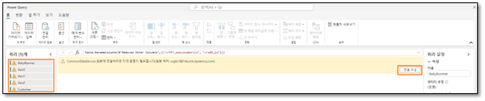
 
2.	Se abre el cuadro de diálogo del origen de datos. En el **menú desplegable Conexión**, asegúrese de que Crear nueva conexión esté **seleccionado**.
3.	**Tipo de autenticación** debería ser **Cuenta de organización**.
4.	Seleccione **Conectar**.

    
 

## Tarea 7: Crear un destino de datos para la consulta Customer
Se establece la conexión y puede ver los datos en el panel de versión preliminar. Siéntase libre de navegar por los pasos aplicados de las consultas. Los datos de los clientes están disponibles por categoría: BabyBoomer, GenX, GenY y GenZ. Estas cuatro consultas se adjuntan para crear la consulta Customer. Ahora necesitamos incorporar los datos del cliente en el lakehouse.

1.	Como se mencionó anteriormente, no vamos a almacenar provisionalmente ninguno de estos datos. Así que **haga clic derecho** en la consulta **Customer** en el panel Consultas y seleccione **Habilitar el almacenamiento provisional** para eliminar la marca de verificación.

    
 
2.	Seleccione la consulta **Customer**.
3.	En la esquina inferior derecha, seleccione **"+"** junto a **Destino de datos**.
4.	Seleccione **lakehouse** en el cuadro de diálogo.

    
 
5.	Se abre el cuadro de diálogo Conectarse al destino de datos. Desde el **menú desplegable de Conexión**, seleccione **Lakehouse (ninguno)**.
6.	Seleccione **Siguiente**.

    
 
7.	Se abre el cuadro de diálogo de Elegir el objetivo de destino. Asegúrese de que el **botón de opción Nueva tabla** esté seleccionado, ya que estamos creando una nueva tabla.
8.	Queremos crear la tabla en el lakehouse que creamos anteriormente. En el panel izquierdo, navegue hasta **Lakehouse -> FAIAD_<username>**. 
9.	Seleccione **lh_FAIAD**.
10.	Deje el nombre de la tabla como **Customer**.
11.	Seleccione **Siguiente**.

    
 
12.	Se abre el cuadro de diálogo de configuración de Elegir la configuración de destino. Cada vez que se actualiza el flujo de datos Gen2, nos gustaría hacer una carga completa. Asegúrese de que el **Método de actualización** esté configurado en **Reemplazar**.
13.	Observe que hay una advertencia que dice "Algunos nombres de columna contienen caracteres no admitidos. ¿Quiere que los corrijamos por usted?". Lakehouse no admite nombres de columnas con espacios. Seleccione **Reparar** para eliminar la advertencia.
14.	La asignación de columnas se puede utilizar para asignar columnas de flujo de datos a columnas existentes. En nuestro caso, es una tabla nueva. Por lo tanto, podemos usar la opción predeterminada. Seleccione **Guardar configuración**.

    
 

## Tarea 8: Publicar y cambiar el nombre del flujo de datos de Dataverse

1.	Volverá a la **ventana de Power Query**. Observe que en la **esquina inferior derecha**, el **destino de los datos** está configurado en el **lakehouse**.
2.	En la esquina inferior derecha, seleccione **Publicar**.

    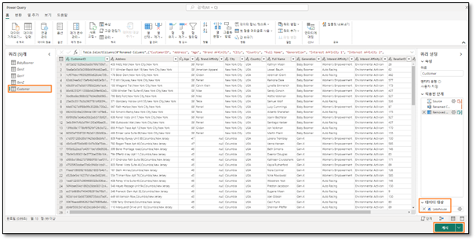
 
**Nota:** Se le dirigirá de nuevo a la pantalla de Data Factory. Es posible que el flujo de datos tarde unos minutos en publicarse.

3.	Estamos trabajando con el Dataflow 1. Cambiémosle el nombre antes de continuar. Haga clic en los **puntos suspensivos (…)** junto a Dataflow 1. Seleccione **Propiedades**.
 
    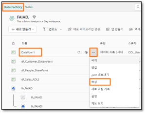

4.	Se abre el cuadro de diálogo de propiedades del flujo de datos. Cambie el **Nombre a df_Customer_Dataverse**.
5.	En el cuadro de texto Descripción, agregue **Dataflow to ingest Customer data from Dataverse to Lakehouse**.
6.	Seleccione **Guardar**.

    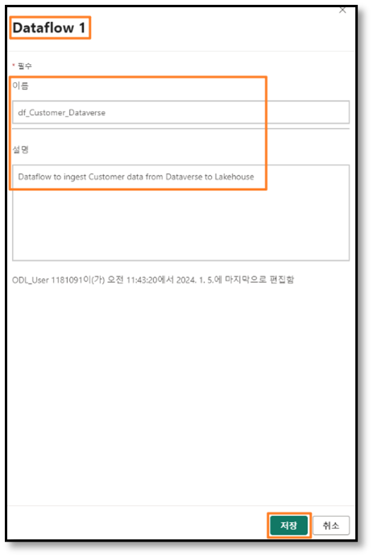
 
Se le dirigirá de nuevo a la **pantalla de Data Factory**. Ahora creemos un flujo de datos para traer datos de SharePoint.

## Tarea 9: Copiar consultas de SharePoint al flujo de datos

1.	En el menú superior, seleccione **Nuevo -> Flujo de datos Gen2**.

    
 
Se le dirigirá de vuelta a la **página de del flujo de datos**. Ahora que estamos familiarizados con el flujo de datos, sigamos adelante y copiemos las consultas de Power BI Desktop en el flujo de datos.

2.	Si aún no lo ha abierto, abra **FAIAD.pbix**, que se encuentra en la carpeta **Report** en el **Escritorio** de su entorno de laboratorio. 
3.	En la cinta de opciones, seleccione **Inicio -> Transformar datos**. Se abre la ventana de Power Query. Como habrá notado en la práctica de laboratorio anterior, las consultas en el panel izquierdo están organizadas por orígenes de datos.
4.	Se abre la ventana de Power Query. En el panel izquierdo, en la carpeta SharepointData, **seleccione** la consulta **People**.

5.	**Haga clic derecho** y seleccione **Copiar**.

    
 
6.	Vuelva a la **pantalla del flujo de datos** en el explorador.
7.	En el **panel del flujo de datos**, introduzca **Ctrl+V** (actualmente, hacer clic con el botón derecho en Pegar no es compatible).

Observe la consulta pegada y disponible en el panel izquierdo. Como no tenemos una conexión creada para SharePoint, verá un mensaje de advertencia que le solicitará que configure la conexión.

## Tarea 10: Crear una conexión a SharePoint
1.	Seleccione **Configurar conexión**.

    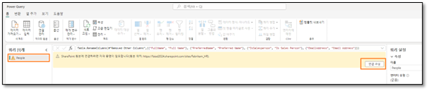
 
2.	Se abre el cuadro de diálogo del origen de datos. En el menú desplegable **Conexión**, asegúrese de que **Crear nueva conexión** esté seleccionado.
3.	**Tipo de autenticación** debería ser **Cuenta de organización**.
4.	Seleccione **Conectar**.

    
 

## Tarea 11: Configurar el destino de datos para la consulta People
Se establece la conexión y puede ver los datos en el panel de versión preliminar. Siéntase libre de navegar por los pasos aplicados de las consultas. Ahora necesitamos incorporar los datos de las personas en el lakehouse.

1.	Como se mencionó anteriormente, no vamos a almacenar provisionalmente ninguno de estos datos. Así que **haga clic derecho** en la consulta **People** en el panel Consultas y seleccione **Habilitar el almacenamiento provisional** para eliminar la marca de verificación.

    
 
2.	Seleccione la consulta **People**.
3.	En la esquina inferior derecha, seleccione **"+"** junto a Destino de datos.
4.	Seleccione Lakehouse en el cuadro de diálogo.

    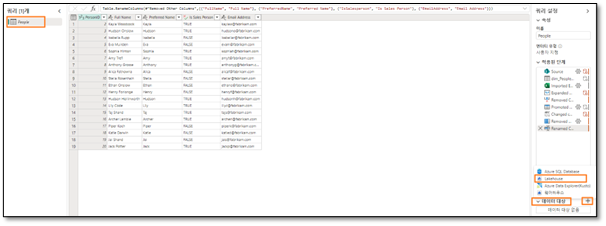
 
5.	Se abre el cuadro de diálogo Conectarse al destino de datos. Desde el **menú desplegable de Conexión, seleccione Lakehouse (ninguno)**.
6.	Seleccione **Siguiente**.

    
 
7.	Se abre el cuadro de diálogo de Elegir el objetivo de destino. Asegúrese de que el botón de opción **Nueva tabla** esté **seleccionado**, ya que estamos creando una nueva tabla.
8.	Queremos crear la tabla en el lakehouse que creamos anteriormente. En el panel izquierdo, navegue hasta **Lakehouse -> FAIAD_<username>**. 
9.	Seleccione **lh_FAIAD**.
10.	Deje el nombre de la tabla como **People**.
11.	Seleccione **Siguiente**.

    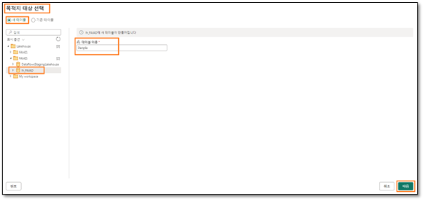
 
12.	Se abre el cuadro de diálogo de configuración de Elegir la configuración de destino. Cada vez que se actualiza el flujo de datos Gen2, nos gustaría hacer una carga completa. Asegúrese de que el **Método de actualización** esté configurado en **Reemplazar**.
13.	Observe que hay una advertencia que dice "Algunos nombres de columna contienen caracteres no admitidos. ¿Quiere que los corrijamos por usted?". Lakehouse no admite nombres de columnas con espacios. Seleccione **Reparar** para eliminar la advertencia.
14.	La asignación de columnas se puede utilizar para asignar columnas de flujo de datos a columnas existentes. En nuestro caso, es una tabla nueva. Por lo tanto, podemos usar la opción predeterminada. Seleccione **Guardar configuración**.

    
 

## Tarea 12: Publicar y cambiar el nombre del flujo de datos de SharePoint

1.	Volverá a la **ventana de Power Query**. Observe que en la **esquina inferior derecha**, el destino de los datos está configurado en el **lakehouse**.
2.	En la esquina inferior derecha, seleccione **Publicar**.

    
 
**Nota:** Se le dirigirá de nuevo a la pantalla de Data Factory. Es posible que el flujo de datos tarde unos minutos en publicarse.

3.	Estamos trabajando con el Dataflow 1. Cambiémosle el nombre antes de continuar. Haga clic en los **puntos suspensivos (…)** junto a Dataflow 1. Seleccione **Propiedades**.

    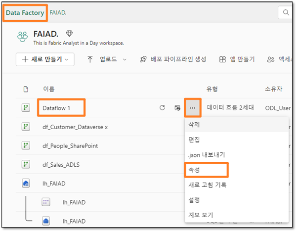
 
4.	Se abre el cuadro de diálogo de propiedades del flujo de datos. Cambie el **nombre** a **df_People_SharePoint**.
5.	En el cuadro de texto Descripción, agregue **Dataflow to ingest People data from SharePoint to Lakehouse**.
6.	Seleccione **Guardar**.

    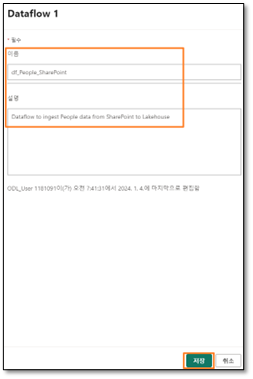
 
Se le dirigirá de nuevo a la **pantalla de Data Factory**. Ahora hemos ingerido todos los datos en el lakehouse. En la próxima práctica de laboratorio, programaremos la actualización del flujo de datos.

# Referencias

Fabric Analyst in a Day (FAIAD) le presenta algunas funciones clave disponibles en Microsoft Fabric. En el menú del servicio, la sección Ayuda (?) tiene vínculos a algunos recursos excelentes.

 
Estos son algunos recursos más que podrán ayudarle a seguir avanzando con Microsoft Fabric.

- Vea la publicación del blog para leer el [anuncio de disponibilidad general de Microsoft Fabric](https://aka.ms/Fabric-Hero-Blog-Ignite23) completo.
- Explore Fabric a través de la [Visita guiada](https://aka.ms/Fabric-GuidedTour)
- Regístrese en la [prueba gratuita de Microsoft Fabric](https://aka.ms/try-fabric)
- Visite el [sitio web de Microsoft Fabric](https://aka.ms/microsoft-fabric)
- Adquiera nuevas capacidades mediante la exploración de los [módulos de aprendizaje de Fabric](https://aka.ms/learn-fabric)
- Explore la [documentación técnica de Fabric](https://aka.ms/fabric-docs)
- Lea el [libro electrónico gratuito sobre cómo empezar a usar Fabric](https://aka.ms/fabric-get-started-ebook)
- Únase a la[ comunidad de Fabric](https://aka.ms/fabric-community) para publicar sus preguntas, compartir sus comentarios y aprender de otros.

Obtenga más información en los blogs de anuncios de la experiencia Fabric:

- [Experiencia de Data Factory en el blog de Fabric ](https://aka.ms/Fabric-Data-Factory-Blog)
- [Experiencia de Synapse Data Engineering en el blog de Fabric ](https://aka.ms/Fabric-DE-Blog)
- [Experiencia de Synapse Data Science en el blog de Fabric](https://aka.ms/Fabric-DS-Blog) 
- [Experiencia de Synapse Data Warehousing en el blog de Fabric ](https://aka.ms/Fabric-DW-Blog)
- [Experiencia de Synapse Real-Time Analytics en el blog de Fabric](https://aka.ms/Fabric-RTA-Blog)
- [Blog de anuncios de Power BI](https://aka.ms/Fabric-PBI-Blog)
- [Experiencia de Data Activator en el blog de Fabric ](https://aka.ms/Fabric-DA-Blog)
- [Administración y gobernanza en el blog de Fabric](https://aka.ms/Fabric-Admin-Gov-Blog)
- [OneLake en el blog de Fabric](https://aka.ms/Fabric-OneLake-Blog)
- [Blog de integración de Dataverse y Microsoft Fabric](https://aka.ms/Dataverse-Fabric-Blog)

© 2023 Microsoft Corporation. Todos los derechos reservados.

Al participar en esta demostración o laboratorio práctico, acepta las siguientes condiciones:

Microsoft Corporation pone a su disposición la tecnología o funcionalidad descrita en esta demostración/laboratorio práctico con el fin de obtener comentarios por su parte y de facilitarle una experiencia de aprendizaje. Esta demostración/laboratorio práctico solo se puede usar para evaluar las características de tal tecnología o funcionalidad y para proporcionar comentarios a Microsoft. No se puede usar para ningún otro propósito. Ninguna parte de esta demostración/laboratorio práctico se puede modificar, copiar, distribuir, transmitir, mostrar, realizar, reproducir, publicar, licenciar, transferir ni vender, ni tampoco 
crear trabajos derivados de ella.

LA COPIA O REPRODUCCIÓN DE ESTA DEMOSTRACIÓN/LABORATORIO PRÁCTICO (O PARTE DE ELLA) EN CUALQUIER OTRO SERVIDOR O UBICACIÓN PARA SU REPRODUCCIÓN O DISTRIBUCIÓN POSTERIOR QUEDA EXPRESAMENTE PROHIBIDA.

ESTA DEMOSTRACIÓN/LABORATORIO PRÁCTICO PROPORCIONA CIERTAS FUNCIONES Y CARACTERÍSTICAS DE PRODUCTOS O TECNOLOGÍAS DE SOFTWARE (INCLUIDOS POSIBLES NUEVOS CONCEPTOS Y CARACTERÍSTICAS) EN UN ENTORNO SIMULADO SIN INSTALACIÓN O CONFIGURACIÓN COMPLEJA PARA EL PROPÓSITO ARRIBA DESCRITO. LA TECNOLOGÍA/CONCEPTOS DESCRITOS EN ESTA DEMOSTRACIÓN/LABORATORIO PRÁCTICO NO REPRESENTAN LA FUNCIONALIDAD COMPLETA DE LAS CARACTERÍSTICAS Y, EN ESTE SENTIDO, ES POSIBLE QUE NO FUNCIONEN DEL MODO EN QUE LO HARÁN EN UNA VERSIÓN FINAL. ASIMISMO, PUEDE QUE NO SE PUBLIQUE UNA VERSIÓN FINAL DE TALES CARACTERÍSTICAS O CONCEPTOS. DE IGUAL MODO, SU EXPERIENCIA CON EL USO DE ESTAS CARACTERÍSTICAS Y FUNCIONALIDADES EN UN ENTORNO FÍSICO PUEDE SER DIFERENTE.

**COMENTARIOS.** Si envía comentarios a Microsoft sobre las características, funcionalidades o conceptos de tecnología descritos en esta demostración/laboratorio práctico, acepta otorgar a Microsoft, sin cargo alguno, el derecho a usar, compartir y comercializar sus comentarios de cualquier modo y para cualquier fin. También concederá a terceros, sin cargo alguno, los derechos de patente necesarios para que sus productos, tecnologías y servicios usen o interactúen con cualquier parte específica de un software o servicio de Microsoft que incluya los comentarios. No enviará comentarios que estén sujetos a una licencia que obligue a Microsoft a conceder su software o documentación bajo licencia a terceras partes porque incluyamos sus comentarios en ellos. Estos derechos seguirán vigentes después del vencimiento de este acuerdo.
MICROSOFT CORPORATION RENUNCIA POR LA PRESENTE A TODAS LAS GARANTÍAS Y CONDICIONES RELATIVAS A LA DEMOSTRACIÓN/LABORATORIO PRÁCTICO, INCLUIDA CUALQUIER GARANTÍA Y CONDICIÓN DE COMERCIABILIDAD (YA SEA EXPRESA, IMPLÍCITA O ESTATUTARIA), DE IDONEIDAD PARA UN FIN DETERMINADO, DE TITULARIDAD Y DE AUSENCIA DE INFRACCIÓN. MICROSOFT NO DECLARA NI GARANTIZA LA EXACTITUD DE LOS RESULTADOS, EL RESULTADO DERIVADO DE LA REALIZACIÓN DE LA DEMOSTRACIÓN/LABORATORIO PRÁCTICO NI LA IDONEIDAD DE LA INFORMACIÓN CONTENIDA EN ELLA CON NINGÚN PROPÓSITO.

**DECLINACIÓN DE RESPONSABILIDADES**

Esta demostración/laboratorio práctico contiene solo una parte de las nuevas características y mejoras realizadas en Microsoft Power BI. Puede que algunas de las características cambien en versiones futuras del producto. En esta demostración/laboratorio práctico, conocerá algunas de estas nuevas características, pero no todas.

