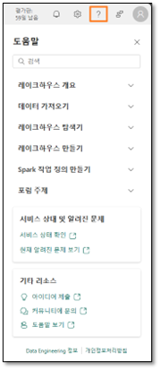

# Inhalt

- Einführung

- Dataflow Gen2

   - Aufgabe 1: Snowflake-Abfragen in Dataflow kopieren

   - Aufgabe 2: Verbindung zu Snowflake erstellen

    - Aufgabe 3: Datenziel für die Abfragen „Supplier“ und „PO“ konfigurieren

    - Aufgabe 4: Snowflake-Dataflow umbenennen und veröffentlichen

    - Aufgabe 5: Dataverse-Abfragen in Dataflow kopieren

    - Aufgabe 6: Verbindung zu Dataverse erstellen

    - Aufgabe 7: Datenziel für die Abfrage „Customer“ erstellen

    - Aufgabe 8: Dataverse-Dataflow veröffentlichen und umbenennen

    - Aufgabe 9: SharePoint-Abfragen in Dataflow kopieren

    - Aufgabe 10: Verbindung zu SharePoint erstellen

    - Aufgabe 11: Datenziel für die Abfrage „People“ konfigurieren

    - Aufgabe 12: SharePoint-Dataflow veröffentlichen und umbenennen

## Referenzen

Bei unserem Anwendungsfall befinden sich die Lieferantendaten in Snowflake, die Kundendaten in Dataverse und die Mitarbeiterdaten in SharePoint. Alle diese Datenquellen werden zu verschiedenen Zeiten aktualisiert. Um die Anzahl der Datenaktualisierungen von Dataflows zu verringern, erstellen wir für jede dieser Datenquellen individuelle Dataflows.
Hinweis: Ein einziger Dataflow berücksichtigt dabei mehrere Datenquellen.

**Inhalt dieser Übung:**
- Mit Dataflow Gen2 eine Verbindung zu Snowflake herstellen und Daten im Lakehouse erfassen
- Mit Dataflow Gen2 eine Verbindung zu SharePoint herstellen und Daten im Lakehouse erfassen
- Mit Dataflow Gen2 eine Verbindung zu Dataverse herstellen und Daten im Lakehouse erfassen

# Dataflow Gen2

## Aufgabe 1: Snowflake-Abfragen in Dataflow kopieren
1. Wechseln wir zurück zum Fabric-Arbeitsbereich **FAIAD_<Benutzername>**, den Sie in Aufgabe 8 von Übung 2 erstellt haben.

2. Wählen Sie im Menü oben die Option **Neu -> Dataflow Gen2 aus**.

   

 Sie werden zur **Dataflow-Seite** weitergeleitet. Nachdem Sie Dataflow nun kennen, kopieren Sie die Abfragen aus Power BI Desktop in Dataflow.

3. Öffnen Sie, sofern noch nicht geschehen, auf dem **Desktop** Ihrer Übungsumgebung im Ordner **Report** die Datei **FAIAD.pbix**.
4. Wählen Sie im Menüband **Start > Daten transformieren** aus. Das Power Query-Fenster wird geöffnet.
5. Das Power Query-Fenster wird geöffnet. Wählen Sie links unter dem Ordner „SnowflakeData“ mit **Strg+Auswahl** oder „Umschalt+Auswahl“ die folgenden Abfragen aus:

   a. SupplierCategories
   
   b. Suppliers
   
   c. Supplier
   
   d. PO
   
   e. PO Line Items

6. **Klicken Sie mit der rechten Maustaste**, und wählen Sie **Kopieren** aus.

   

7. Navigieren Sie zurück zum **Browser**.

8. Wählen Sie im Bereich **Dataflow** den **mittleren Bereich** aus, und drücken Sie **Strg+V** (das Einfügen mittels Rechtklick ist derzeit nicht möglich).

## Aufgabe 2: Verbindung zu Snowflake erstellen
Beachten Sie, dass die fünf Abfragen eingefügt wurden und dass der Bereich „Abfragen“ jetzt links ist. Weil für Snowflake keine Verbindung erstellt wurde, wird eine Warnmeldung angezeigt, in der Sie aufgefordert werden, eine Verbindung zu konfigurieren.

1. Wählen Sie **Verbindung konfigurieren** aus.

   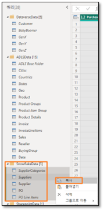

2. Das Dialogfeld „Mit Datenquelle verbinden“ wird geöffnet. Überprüfen Sie, dass im Dropdown-Menü **Verbindung** die Option **Neue Verbindung erstellen** ausgewählt ist.

3. Die **Authentifizierungsart** sollte **Snowflake** lauten.

4. Geben Sie den **Benutzernamen und das Kennwort für Snowflake** ein. Beides finden Sie auf der Registerkarte mit den Environment Variables (neben der Registerkarte mit der Übungsanleitung).
5. Wählen Sie **Verbinden** aus.

   

Die Verbindung wird hergestellt, und Sie können die Daten im Vorschaufenster ansehen. Wenn Sie möchten, sehen Sie sich die angewandten Schritte der Abfragen an. Grundsätzlich enthält die Suppliers-Abfrage Lieferanteninformationen und „SupplierCategories“, wie der Name schon sagt, Lieferantenkategorien. Diese beiden Tabellen werden zusammengeführt, um die Dimension „Supplier“ mit den erforderlichen Spalten zu erstellen. Auf ähnliche Weise wird „PO Line Items“ mit „PO“ zusammengeführt, um den Fakt „PO“ zu erstellen. Nun müssen die Daten von „Supplier“ und „PO“ im Lakehouse erfasst werden.

6. Wie bereits erwähnt, stellen wir keine dieser Daten bereit. Klicken Sie im Bereich mit den Abfragen **mit der rechten Maustaste** auf die Abfrage **Supplier**, und wählen Sie **Staging aktivieren** aus, um das Häkchen zu entfernen.

   

7. Klicken Sie ebenfalls mit der rechten Maustaste auf die Abfrage **PO**. Entfernen Sie durch Auswahl von **Staging aktivieren** das Häkchen.

**Hinweis:** Bei den anderen drei Abfragen muss das Staging nicht deaktiviert werden, weil die Option „Laden aktivieren“ in Power BI Desktop (aus dem diese Abfragen kopiert wurden) deaktiviert war.

## Aufgabe 3: Datenziel für die Abfragen „Supplier“ und „PO“ konfigurieren

1. Wählen Sie die Abfrage **Supplier** aus.
2. Wählen Sie unten rechts **„+“** neben Datenziel aus.
3. Wählen Sie im Dialogfeld die Option **Lakehouse** aus.

   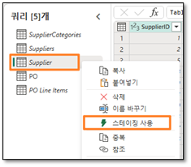

4. Das Dialogfeld „Herstellen einer Verbindung mit dem Datenziel“ wird geöffnet. Wählen Sie im **Dropdown-Menü** **„Verbindung“** die Option **Lakehouse (keine)** aus.
5. Wählen Sie Weiter aus.

   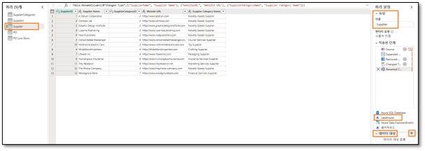

6. Das Dialogfeld „Ziel auswählen“ wird geöffnet. Stellen Sie sicher, dass das Optionsfeld **Neue Tabelle ausgewählt** ist, weil wir eine neue Tabelle erstellen.
7. Wir möchten die zuvor erstellte Tabelle in Lakehouse erstellen. Navigieren Sie im linken Bereich zu **Lakehouse -> FAIAD_<Benutzername>**.
8. Wählen Sie **lh_FAIAD** aus.
9. Behalten Sie den Tabellennamen **Supplier** bei.
10. Wählen Sie **Weiter** aus.

    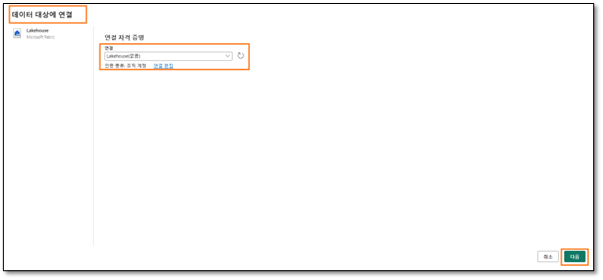

11. Das Dialogfeld „Zieleinstellungen auswählen“ wird geöffnet. Bei jeder Aktualisierung von Dataflow Gen2 möchten wir einen vollständigen Ladevorgang durchführen. Stellen Sie sicher, dass **Updatemethode** auf **Ersetzen** festgelegt ist.
12. Beachten Sie, dass die Warnung „Einige Spaltennamen enthalten nicht unterstützte Zeichen. Sollen wir das Problem für Sie beheben?“ Lakehouse unterstützt keine Spaltennamen mit Leerzeichen. Wählen Sie **Korrigieren** aus, um die Warnung zu entfernen.
13. Mithilfe der Spaltenzuordnung können Dataflow-Spalten vorhandenen Spalten zugeordnet werden. In unserem Fall handelt es sich um eine neue Tabelle. Daher können wir die Standardwerte verwenden. Wählen Sie **Einstellungen speichern** aus.

    

14. Sie werden zum **Power Query-Fenster** weitergeleitet. Beachten Sie unten rechts, dass das **Datenziel** auf **Lakehouse** festgelegt ist. Legen Sie ebenso das **Datenziel für die Abfrage „PO“** fest. Sobald das erledigt ist, sollte bei der Abfrage „PO“ das **Datenziel**, wie im Screenshot unten zu sehen, **Lakehouse** lauten.

    

## Aufgabe 4: Snowflake-Dataflow umbenennen und veröffentlichen

1. Wählen Sie oben auf dem Bildschirm den **Pfeil neben Dataflow 1** aus.
2. Ändern Sie im Dialogfeld den Namen in **df_Supplier_Snowflake**.
3. Speichern Sie die Namensänderung durch Drücken der **Eingabetaste**.

   

4. Wählen Sie unten rechts **Veröffentlichen** aus.

   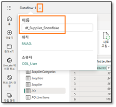

Sie werden zum **Bildschirm „Data Factory“** weitergeleitet. Es kann einige Momente dauern, bis der Dataflow veröffentlicht wird.

**Hinweis:** Manchmal wird der Dataflow-Name nicht geändert. Gehen Sie in diesem Fall wie nachstehend angegeben vor. Wurde der Dataflow umbenannt, können Sie mit der nächsten Aufgabe fortfahren.

5. Sobald Dataflow 1 veröffentlicht wurde, benennen Sie ihn um. Klicken Sie auf die **Auslassungspunkte (…)** neben Dataflow 1. Wählen Sie **Eigenschaften** aus.

   

6. Das Dialogfeld „Dataflow-Eigenschaften“ wird geöffnet. Ändern Sie den Namen in **df_Supplier_Snowflake**.

7. Ergänzen Sie im Textfeld **Beschreibung** den Text **Dataflow zur Erfassung der Lieferantendaten von Snowflake im Lakehouse**.

8. Klicken Sie auf **Speichern**.

   

Sie werden zum **Bildschirm „Data Factory“** weitergeleitet. Erstellen wir nun einen Dataflow zur Erfassung der Daten aus Dataverse.

## Aufgabe 5: Dataverse-Abfragen in Dataflow kopieren

1. Wählen Sie im Menü oben die Option **Neu -> Dataflow Gen2** aus.

   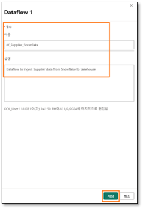

Sie werden zur **Dataflow-Seite** weitergeleitet. Nachdem Sie Dataflow nun kennen, kopieren Sie die Abfragen aus Power BI Desktop in Dataflow.

2. Öffnen Sie **FAIAD.pbix** im Ordner **Report** auf dem Desktop Ihrer Übungsumgebung, falls dies noch nicht erfolgt ist.
3. Wählen Sie im Menüband **Start > Daten transformieren** aus. Das Power Query-Fenster wird geöffnet. Wie Sie in der vorherigen Übung festgestellt haben, sind die Abfragen im linken Bereich nach Datenquelle organisiert.
4. Das Power Query-Fenster wird geöffnet. Wählen Sie links im Ordner „DataverseData“ mit **Strg+Auswahl** die folgenden Abfragen aus:

    a. BabyBoomer
    
    b. GenX
    
    c. GenY
    
    d. GenZ
    
    e. Customer

5. **Klicken Sie mit der rechten Maustaste**, und wählen Sie **Kopieren** aus.

   

6. Rufen Sie im Browser wieder die **Dataflow-Seite** auf.
7. Drücken Sie im Bereich **Dataflow** auf **Strg+V** (das Einfügen mittels Rechtsklick ist derzeit nicht möglich).

## Aufgabe 6: Verbindung zu Dataverse erstellen

Beachten Sie, dass die fünf Abfragen eingefügt wurden und dass der Bereich „Abfragen“ jetzt links ist. Weil für Dataverse keine Verbindung erstellt wurde, wird eine Warnmeldung angezeigt, in der Sie aufgefordert werden, eine Verbindung zu konfigurieren.

1. Wählen Sie **Verbindung konfigurieren** aus.

   

2. Das Dialogfeld „Mit Datenquelle verbinden“ wird geöffnet. Überprüfen Sie, dass im Dropdown-Menü **Verbindung** die Option **Neue Verbindung erstellen ausgewählt** ist.

3. Die **Authentifizierungsart** muss **Organisationskonto** lauten.

4. Wählen Sie **Verbinden** aus.

   

## Aufgabe 7: Datenziel für die Abfrage „Customer“ erstellen

Die Verbindung wird hergestellt, und Sie können die Daten im Vorschaufenster ansehen. Wenn Sie möchten, sehen Sie sich die angewandten Schritte der Abfragen an. Kundendaten sind nach Kategorie verfügbar: BabyBoomer, GenX, GenY und GenZ. Diese vier Abfragen werden angehängt, um die Customer-Abfrage zu erstellen. Nun müssen die Kundendaten im Lakehouse erfasst werden.

1. Wie bereits erwähnt, stellen wir keine dieser Daten bereit. Klicken Sie im Bereich mit den Abfragen **mit der rechten Maustaste** auf die Abfrage **Customer**, und wählen Sie **Staging aktivieren** aus, um das Häkchen zu entfernen.

   

2. Wählen Sie die Abfrage **Customer** aus.

3. Wählen Sie unten rechts **„+“** neben Datenziel aus.

4. Wählen Sie im Dialogfeld die Option **Lakehouse** aus.

   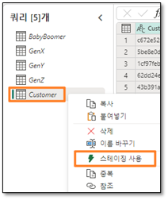

5. Das Dialogfeld „Herstellen einer Verbindung mit dem Datenziel“ wird geöffnet. Wählen Sie im **Dropdown-Menü „Verbindung“** die Option **Lakehouse (keine)** aus.

6. Wählen Sie **Weiter** aus.

   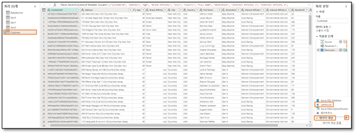

7. Das Dialogfeld „Ziel auswählen“ wird geöffnet. Stellen Sie sicher, dass das **Optionsfeld „Neue Tabelle“** ausgewählt ist, da wir eine neue Tabelle erstellen.

8. Wir möchten die zuvor erstellte Tabelle in Lakehouse erstellen. Wechseln Sie links zu **Lakehouse -> FAIAD_<Benutzername>**.

9. Wählen Sie **lh_FAIAD** aus.

10. Behalten Sie den Tabellennamen **Customer** bei.

11. Wählen Sie **Weiter** aus.

    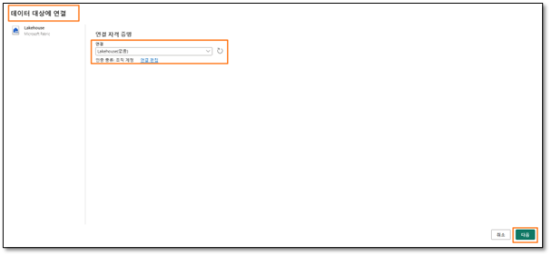

12. Das Dialogfeld „Zieleinstellungen auswählen“ wird geöffnet. Bei jeder Aktualisierung von Dataflow Gen2 möchten wir einen vollständigen Ladevorgang durchführen. Stellen Sie sicher, dass **Updatemethode** auf **Ersetzen** festgelegt ist.

13. Beachten Sie, dass die Warnung „Einige Spaltennamen enthalten nicht unterstützte Zeichen. Sollen wir das Problem für Sie beheben?“ Lakehouse unterstützt keine Spaltennamen mit Leerzeichen. Wählen Sie **Korrigieren** aus, um die Warnung zu entfernen.

14. Mithilfe der Spaltenzuordnung können Dataflow-Spalten vorhandenen Spalten zugeordnet werden. In unserem Fall handelt es sich um eine neue Tabelle. Daher können wir die Standardwerte verwenden. Wählen Sie **Einstellungen speichern** aus.

    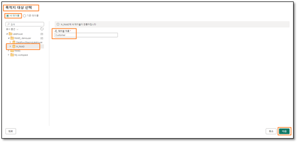

## Aufgabe 8: Dataverse-Dataflow veröffentlichen und umbenennen

1. Sie werden zum **Power Query-Fenster** weitergeleitet. Beachten Sie unten rechts, dass das **Datenziel** auf **Lakehouse** festgelegt ist.

2. Wählen Sie unten rechts **Veröffentlichen** aus.

   

**Hinweis:** Sie werden wieder zum Bildschirm Data Factory geleitet. Es kann einige Momente dauern, bis der Dataflow veröffentlicht wird.

3. Wir arbeiten mit Dataflow 1. Benennen wir ihn um, bevor wir fortfahren. Klicken Sie auf die **Auslassungspunkte (…)** neben Dataflow 1. Wählen Sie **Eigenschaften** aus.

   

4. Das Dialogfeld „Dataflow-Eigenschaften“ wird geöffnet. Ändern Sie den **Namen** in **df_Customer_Dataverse**.

5. Ergänzen Sie im Textfeld **Beschreibung** den Text **Dataflow zur Erfassung von Kundendaten aus Dataverse im Lakehouse**.

6. Klicken Sie auf **Speichern**.

   

Sie werden zum **Bildschirm „Data Factory“** weitergeleitet. Erstellen wir nun einen Dataflow zur Erfassung der Daten aus SharePoint.

## Aufgabe 9: SharePoint-Abfragen in Dataflow kopieren

1. Wählen Sie im Menü oben die Option **Neu -> Dataflow Gen2** aus.

   

Sie werden zur **Dataflow-Seite** weitergeleitet. Nachdem Sie Dataflow nun kennen, kopieren Sie die Abfragen aus Power BI Desktop in Dataflow.

2. Öffnen Sie, sofern noch nicht geschehen, auf dem **Desktop** Ihrer Übungsumgebung im Ordner Report die Datei **FAIAD.pbix**.

3. Wählen Sie im Menüband **Start > Daten transformieren** aus. Das Power Query-Fenster wird geöffnet. Wie Sie in der vorherigen Übung festgestellt haben, sind die Abfragen im linken Bereich nach Datenquelle organisiert.

4. Das Power Query-Fenster wird geöffnet. Wählen Sie links unter dem Ordner **SharepointData** die Abfrage **People** aus.

5. **Klicken Sie mit der rechten Maustaste**, und wählen Sie **Kopieren** aus.

   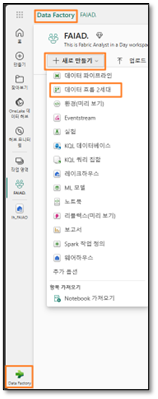

6. Rufen Sie im Browser wieder das Fenster **Dataflow** auf.

7. Drücken Sie im Bereich **Dataflow** auf **Strg+V** (das Einfügen mittels Rechtsklick ist derzeit nicht möglich).

Beachten Sie, dass die Abfrage links eingefügt wurde. Weil für SharePoint keine Verbindung erstellt wurde, wird eine Warnmeldung angezeigt, in der Sie aufgefordert werden, eine Verbindung zu konfigurieren.

## Aufgabe 10: Verbindung zu SharePoint erstellen

1. Wählen Sie **Verbindung konfigurieren** aus.

   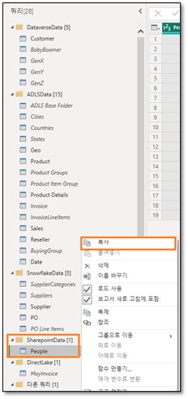

2. Das Dialogfeld „Mit Datenquelle verbinden“ wird geöffnet. Überprüfen Sie, dass im Dropdown-Menü **Verbindung** die Option **Neue Verbindung erstellen** ausgewählt ist.

3. Die **Authentifizierungsart** muss **Organisationskonto** lauten.

4. Wählen Sie **Verbinden** aus.

   

## Aufgabe 11: Datenziel für die Abfrage „People“ konfigurieren

Die Verbindung wird hergestellt, und Sie können die Daten im Vorschaufenster ansehen. Wenn Sie möchten, sehen Sie sich die angewandten Schritte der Abfragen an. Nun müssen die Personendaten im Lakehouse erfasst werden.

1. Wie bereits erwähnt, stellen wir keine dieser Daten bereit. Klicken Sie im Bereich mit den Abfragen **mit der rechten Maustaste** auf die Abfrage **People**, und wählen Sie **Staging aktivieren** aus, um das Häkchen zu entfernen.

   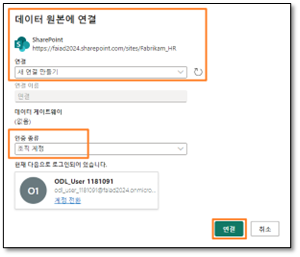

2. Wählen Sie die Abfrage **People** aus.

3. Wählen Sie unten rechts **„+“** neben **Datenziel** aus.

4. Wählen Sie im Dialogfeld die Option **Lakehouse** aus.

   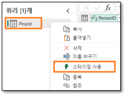

5. Das Dialogfeld „Herstellen einer Verbindung mit dem Datenziel“ wird geöffnet. Wählen Sie im **Dropdown-Menü „Verbindung“** die Option **Lakehouse (keine)** aus.

6. Wählen Sie **Weiter** aus.

   

7. Das Dialogfeld „Ziel auswählen“ wird geöffnet. Stellen Sie sicher, dass das **Optionsfeld „Neue Tabelle“** ausgewählt ist, da wir eine neue Tabelle erstellen.

8. Wir möchten die zuvor erstellte Tabelle in Lakehouse erstellen. Navigieren Sie im linken Bereich zu **Lakehouse -> FAIAD_<Benutzername>**.

9. Wählen Sie **lh_FAIAD** aus.

10. Behalten Sie den Tabellennamen **People** bei.

11. Wählen Sie **Weiter** aus.

    

12. Das Dialogfeld „Zieleinstellungen auswählen“ wird geöffnet. Bei jeder Aktualisierung von Dataflow Gen2 möchten wir einen vollständigen Ladevorgang durchführen. Stellen Sie sicher, dass **Updatemethode** auf **Ersetzen** festgelegt ist.

13. Beachten Sie, dass die Warnung „Einige Spaltennamen enthalten nicht unterstützte Zeichen. Sollen wir das Problem für Sie beheben?“ Lakehouse unterstützt keine Spaltennamen mit Leerzeichen. Wählen Sie **Korrigieren** aus, um die Warnung zu entfernen.

14. Mithilfe der Spaltenzuordnung können Dataflow-Spalten vorhandenen Spalten zugeordnet werden. In unserem Fall handelt es sich um eine neue Tabelle. Daher können wir die Standardwerte verwenden. Wählen Sie **Einstellungen speichern** aus.

    

## Aufgabe 12: SharePoint-Dataflow veröffentlichen und umbenennen

1. Sie werden zum **Power Query-Fenster** weitergeleitet. Beachten Sie **unten rechts**, dass das Datenziel auf **Lakehouse** festgelegt ist.

2. Wählen Sie unten rechts **Veröffentlichen** aus.

   

**Hinweis:** Sie werden wieder zum Bildschirm Data Factory geleitet. Es kann einige Momente dauern, bis der Dataflow veröffentlicht wird.

3. Wir arbeiten mit Dataflow 1. Benennen wir ihn um, bevor wir fortfahren. Klicken Sie auf die **Auslassungspunkte (…)** neben Dataflow 1. Wählen Sie **Eigenschaften** aus.

   

4. Das Dialogfeld „Dataflow-Eigenschaften“ wird geöffnet. Ändern Sie den **Namen** in **df_People_SharePoint**.

5. Ergänzen Sie im Textfeld **Beschreibung** den Text **Dataflow zur Erfassung der Personendaten aus SharePoint im Lakehouse**.

6. Klicken Sie auf **Speichern**.

   

Sie werden zum **Bildschirm „Data Factory“** weitergeleitet. Nun sind alle Daten im Lakehouse erfasst. In der nächsten Übung beschäftigen wir uns mit der Planung von Dataflow-Aktualisierungen.

## Referenzen
Bei Fabric Analyst in a Day (FAIAD) lernen Sie einige der wichtigsten Funktionen von Microsoft Fabric kennen. Im Menü des Dienstes finden Sie in der Hilfe (?) Links zu praktischen Informationen.

   

Nachfolgend finden Sie weitere Angebote zur weiteren Arbeit mit Microsoft Fabric.

Nachfolgend finden Sie weitere Angebote zur weiteren Arbeit mit Microsoft Fabric.

- Die vollständige Ankündigung https://aka.ms/Fabric-Hero-Blog-Ignite23 finden Sie im Blogbeitrag.
- Fabric bei einer https://aka.ms/Fabric-GuidedTour kennenlernen
- Zur https://aka.ms/try-fabric anmelden
- https://aka.ms/microsoft-fabric besuchen
- Mit Modulen von https://aka.ms/learn-fabric neue Qualifikationen erwerben
- https://aka.ms/fabric-docs lesen
- https://aka.ms/fabric-get-started-ebook lesen
- Mitglied der https://aka.ms/fabric-community werden, um Fragen zu stellen, Feedback zu geben und sich mit anderen auszutauschen

Lesen Sie die detaillierteren Blogs zur Ankündigung der Fabric-Umgebung:

- https://aka.ms/Fabric-Data-Factory-Blog

- https://aka.ms/Fabric-DE-Blog

- https://aka.ms/Fabric-DS-Blog

- https://aka.ms/Fabric-DW-Blog

- https://aka.ms/Fabric-RTA-Blog

- https://aka.ms/Fabric-PBI-Blog

- https://aka.ms/Fabric-DA-Blog

- https://aka.ms/Fabric-Admin-Gov-Blog

- https://aka.ms/Fabric-OneLake-Blog

- https://aka.ms/Dataverse-Fabric-Blog

© 2023 Microsoft Corporation. Alle Rechte vorbehalten.

Durch die Verwendung der vorliegenden Demo/Übung stimmen Sie den folgenden Bedingungen zu:

Die in dieser Demo/Übung beschriebene Technologie/Funktionalität wird von der Microsoft Corporation bereitgestellt, um Feedback von Ihnen zu erhalten und Ihnen Wissen zu vermitteln. Sie dürfen die Demo/Übung nur verwenden, um derartige Technologiefeatures und Funktionen zu bewerten und Microsoft Feedback zu geben. Es ist Ihnen nicht erlaubt, sie für andere Zwecke zu verwenden. Es ist Ihnen nicht gestattet, diese Demo/Übung oder einen Teil derselben zu ändern, zu kopieren, zu verbreiten, zu übertragen, anzuzeigen, auszuführen, zu vervielfältigen, zu veröffentlichen, zu lizenzieren, zu transferieren oder zu verkaufen oder aus ihr abgeleitete Werke zu erstellen.

DAS KOPIEREN ODER VERVIELFÄLTIGEN DER DEMO/ÜBUNG (ODER EINES TEILS DERSELBEN) AUF EINEN/EINEM ANDEREN SERVER ODER SPEICHERORT FÜR DIE WEITERE VERVIELFÄLTIGUNG ODER VERBREITUNG IST AUSDRÜCKLICH UNTERSAGT.

DIESE DEMO/ÜBUNG STELLT BESTIMMTE SOFTWARE-TECHNOLOGIE-/PRODUKTFEATURES UND FUNKTIONEN, EINSCHLIESSLICH POTENZIELLER NEUER FEATURES UND KONZEPTE, IN EINER SIMULIERTEN UMGEBUNG OHNE KOMPLEXE EINRICHTUNG ODER INSTALLATION FÜR DEN OBEN BESCHRIEBENEN ZWECK BEREIT. DIE TECHNOLOGIE/KONZEPTE IN DIESER DEMO/ÜBUNG ZEIGEN MÖGLICHERWEISE NICHT DAS VOLLSTÄNDIGE FUNKTIONSSPEKTRUM UND FUNKTIONIEREN MÖGLICHERWEISE NICHT WIE DIE ENDGÜLTIGE VERSION. UNTER UMSTÄNDEN VERÖFFENTLICHEN WIR AUCH KEINE ENDGÜLTIGE VERSION DERARTIGER FEATURES ODER KONZEPTE. IHRE ERFAHRUNG BEI DER VERWENDUNG DERARTIGER FEATURES UND FUNKTIONEN IN EINER PHYSISCHEN UMGEBUNG KANN FERNER ABWEICHEND SEIN.

**FEEDBACK.** Wenn Sie Feedback zu den Technologiefeatures, Funktionen und/oder Konzepten geben, die in dieser Demo/Übung beschrieben werden, gewähren Sie Microsoft das Recht, Ihr Feedback in jeglicher Weise und für jeglichen Zweck kostenlos zu verwenden, zu veröffentlichen und gewerblich zu nutzen. Außerdem treten Sie Dritten kostenlos sämtliche Patentrechte ab, die erforderlich sind, damit deren Produkte, Technologien und Dienste bestimmte Teile einer Software oder eines Dienstes von Microsoft, welche/welcher das Feedback enthält, verwenden oder eine Verbindung zu dieser/diesem herstellen können. Sie geben kein Feedback, das einem Lizenzvertrag unterliegt, aufgrund dessen Microsoft Drittparteien eine Lizenz für seine Software oder Dokumentation gewähren muss, weil wir Ihr Feedback in diese aufnehmen. Diese Rechte bestehen nach Ablauf dieser Vereinbarung fort.

DIE MICROSOFT CORPORATION LEHNT HIERMIT JEGLICHE GEWÄHRLEISTUNGEN UND GARANTIEN IN BEZUG AUF DIE DEMO/ÜBUNG AB, EINSCHLIESSLICH ALLER AUSDRÜCKLICHEN, KONKLUDENTEN ODER GESETZLICHEN GEWÄHRLEISTUNGEN UND GARANTIEN DER HANDELSÜBLICHKEIT, DER EIGNUNG FÜR EINEN BESTIMMTEN ZWECK, DES RECHTSANSPRUCHS UND DER NICHTVERLETZUNG VON RECHTEN DRITTER. MICROSOFT MACHT KEINERLEI ZUSICHERUNGEN BZW. ERHEBT KEINERLEI ANSPRÜCHE IM HINBLICK AUF DIE RICHTIGKEIT DER ERGEBNISSE UND DES AUS DER VERWENDUNG DER DEMO/ÜBUNG RESULTIERENDEN ARBEITSERGEBNISSES BZW. BEZÜGLICH DER EIGNUNG DER IN DER DEMO/ÜBUNG ENTHALTENEN INFORMATIONEN FÜR EINEN BESTIMMTEN ZWECK.

**HAFTUNGSAUSSCHLUSS**

Diese Demo/Übung enthält nur einen Teil der neuen Features und Verbesserungen in Microsoft Power BI. Einige Features können sich unter Umständen in zukünftigen Versionen des Produkts ändern. In dieser Demo/Übung erhalten Sie Informationen über einige, aber nicht über alle neuen Features.
