# Einführung

Wir haben Daten aus verschiedenen Datenquellen in Lakehouse erfasst. In dieser Übung richten Sie einen Aktualisierungszeitplan für die Datenquellen ein. Zusammenfassung der Anforderung:

- **Verkaufsdaten:** Diese werden in ADLS täglich mittags bzw. um 12:00 Uhr aktualisiert.
- **Lieferantendaten:** Diese werden in Snowflake täglich um Mitternacht/00:00 Uhr aktualisiert.
- **Kundendaten:** Diese sind in Dataverse immer auf dem neuesten Stand. Wir müssen diese viermal täglich aktualisieren, um Mitternacht bzw. 00:00 Uhr, um 6:00 Uhr, mittags bzw. um 12:00 Uhr und um 18:00 Uhr.
- **Mitarbeiterdaten:** Diese werden in SharePoint täglich um 9:00 Uhr aktualisiert. Wir haben jedoch festgestellt, dass es manchmal zu einer Verzögerung von 15 bis 30 Minuten kommt. Wir müssen einen Aktualisierungsplan erstellen, um dies zu berücksichtigen.

Inhalt dieser Übung:
- So konfigurieren Sie eine geplante Aktualisierung von Dataflow Gen2
- So erstellen Sie eine Datenpipeline
- So konfigurieren Sie eine geplante Aktualisierung einer Datenpipeline

# Dataflow Gen2

## Aufgabe 1: Geplante Aktualisierung für den Verkaufs-Dataflow konfigurieren

Beginnen wir damit, eine geplante Aktualisierung des Verkaufs-Dataflows zu konfigurieren.

1. Navigieren wir nun zurück zum Fabric-Arbeitsbereich **FAIAD_\<username>**, den Sie in Übung 2, Aufgabe 8, erstellt haben.

1. Alle von Ihnen erstellten Artefakte werden hier aufgelistet. Geben Sie rechts im Bildschirm **df** in das **Suchfeld** ein. Dadurch werden die Artefakte nach Dataflows gefiltert.

    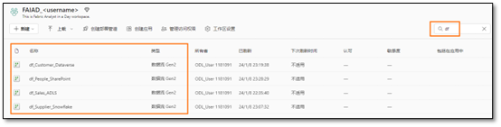

1. Zeigen Sie mit der Maus auf die Zeile **df_Sales_ADLS**. Beachten Sie, dass die vertrauten Symbole **Aktualisieren** und **Aktualisierung planen** verfügbar sind. Klicken Sie auf die **Auslassungspunkte (...)**.

1. Beachten Sie, dass die Optionen „Löschen“, „Bearbeiten“ und „Dataflow exportieren“ vorhanden sind. Wir können Eigenschaften verwenden, um den Namen und die Beschreibung des Dataflows zu aktualisieren. Wir sehen uns den Aktualisierungsverlauf in Kürze an. Wählen Sie **Einstellungen** aus.

    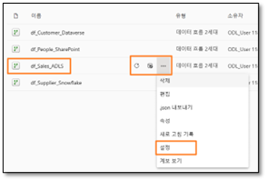

    >**Hinweis:** Die Seite „Einstellungen“ wird geöffnet. Im linken Bereich sind alle Dataflows aufgelistet.

5. Wählen Sie im mittleren Bereich den Link **Verlauf aktualisieren** aus.

   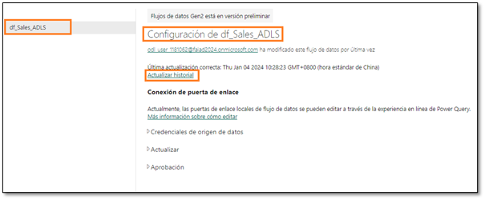

1. Das Dialogfeld „Verlauf aktualisieren“ wird geöffnet. Es wird mindestens eine Aktualisierung aufgelistet. Hierbei handelt es sich um die Aktualisierung, die bei der Veröffentlichung des Dataflows erfolgt ist. Wählen Sie den Link **Startzeit** aus.

    >**Hinweis:** Die Startzeit ist für Sie unterschiedlich.

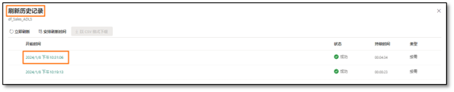

Der Detailbildschirm wird geöffnet. Hier erhalten Sie Details zur Aktualisierung sowie eine Liste mit Start-, Endzeit und Dauer. Außerdem werden die aktualisierten Tabellen/Aktivitäten aufgelistet. Falls ein Fehler auftritt, können Sie auf den Namen der Tabelle/Aktivität klicken, um mehr zu erfahren.

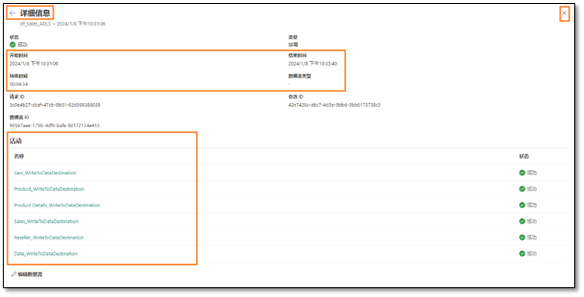

7. Wir navigieren von dieser Seite weg, indem wir auf das **X** in der oberen rechten Ecke klicken. Sie werden zur **Seite „Dataflow-Einstellungen“** weitergeleitet.

1. Erweitern Sie unter „Gateway-Verbindung“ **Datenquellen-Anmeldeinformationen**. Es wird eine Liste der im Dataflow verwendeten Verbindungen angezeigt. In diesem Fall „Lakehouse“ und „ADLS“.

    - **Lakehouse:** Dies ist die Verbindung zum Erfassen von Daten aus Dataflow.

    - **ADLS:** Dies ist die Verbindung zu den ADLS-Quelldaten.

        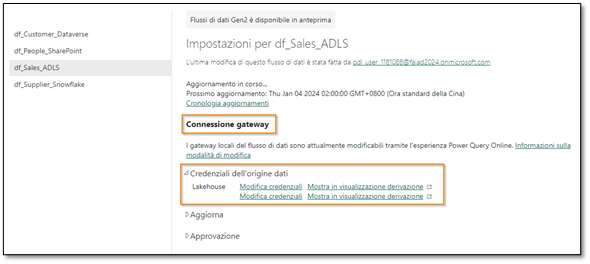

1. Erweitern Sie **Aktualisieren**.

1. Legen Sie den Schieberegler für **Aktualisierungszeitplan** auf **Ein** fest.

1. Legen Sie das **Dropdownmenü Aktualisierungshäufigkeit** auf **Täglich** fest. Beachten Sie, dass Sie auch die Option „Wöchentlich“ auswählen können.

1. Legen Sie die **Zeitzone** auf Ihre bevorzugte Zeitzone fest.

    >**Hinweis:** Da es sich um eine Übungsumgebung handelt, können Sie die Zeitzone auf Ihre bevorzugte Zeitzone festlegen. In einem realen Szenario legen Sie die Zeitzone basierend auf Ihrem/Speicherort der Datenquelle fest.

13. Klicken Sie auf den Link **Andere Uhrzeit hinzufügen**.

>**Hinweis:** Die Option **Uhrzeit** wird angezeigt.

14. Legen Sie die **Uhrzeit** auf **Mittag** fest. Beachten Sie, dass Sie die Aktualisierung zu jeder vollen oder halben Stunde einstellen können.

1. Wählen Sie **Übernehmen** aus, um diese Einstellung zu speichern.

>**Hinweis:** Durch Klicken auf den Link „Andere Uhrzeit hinzufügen“ können Sie mehrere Aktualisierungszeiten hinzufügen.

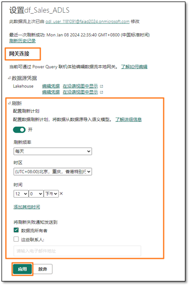

Sie können auch Fehlerbenachrichtigungen an den Besitzer des Dataflows und an andere Kontakte senden.

## Aufgabe 2: Geplante Aktualisierung für den Lieferanten- und Kunden-Dataflow konfigurieren

1. Wählen Sie im linken Bereich **df_Supplier_Snowflake** aus.

1. Konfigurieren Sie den Aktualisierungszeitplan, sodass die Aktualisierung **täglich um Mitternacht/00:00 Uhr** durchgeführt wird.

1. Wählen Sie **Übernehmen** aus, um diese Einstellung zu speichern.

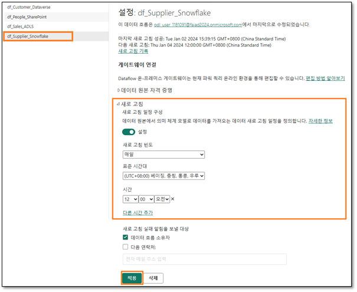

4. Wählen Sie im linken Bereich **df_Customer_Dataverse** aus.

1. Konfigurieren Sie den Aktualisierungszeitplan, sodass die Aktualisierung viermal täglich erfolgt: **um Mitternacht bzw. um 00:00 Uhr, um 6:00 Uhr, mittags bzw. um 12:00 Uhr und um 18 Uhr**.

1. Wählen Sie **Übernehmen** aus, um diese Einstellung zu speichern.

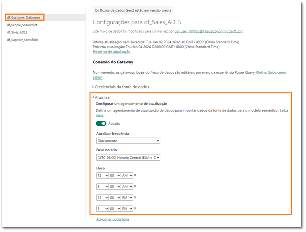

Wie bereits erwähnt, müssen wir eine benutzerdefinierte Logik erstellen, um das Szenario zu handhaben, in dem die Mitarbeiterdatei in SharePoint nicht rechtzeitig gesendet wird. Wir verwenden die Datenpipeline, um dieses Problem zu beheben.

# Datenpipeline

## Aufgabe 3: Datenpipeline erstellen

1. Wählen Sie **unten links** in Ihrem Browserfenster **Power BI** aus.

1. Das Dialogfeld Microsoft Fabric wird geöffnet. Wählen Sie **Data Factory** aus. Sie navigieren zur Data Factory-Startseite.

    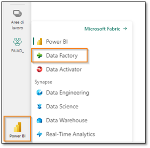

1. Wählen Sie im oberen Bereich **Datenpipeline** aus, um eine neue Pipeline zu erstellen.

1. Das Dialogfeld „Neue Pipeline“ wird geöffnet. Geben Sie der Pipeline den Namen **pl_Refresh_People_SharePoint**.

1. Wählen Sie **Erstellen** aus.

    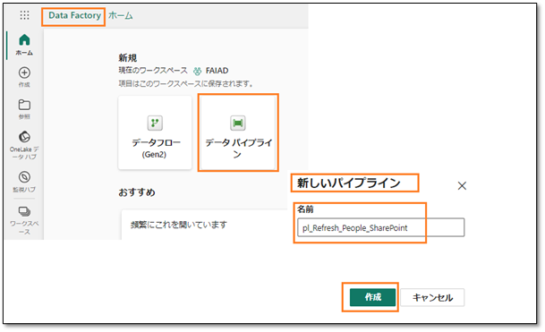

Sie werden zur Seite „Datenpipeline“ weitergeleitet. Wenn Sie bereits mit Azure Data Factory gearbeitet haben, sind Sie mit diesem Bildschirm vertraut. Verschaffen wir uns einen kurzen Überblick über das Layout.

Sie befinden sich auf dem Startbildschirm. Im oberen Menü finden Sie Optionen zum Hinzufügen häufig verwendeter Aktivitäten: „Überprüfen“, „Ausführen“ und „Ausführungsverlauf anzeigen“. Im mittleren Bereich finden Sie ebenfalls Optionen zum schnellen Erstellen der Pipeline.

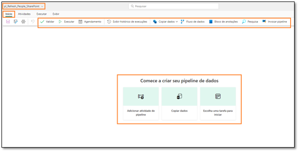

6. Wählen Sie im oberen Menü die Option **Aktivitäten** aus. Das Menü enthält nun eine Liste mit häufig verwendeten Aktivitäten.

1. Wählen Sie rechts im Menü die **Auslassungspunkte (…)** aus, um alle anderen verfügbaren Aktivitäten anzuzeigen. Wir werden einige dieser Aktivitäten in der Übung verwenden.

    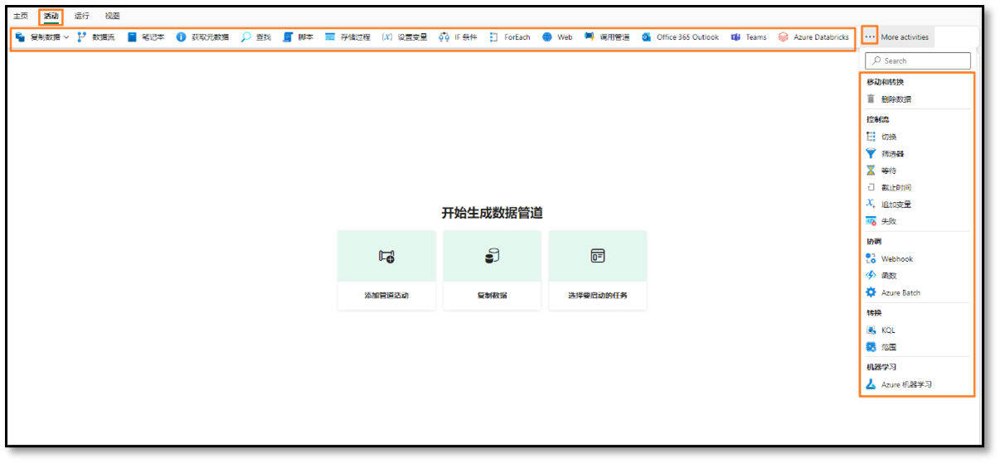

1. Klicken Sie im oberen Menü auf **Ausführen**. Es werden Optionen zum Ausführen und Planen der Pipeline angezeigt. Hier finden Sie auch die Option zum Anzeigen des Ausführungsverlaufs mithilfe von „Ausführungsverlauf anzeigen“.

1. Wählen Sie im oberen Menü die Option **Anzeigen** aus. Hier finden Sie Optionen zum Anzeigen des Codes im JSON-Format. Außerdem sind Optionen zum Formatieren der Aktivitäten verfügbar.

> **Hinweis:** Wenn Sie am Ende der Übung über einen JSON-Hintergrund verfügen, können Sie auch „JSON-Code anzeigen“ auswählen. Hier sehen Sie, dass die gesamte Orchestrierung, die Sie über die Entwurfsansicht durchführen, auch in JSON geschrieben werden kann.

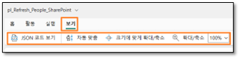

## Aufgabe 4: Einfache Datenpipeline erstellen

Beginnen wir mit der Erstellung der Pipeline. Wir benötigen eine Aktivität, um den Dataflow zu aktualisieren. Lassen Sie uns nach einer Aktivität suchen, die wir verwenden können.

1. Wählen Sie im oberen Menü **Aktivitäten -> Dataflow** aus. Die Dataflow-Aktivität wird dem mittleren Designbereich hinzugefügt. Beachten Sie, dass der untere Bereich jetzt Konfigurationsoptionen der Dataflow-Aktivität enthält.

1. Wir werden die Aktivität so konfigurieren, dass sie eine Verbindung zur df_People_SharePoint-Aktivität herstellt. Wählen Sie im **unteren Bereich** die Option **Einstellungen** aus.

1. Stellen Sie sicher, dass **Arbeitsbereich** auf Ihren Fabric-Arbeitsbereich, **FAIAD_\<Benutzername>**, festgelegt ist.

1. Wählen Sie im **Dropdownmenü „Dataflow“** die Option **df_People_SharePoint** aus. Wenn diese Dataflow-Aktivität ausgeführt wird, erfolgt eine Aktualisierung von **df_People_SharePoint**. Das war doch einfach, oder? 😊

>**Hinweis:** Die Benachrichtigungsoption ist derzeit ausgegraut. Diese Funktion wird in Kürze aktiviert. Sie können Benachrichtigungen konfigurieren, die Sie darüber informieren, ob diese Aktivität erfolgreich war oder nicht.

In unserem Szenario werden Mitarbeiterdaten nicht planmäßig aktualisiert. Manchmal kommt es zu einer Verzögerung. Sehen wir uns an, ob wir dies berücksichtigen können.

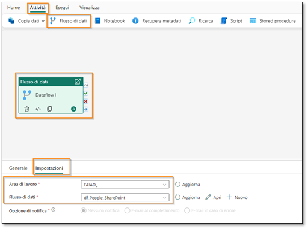

5. Wählen Sie im **unteren Bereich** die Option **Allgemein** aus. Wir geben der Aktivität einen Namen und eine Beschreibung.

1. Geben Sie im Feld **Name dfactivity_People_SharePoint** ein.

1. Geben Sie im Feld **Beschreibung** die **Dataflow-Aktivität ein, um den df_People_Sharepoint-Dataflow zu aktualisieren.**

1. Beachten Sie, dass eine Option zum Deaktivieren einer Aktivität vorhanden ist. Diese Funktion ist beim Testen oder Debuggen hilfreich. Behalten Sie die Einstellung Aktiviert bei.

1. Es ist eine Option zum Festlegen eines **Timeouts** verfügbar. Lassen wir den **Standardwert** unverändert, damit dem Dataflow genügend Zeit für die Aktualisierung zur Verfügung steht.

>**Hinweis:** Wenn die Daten nicht planmäßig verfügbar sind, legen wir die Aktivität so fest, dass sie dreimal alle 10 Minuten erneut ausgeführt wird. Wenn der dritte Versuch fehlschlägt, wird ein Fehler gemeldet.

10. Legen Sie **Wiederholen** auf **3** fest.

1. Erweitern Sie den Abschnitt **Erweitert**.

1. 	Legen Sie **Wiederholungsintervall (Sek.)** auf **600** fest.

1. Wählen Sie im Menü **Startseite -> Symbol „Speichern“** aus, um die Pipeline zu speichern.

    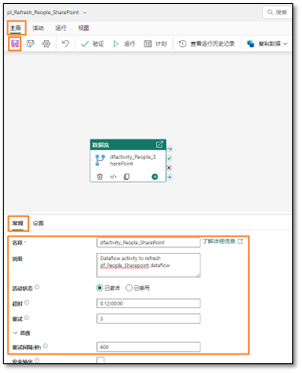

Beachten Sie, welchen Vorteil die Verwendung der Datenpipeline im Vergleich zur Festlegung des Dataflows auf eine geplante Aktualisierung bietet (wie es schon bei früheren Dataflows erfolgt ist):

- Die Pipeline bietet die Möglichkeit der mehrmaligen Wiederholung, bevor die Aktualisierung fehlschlägt.

- Die Pipeline ermöglicht eine Aktualisierung innerhalb von Sekunden, während beim Dataflow alle 30 Minuten eine geplante Aktualisierung erfolgt.

## Aufgabe 5: Neue Datenpipeline erstellen

Fügen wir unserem Szenario etwas mehr Komplexität hinzu. Wir haben festgestellt, dass, wenn die Daten nicht um 9:00 Uhr morgens verfügbar sind, sie in der Regel innerhalb von fünf Minuten verfügbar sind. Wird das Zeitfenster verpasst, dauert es 15 Minuten, bis die Datei verfügbar ist. Wir möchten die Wiederholungen so planen, dass sie alle 5 und 15 Minuten erfolgen. Sehen wir uns an, wie dies durch die Erstellung einer neuen Datenpipeline erreicht werden kann.

1. Klicken Sie im linken Bereich auf **FAIAD_\<Benutzername>**, sodass Sie zur Data Factory-Startseite weitergeleitet werden.

1. Klicken Sie im oberen Menü auf **Neu** und im **Dropdownmenü** auf **Datenpipeline**.

1. Das Dialogfeld „Neue Pipeline“ wird geöffnet. **Geben Sie der Pipeline den Namen pl_Refresh_People_SharePoint_Option2.**

1. Wählen Sie **Erstellen** aus.

    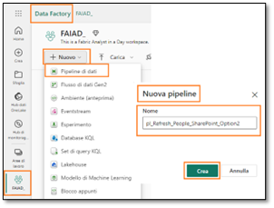

## Aufgabe 6: Bis-Aktivität erstellen

1. Sie werden zum Bildschirm „Datenpipeline“ weitergeleitet. Wählen Sie im Menü die Option **Aktivitäten** aus.

1. Klicken Sie rechts auf die **Auslassungspunkte (...)**.

1. Klicken Sie in der Aktivitätsliste auf **Bis**.

**Bis:** Mit dieser Aktivität wird eine Iteration ausgeführt, bis eine Bedingung erfüllt ist.

In unserem Szenario erfolgt die Iteration des Dataflows so lange, bis er erfolgreich ist oder drei Versuche durchgeführt wurden.

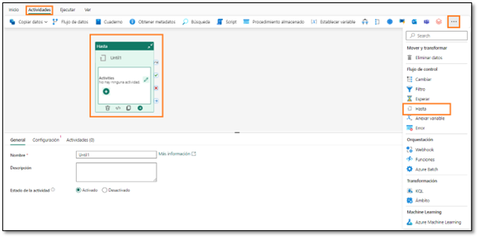

## Aufgabe 7: Variablen erstellen

1. Wir müssen Variablen für die Iteration und Festlegung des Status festlegen. Wählen Sie den **leeren Bereich** im Bereich für Pipelinedesign aus.

1. Beachten Sie, dass sich das Menü im unteren Bereich ändert. Wählen Sie **Variablen** aus.

1. Wählen Sie **Neu** aus, um eine neue Variable hinzuzufügen.

1. Beachten Sie, dass eine Zeile angezeigt wird. Geben Sie **varCounter** in das **Textfeld „Name“** ein. Wir verwenden diese Variable für eine dreimalige Iteration.

1. Wählen Sie im Dropdownmenü **Typ** die Option **Integer** aus.

1. Geben Sie den Standardwert 0 ein.

>**Hinweis:** Wir stellen den Variablennamen „var“ voran, damit sie leicht zu finden sind und da es eine gut Vorgehensweise ist.

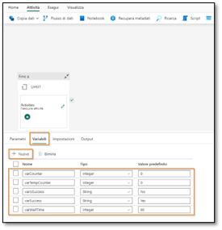

7. Wählen Sie **Neu** aus, um eine weitere Variable hinzuzufügen.

1. Beachten Sie, dass eine Zeile angezeigt wird. Geben Sie **varTempCounter** in das **Textfeld „Name“** ein. Wir werden diese Variable verwenden, um die Variable varCounter zu inkrementieren.

1. Wählen Sie im Dropdownmenü **Typ** die Option **Integer** aus.

1. Geben Sie den **Standardwert 0** ein.

1. Fügen Sie auf die gleiche Weise drei weitere Variablen hinzu:

    - **varIsSuccess** vom Typ **String** und Standardwert **No**. Diese Variable wird verwendet, um anzuzeigen, ob die Dataflow-Aktualisierung erfolgreich war.
    - **varSuccess** vom Typ **String** und Standardwert **Yes**. Diese Variable wird verwendet, um den Wert „varIsSuccess“ festzulegen, wenn die Dataflow-Aktualisierung erfolgreich ist.
    - **varWaitTime** vom Typ **Integer** und Standardwert **60**. Mit dieser Variablen wird die Wartezeit festgelegt, wenn der Dataflow fehlschlägt (entweder 5 Minuten/300 Sekunden oder 15 Minuten/900 Sekunden).

## Aufgabe 8: Bis-Aktivität konfigurieren

1. Wählen Sie die **Bis**-Aktivität aus.

1. Wählen Sie im **unteren Bereich** die Option **Allgemein** aus.

1. Geben Sie als **Name Iterator** ein.

1. Geben Sie als **Beschreibung Iterator zum Aktualisieren des Dataflows ein. Es werden bis zu drei Wiederholungen durchgeführt**.

    

1. Wählen Sie im unteren Bereich die Option **Einstellungen** aus.

1. Wählen Sie das **Textfeld „Ausdruck“** aus. Wir müssen einen Ausdruck in dieses Textfeld eingeben, der als wahr oder falsch ausgewertet wird. Die Bis-Aktivität führt die Iteration durch, während dieser Ausdruck als falsch ausgewertet wird. Sobald der Ausdruck als wahr ausgewertet wird, beendet die Bis-Aktivität die Iteration.

1. Wählen Sie den Link **Dynamischen Inhalt hinzufügen** aus, der unter dem Textfeld angezeigt wird.

    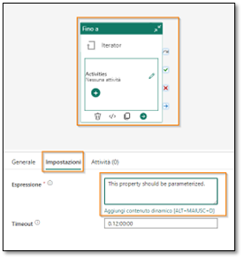

Wir müssen einen Ausdruck schreiben, der so lange ausgeführt wird, bis der Wert **varCounter 3** oder der Wert **varIsSuccess** „Ja“ lautet. („varCounter“ und „varIsSuccess“ sind die Variablen, die wir gerade erstellt haben.)

8. Das Dialogfeld Pipeline-Ausdrucks-Generator wird geöffnet. In der unteren Hälfte des Dialogfelds finden Sie ein Menü:

    - **Parameter:** Hierbei handelt es sich um Konstanten in einer Data Factory, die von einer Pipeline in jedem Ausdruck verwendet werden können.
    - **Systemvariablen:** Diese Variablen können in Ausdrücken verwendet werden, wenn Entitäten in einem der Dienste definiert werden. Zum Beispiel Pipeline-ID, Pipeline-Name, Triggername usw.
    - **Funktionen:** Sie können Funktionen innerhalb von Ausdrücken aufrufen. Die Funktionen sind in die Kategorien „Sammlung“, „Konvertierung“, „Datum“, „Logisch“, „Mathematik“ und „Zeichenfolge“ unterteilt. „concat“ ist beispielsweise eine Zeichenfolgenfunktion, „add“ ist eine mathematische Funktion usw.
    - **Variablen:** Pipeline-Variablen sind Werte, die während einer Pipeline-Ausführung festgelegt und geändert werden können. Im Gegensatz zu Pipeline-Parametern, die auf Pipeline-Ebene definiert werden und während einer Pipeline-Ausführung nicht geändert werden können, lassen sich Pipeline-Variablen innerhalb einer Pipeline mit der Aktivität „Variable festlegen“ festlegen und ändern. Wir werden die Aktivität „Variable festlegen“ in Kürze verwenden.

    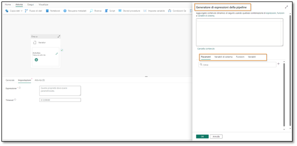

1. Klicken Sie im unteren Menü auf **Funktionen**.

1. Wählen Sie im Abschnitt **Logical Funktionen** die **or-Funktion** aus. Beachten Sie, dass **@or()** dem Textfeld für den dynamischen Ausdruck hinzugefügt wird. Die Funktion „or“ benötigt zwei Parameter. Wir arbeiten am ersten Parameter.

    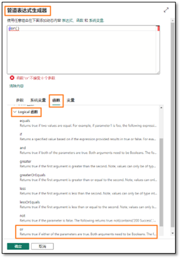

1. Platzieren Sie den Cursor **zwischen den Klammern** der Funktion **@or**.

1. Wählen Sie im Abschnitt **Logical Funktionen** die Funktion **equals** aus. Beachten Sie, dass diese dem Textfeld für den dynamischen Ausdruck hinzugefügt wird.

    >**Hinweis:** Ihre Funktion sollte wie folgt aussehen: @or(equals()). Die Funktion „equals“ benötigt auch drei Parameter. Wir überprüfen, ob die Variable „varCounter“ gleich 3 ist.

    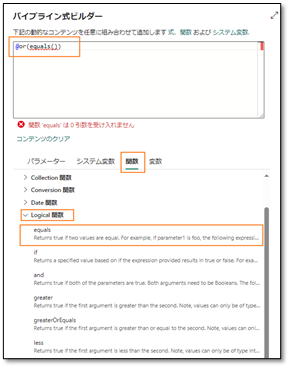

1. Platzieren Sie nun den Cursor **zwischen den Klammern** der Funktion **@equals**, um die Parameter hinzuzufügen.

1. Wählen Sie im unteren Menü **Variablen** aus.

1. Wählen Sie die Variable **varCounter** aus, bei der es sich um den ersten Parameter handelt.

1. Geben Sie **3** als zweiten Parameter der Funktion „equals“ ein. Wie im Screenshot unten lautet Ihr Ausdruck **@or(equals(variables('varCounter'),3))**.

    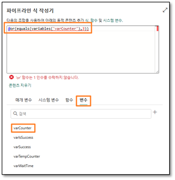

1. Wir müssen den zweiten Parameter der Funktion „or“ hinzufügen. **Fügen Sie zwischen den beiden Endklammern ein Komma** ein. Dieses Mal versuchen wir, den Funktionsnamen einzugeben. Beginnen Sie mit der Eingabe von **equ**, sodass Sie ein Dropdownmenü mit den verfügbaren Funktionen erhalten (dies wird als IntelliSense bezeichnet). Wählen Sie die Funktion **equals** aus.

    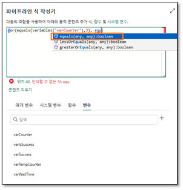

1. Der erste Parameter der Funktion „equals“ ist eine Variable. Platzieren Sie den **Cursor vor dem Komma**.

1. Beginnen Sie mit der Eingabe von **variables(**.

1. Wählen Sie mithilfe von IntelliSense **variables('varIsSuccess')** aus.

1. Nach dem Komma geben wir den zweiten Parameter ein. Beginnen Sie mit der Eingabe von **variables(**.

1. Wählen Sie mithilfe von IntelliSense **variables('varSuccess')** aus. Hier vergleichen wir den Wert „varIsSuccess“ mit dem Wert „varSuccess“. („varSuccess“ ist standardmäßig auf „Ja“ festgelegt.)

    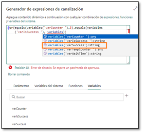

1. Ihr Ausdruck sollte folgendermaßen lauten:
**@or(equals(variables('varCounter'),3),equals(variables('varIsSuccess'), variables('varSuccess')))**.

1. Wählen Sie **OK** aus.

    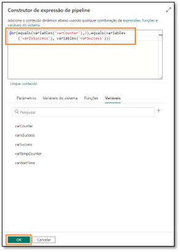

## Aufgabe 9: Dataflow-Aktivität konfigurieren

1. Sie werden zum Designbildschirm weitergeleitet. Wählen Sie bei ausgewählter **Bis-Aktivität** im **unteren Bereich** die Option **Aktivitäten** aus. Wir fügen nun die Aktivitäten hinzu, die ausgeführt werden müssen.

1. Wählen Sie in der ersten Zeile das **Bearbeitungssymbol** aus. Sie werden zum leeren Iterator-Designbildschirm weitergeleitet.

    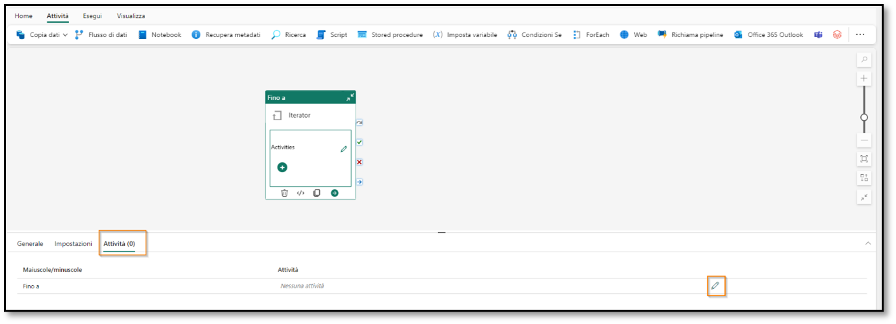

1. Wählen Sie im oberen Menü **Aktivitäten -> Dataflow** aus. Die Dataflow-Aktivität wird dem Designbereich hinzugefügt.

1. Wählen Sie bei ausgewählter **Dataflow-Aktivität** im unteren Bereich **Allgemein** aus. Wir geben der Aktivität einen Namen und eine Beschreibung.

1. Geben Sie im Feld **Name dfactivity_People_SharePoint** ein.

1. Geben Sie im Feld **Beschreibung die Dataflow-Aktivität ein, um den df_People_Sharepoint-Dataflow zu aktualisieren.**

    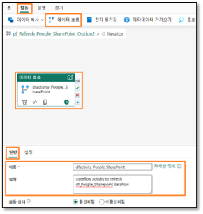

1. Wählen Sie im unteren Bereich die Option **Einstellungen** aus.

1. Stellen Sie sicher, dass **Arbeitsbereich** auf Ihren Arbeitsbereich, **FAIAD_\<Benutzername>**, festgelegt ist.

1. Wählen Sie im **Dropdownmenü „Dataflow“** die Option **df_People_SharePoint** aus. Wenn diese Dataflow-Aktivität ausgeführt wird, erfolgt eine Aktualisierung von **df_People_SharePoint.**

    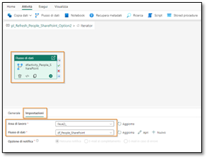

## Aufgabe 10: Erste Aktivität „Variable festlegen“ konfigurieren

Wir haben die Dataflow-Aktivität wie zuvor in der Übung konfiguriert. Nun fügen wir neue Logik hinzu. Wenn die Dataflow-Aktualisierung erfolgreich ist, müssen wir den Bis-Iterator beenden. Bedenken Sie, dass eine der Bedingungen für die Beendigung des Iterators darin besteht, den Wert der Variablen „varIsSuccess“ auf „Ja“ festzulegen.

1. Wählen Sie im oberen Menü **Aktivitäten -> Variable festlegen** aus. Die Aktivität „Variable festlegen“ wird dem Designcanvas hinzugefügt.

1. Wählen Sie bei ausgewählter **Aktivität „Variable festlegen**“ im unteren Bereich **Allgemein** aus. Wir geben der Aktivität einen Namen und eine Beschreibung.

1. Geben Sie im Feld **Name set_varIsSuccess** ein.

1. Geben Sie im Feld **Beschreibung Variable „varIsSuccess“ auf „Ja“ festlegen** aus.

>**Hinweis:** Zeigen Sie mit der Mais auf Dataflow-Aktivität. Rechts neben dem Aktivitätsfeld befinden sich vier Symbole. Diese können verwendet werden, um basierend auf dem Ergebnis der Aktivität eine Verbindung zur nächsten Aktivität herzustellen:

- Das Symbol **Grauer gebogener Pfeil** dient zum Überspringen der Aktivität.
- Das Symbol **Grünes Häkchen** wird bei erfolgreicher Ausführung der Aktivität verwendet.
- Das Symbol **Rotes X** wird verwendet, wenn die Aktivität nicht erfolgreich war.
- Das Symbol **Blauer gerader Pfeil** wird nach Abschluss der Aktivität verwendet.

5. Klicken Sie auf das **grüne Häkchen** der Dataflow-Aktivität „dfactivity_People_SharePoint“, und ziehen Sie es, um eine Verbindung mit der neuen **Aktivität „Variable festlegen“ set_varIsSuccess** herzustellen. Bei erfolgreicher Dataflow-Aktualisierung möchten wir also die Aktivität „Variable festlegen“ ausführen.

    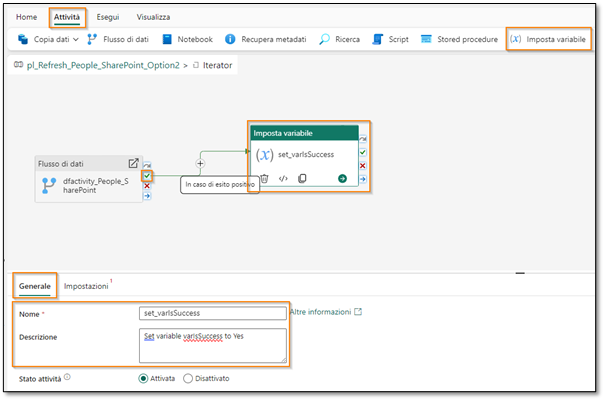

1. Klicken Sie bei ausgewählter **Aktivität „Variable festlegen“** im unteren Menü auf **Einstellungen**.

1. Stellen Sie im unteren Bereich sicher, dass **Variablentyp** auf **Pipelinevariable** festgelegt ist.

1. Wählen Sie im Feld **Name** die Option **varIsSucces**  aus. Dies ist die Variable, deren Wert wir festlegen werden.

1. Wählen Sie im Feld **Wert** das **Textfeld** aus. Wählen Sie den Link **Dynamischen Inhalt hinzufügen** aus.

    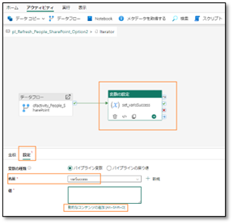

1. Das Dialogfeld Pipeline-Ausdrucks-Generator wird geöffnet. Wählen Sie unten den Textbereich **Dynamischen Inhalt unten mit einer beliebigen Kombination aus Ausdrücken, Funktionen und Systemvariablen hinzufügen aus**.

1. Wählen Sie im unteren Menü **Variablen -> varSuccess** aus. Beachten Sie, dass „@variables('varSuccess')“ im Textbereich „Dynamischen Inhalt unten hinzufügen“ eingegeben wird. Denken Sie daran, als wir Variablen erstellt haben, hatten wir den Wert der Variablen „varSuccess“ auf „Ja“ voreingestellt. Daher weisen wir der Variablen „varIsSuccess“ den Wert „Ja“ zu.

1. Wählen Sie **OK** aus. Sie werden zum **Iterator-Designbereich** weitergeleitet.

    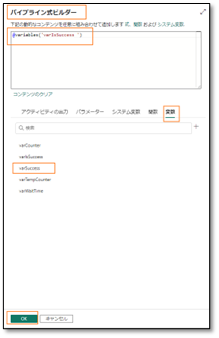

Nun müssen wir den Zähler festlegen, wenn die Dataflow-Aktivität fehlschlägt. In der Datenpipeline können wir keine Selbstreferenz für eine Variable festlegen. Das bedeutet, dass wir die Zählervariable „varCounter“ nicht inkrementieren können, indem wir ihr den Wert eins hinzufügen (varCounter = varCounter + 1). Daher nutzen wir die Variable „varTempCounter“.

## Aufgabe 11: Zweite Aktivität „Variable festlegen“ konfigurieren

1. Wählen Sie im oberen Menü **Aktivitäten -> Variable festlegen** aus. Die Aktivität „Variable festlegen“ wird dem Designcanvas hinzugefügt.

1. Wählen Sie bei ausgewählter **Aktivität „Variable festlegen**“ im unteren Bereich **Allgemein** aus. Wir geben der Aktivität einen Namen und eine Beschreibung.

1. Geben Sie im Feld **Name set_varTempCounter** ein.

1. Geben Sie im Feld **Beschreibung Variable „varTempCounter“ inkrementieren** aus.

1. Klicken Sie auf das **rote X** der Dataflow-Aktivität “ zur neuen Aktivität „Variable festlegen“. Bei nicht erfolgreicher Dataflow-Aktualisierung können wir also diese Aktivität „Variable festlegen“ ausführen.

    

1. Wählen Sie bei ausgewählter **Aktivität „Variable festlegen**“ im unteren Menü **Einstellungen** aus.

1. Stellen Sie im unteren Bereich sicher, dass **Variablentyp** auf **Pipelinevariable** festgelegt ist.

1. Wählen Sie im Feld **Name varTempCounter** aus.  aus. Dies ist die Variable, deren Wert wir festlegen werden.

1. Wählen Sie im Feld **Wert** das **Textfeld** aus. Wählen Sie den Link **Dynamischen Inhalt hinzufügen** aus.

1. Das Dialogfeld Pipeline-Ausdrucks-Generator wird geöffnet. Geben Sie **@add(variables('varCounter'),1)** ein.

    >**Hinweis:** Sie können diesen Ausdruck gerne eingeben und die Funktionen über das Menü auswählen oder kopieren und einfügen.

>**Hinweis:** Diese Funktion legt den Wert der Variablen „varTempCounter“ auf den Wert der Variablen „varCounter“ plus eins (varTempCounter = varCounter + 1) fest.

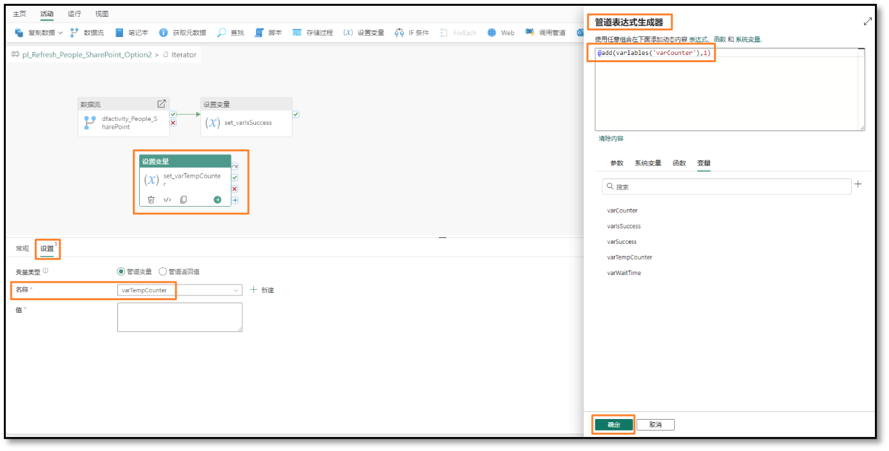

Nun müssen wir den Wert der Variablen „varCounter“ auf den Wert „varTempCounter“ festlegen.

## Aufgabe 12: Dritte Aktivität „Variable festlegen“ konfigurieren

1. Wählen Sie im oberen Menü **Aktivitäten -> Variable festlegen** aus. Die Aktivität „Variable festlegen“ wird dem Designcanvas hinzugefügt.

1. Wählen Sie bei ausgewählter **Aktivität „Variable festlegen**“ im unteren Bereich **Allgemein** aus. Wir geben der Aktivität einen Namen und eine Beschreibung.

1. Geben Sie im Feld **Name set_varCounter** ein.

1. Geben Sie im Feld **Beschreibung Variable „varCounter“ inkrementieren** ein.

1. Klicken Sie auf das **grüne Häkchen** der Aktivität zum Festlegen der Variablen „set_varTempCounter“, und ziehen Sie es, um eine Verbindung mit der neuen der Aktivität zum Festlegen der Variablen **set_varCounter** herzustellen.

    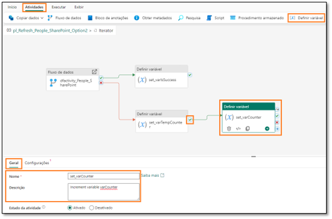

1. Wählen Sie bei ausgewählter **Aktivität zum Festlegen der Variablen „set_varCounter“** im unteren Menü **Einstellungen** aus.

1. Stellen Sie im unteren Bereich sicher, dass **Variablentyp** auf **Pipelinevariable** festgelegt ist.

1. Wählen Sie im Feld **Name varCounter** aus.  aus. Dies ist die Variable, deren Wert wir festlegen werden.

1. Wählen Sie im Feld **Wert** das **Textfeld** aus. Wählen Sie den Link **Dynamischen Inhalt hinzufügen** aus.

1. Das Dialogfeld Pipeline-Ausdrucks-Generator wird geöffnet. Geben Sie **@variables(‘varTempCounter’)** ein. Sie können diesen Ausdruck gerne eingeben oder die Funktionen über das Menü auswählen oder kopieren und einfügen.

    >**Hinweis:** Diese Funktion legt den Wert der Variablen „varTempCounter“ auf den Wert der Variablen „varTempCounter“ (varCounter = varTempCounter) fest. Am Ende jeder Iteration haben sowohl varCounter als auch varTempCounter denselben Wert.

    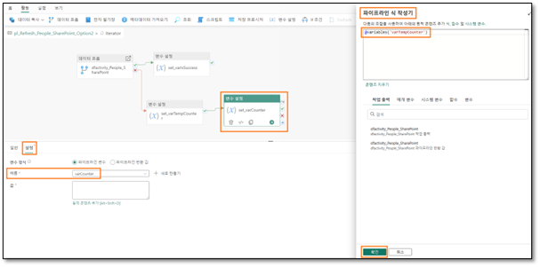

## Aufgabe 13: Wait-Aktivität konfigurieren

Als nächstes müssen wir 5 Minuten/300 Sekunden warten, wenn die Dataflow-Aktualisierung beim ersten Mal fehlschlägt, bevor wir es erneut versuchen. Wenn die Dataflow-Aktualisierung zum zweiten Mal fehlschlägt, müssen wir 15 Minuten/900 Sekunden warten, und es erneut versuchen. Wir verwenden die Wait-Aktivität und die Variable „varWaitTime“, um die Wartezeit festzulegen.

1. Wählen Sie im oberen Menü **Aktivitäten -> Auslassungspunkte -> Warten** aus. Die Wait-Aktivität wird dem Designcanvas hinzugefügt.

1. Wählen Sie bei ausgewählter **Wait-Aktivität** im unteren Bereich **Allgemein** aus. Wir geben der Aktivität einen Namen und eine Beschreibung.

1. Geben Sie im Feld **Name wait_onFailure** ein.

1. Geben Sie im Feld **Beschreibung 300 Sekunden beim zweiten Versuch und 900 Sekunden beim dritten Versuch warten** ein.

1. Klicken Sie auf das **grüne Häkchen** der Aktivität zum Festlegen der Variablen „set_varCounter“, und ziehen Sie es, um eine Verbindung mit der neuen **Wait-Aktivität „wait_onFailure“** herzustellen.

    

1. Klicken Sie bei ausgewählter **Wait-Aktivität** im unteren Menü auf **Einstellungen**.

1. Wählen Sie im Feld **Wartezeit in Sekunden** das **Textfeld** und dann den Link **Dynamischer Inhalt** aus.

1. Das Dialogfeld Pipeline-Ausdrucks-Generator wird geöffnet. Geben Sie
    ```
    @if(
     greater(variables(‘varCounter’), 1),
     if(equals(variables(‘varCounter’), 2),
        mul(variables(‘varWaitTime’),15 ), 
        mul(variables(‘varWaitTime’), 0)
     ),
     mul(variables(‘varWaitTime’),5 ) ein.
    )
    ```

Sie können diesen Ausdruck gerne eingeben oder die Funktionen über das Menü auswählen oder kopieren und einfügen.

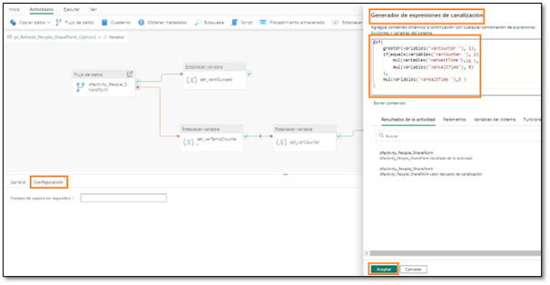

Wir verwenden hier zwei neue Funktionen:
- **greater:** Verwendet zwei Zahlen als Parameter und vergleicht, welche größer ist
- **mul:** Dies ist eine Multiplikationsfunktion, die zur Multiplikation zwei Parameter benötigt.

Der Ausdruck ist eine geschachtelte if-Anweisung. Hiermit wird überprüft, ob der Wert der Variablen „varCounter“ größer als „1“ ist. Wenn dies zutrifft, wird überprüft, ob der Wert der Variablen „varCounter“ „2“ ist. Wenn dies zutrifft, wird die Wartezeit auf „varWaitTime mal 15“ festgelegt. Denken Sie daran, dass wir „varWaitTime“ standardmäßig auf „60“ festgelegt haben. Das wären 60*15 = 900 Sekunden. Wenn der Wert der Variablen „varCounter“ nicht „2“ ist (er größer als „2“ ist, was bedeutet, dass die Dataflow-Aktualisierung dreimal fehlgeschlagen ist, ist die Iteration abgeschlossen. Wir müssen nicht mehr warten), die Wartezeit ist auf „varWaitTime * 0“ festgelegt, also auf „0“. Wenn der Wert der Variablen „varCounter“ „1“ ist, multiplizieren wir „varWaitTime“ mit „5“. Das wären 60*5 = 300 Sekunden

9. Wählen Sie OK aus.

**Prüfpunkt:** Ihr Bis-Iterator sollte so wie im Screenshot unten aussehen.

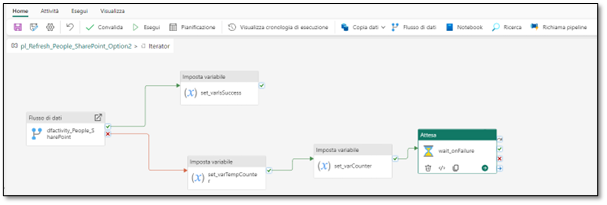

10. Wählen Sie oben links im Designcanvas **pl_Refresh_People_Sharepoint_Option2** aus, um vom Bis-Iterator weg zu navigieren.

    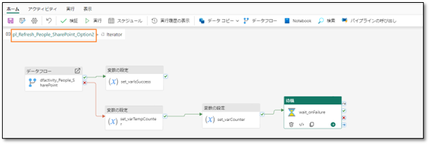

1. Nun ist die Datenpipeline erstellt. Wählen Sie im oberen Menü **Startseite -> Symbol „Speichern“** aus, um die Datenpipeline zu speichern.

    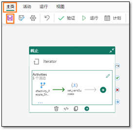

## Aufgabe 14: Geplante Aktualisierung für die Datenpipeline konfigurieren

1. Wir können die Datenpipeline testen, indem wir **Startseite -> Ausführen** auswählen.

    >**Hinweis:** Es kann einige Minuten dauern, bis die Datenpipeline vollständig aktualisiert ist. Dies ist eine Trainingsumgebung, sodass die Datei in SharePoint immer verfügbar. Daher schlägt Ihre Datenpipeline fehl.

1. Wir können die Ausführung der Datenpipeline nach einem Zeitplan festlegen. Wählen Sie im Menü oben den Eintrag **Startseite -> Zeitplan** aus. Das Dialogfeld „Zeitplan“ wird geöffnet.

1. Legen Sie das Optionsfeld **Geplante Ausführung** auf **Ein** fest.

1. Legen Sie das **Dropdownmenü „Wiederholen“** auf **Täglich** fest.

1. Legen Sie die **Uhrzeit** auf **9:00 Uhr** fest.

1. Legen Sie **Startdatum und Uhrzeit** auf **Heute** fest.

1. Legen Sie **Startdatum und Uhrzeit** auf ein **zukünftiges Datum** fest.

1. Legen Sie Ihre **Zeitzone** fest.

    >**Hinweis:** Da es sich um eine Übungsumgebung handelt, können Sie die Zeitzone auf Ihre bevorzugte Zeitzone festlegen. In einem realen Szenario legen Sie die Zeitzone basierend auf Ihrem/Speicherort der Datenquelle fest.

1. Wählen Sie **Übernehmen** aus.

1. Wählen Sie das **X** oben rechts im Dialogfeld aus, um es zu schließen.

    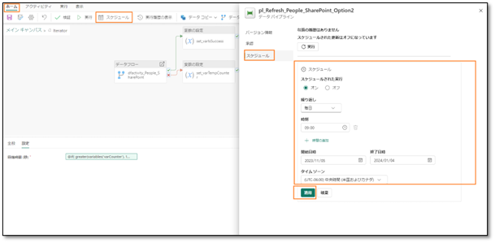

1. Wählen Sie im linken Bereich Ihren Fabric-Arbeitsbereich **FAIAD_\<Benutzername>** aus, um zum Bildschirm **Data Factory-Startseite** zu navigieren.

>**Hinweis:** Im Bildschirm „Zeitplan“ ist keine Option verfügbar, um Sie zu benachrichtigen, ob der Vorgang erfolgreich war oder nicht (wie beim Dataflow-Zeitplan). Die Benachrichtigung kann durch Hinzufügen einer Aktivität in der Datenpipeline erfolgen. Wir führen diesen Schritt nicht in dieser Übung durch, da es sich um eine Übungsumgebung handelt.

Wir haben Aktualisierungen für die verschiedenen Datenquellen geplant. In der nächsten Übung werden wir Beziehungen und Kennzahlen erstellen und andere Modellierungsaktivitäten durchführen.

## Referenzen

Bei Fabric Analyst in a Day (FAIAD) lernen Sie einige der wichtigsten Funktionen von Microsoft Fabric kennen. Im Menü des Dienstes finden Sie in der Hilfe (?) Links zu praktischen Informationen.


Nachfolgend finden Sie weitere Angebote zur weiteren Arbeit mit Microsoft Fabric.

- Die vollständige [Ankündigung der allgemeinen Verfügbarkeit von Microsoft Fabric](https://aka.ms/Fabric-Hero-Blog-Ignite23) finden Sie im Blogbeitrag.
- Fabric bei einer [interaktiven Vorstellung](https://aka.ms/Fabric-GuidedTour) kennenlernen
- Zur [kostenlosen Testversion von Microsoft Fabric](https://aka.ms/try-fabric) anmelden
- [Website von Microsoft Fabric](https://aka.ms/microsoft-fabric) besuchen
- Mit Modulen von [Fabric Learning](https://aka.ms/learn-fabric) neue Qualifikationen erwerben
- [Technische Dokumentation zu Fabric](https://aka.ms/fabric-docs) lesen
- [Kostenloses E-Book zum Einstieg in Fabric](https://aka.ms/fabric-get-started-ebook) lesen
- Mitglied der [Fabric-Community](https://aka.ms/fabric-community) werden, um Fragen zu stellen, Feedback zu geben und sich mit anderen auszutauschen

Lesen Sie die detaillierteren Blogs zur Ankündigung der Fabric-Umgebung:

- [Blog zum Data Factory-Funktionsbereich in Fabric](https://aka.ms/Fabric-Data-Factory-Blog)
- [Blog zum Data Engineering-Funktionsbereich von Synapse in Fabric](https://aka.ms/Fabric-DE-Blog)
- [Blog zum Data Science-Funktionsbereich von Synapse in Fabric](https://aka.ms/Fabric-DS-Blog)
- [Blog zum Data Warehousing-Funktionsbereich von Synapse in Fabric](https://aka.ms/Fabric-DW-Blog)
- [Blog zum Real-Time Analytics-Funktionsbereich von Synapse in Fabric](https://aka.ms/Fabric-RTA-Blog)
- [Blog mit Ankündigungen zu Power BI](https://aka.ms/Fabric-PBI-Blog)
- [Blog zum Data Activator-Funktionsbereich in Fabric](https://aka.ms/Fabric-DA-Blog) 
- [Blog zu Verwaltung und Governance in Fabric](https://aka.ms/Fabric-Admin-Gov-Blog)
- [Blog zu OneLake in Fabric](https://aka.ms/Fabric-OneLake-Blog)
- [Blog zur Dataverse- und Microsoft Fabric-Integration](https://aka.ms/Dataverse-Fabric-Blog)

© 2023 Microsoft Corporation. Alle Rechte vorbehalten.

Durch die Verwendung der vorliegenden Demo/Übung stimmen Sie den folgenden Bedingungen zu:

Die in dieser Demo/Übung beschriebene Technologie/Funktionalität wird von der Microsoft Corporation bereitgestellt, um Feedback von Ihnen zu erhalten und Ihnen Wissen zu vermitteln. Sie dürfen die Demo/Übung nur verwenden, um derartige Technologiefeatures und Funktionen zu bewerten und Microsoft Feedback zu geben. Es ist Ihnen nicht erlaubt, sie für andere Zwecke zu verwenden. Es ist Ihnen nicht gestattet, diese Demo/Übung oder einen Teil derselben zu ändern, zu kopieren, zu verbreiten, zu übertragen, anzuzeigen, auszuführen, zu vervielfältigen, zu veröffentlichen, zu lizenzieren, zu transferieren oder zu verkaufen oder aus ihr abgeleitete Werke zu erstellen.

DAS KOPIEREN ODER VERVIELFÄLTIGEN DER DEMO/ÜBUNG (ODER EINES TEILS DERSELBEN) AUF EINEN/EINEM ANDEREN SERVER ODER SPEICHERORT FÜR DIE WEITERE VERVIELFÄLTIGUNG ODER VERBREITUNG IST AUSDRÜCKLICH UNTERSAGT.

DIESE DEMO/ÜBUNG STELLT BESTIMMTE SOFTWARE-TECHNOLOGIE-/PRODUKTFEATURES UND FUNKTIONEN, EINSCHLIESSLICH POTENZIELLER NEUER FEATURES UND KONZEPTE, IN EINER SIMULIERTEN UMGEBUNG OHNE KOMPLEXE EINRICHTUNG ODER INSTALLATION FÜR DEN OBEN BESCHRIEBENEN ZWECK BEREIT. DIE TECHNOLOGIE/KONZEPTE IN DIESER DEMO/ÜBUNG ZEIGEN MÖGLICHERWEISE NICHT DAS VOLLSTÄNDIGE FUNKTIONSSPEKTRUM UND FUNKTIONIEREN MÖGLICHERWEISE NICHT WIE DIE ENDGÜLTIGE VERSION. UNTER UMSTÄNDEN VERÖFFENTLICHEN WIR AUCH KEINE ENDGÜLTIGE VERSION DERARTIGER FEATURES ODER KONZEPTE. IHRE ERFAHRUNG BEI DER VERWENDUNG DERARTIGER FEATURES UND FUNKTIONEN IN EINER PHYSISCHEN UMGEBUNG KANN FERNER ABWEICHEND SEIN.

**FEEDBACK.** Wenn Sie Feedback zu den Technologiefeatures, Funktionen und/oder Konzepten geben, die in dieser Demo/Übung beschrieben werden, gewähren Sie Microsoft das Recht, Ihr Feedback in jeglicher Weise und für jeglichen Zweck kostenlos zu verwenden, zu veröffentlichen und gewerblich zu nutzen. Außerdem treten Sie Dritten kostenlos sämtliche Patentrechte ab, die erforderlich sind, damit deren Produkte, Technologien und Dienste bestimmte Teile einer Software oder eines Dienstes von Microsoft, welche/welcher das Feedback enthält, verwenden oder eine Verbindung zu dieser/diesem herstellen können. Sie geben kein Feedback, das einem Lizenzvertrag unterliegt, aufgrund dessen Microsoft Drittparteien eine Lizenz für seine Software oder Dokumentation gewähren muss, weil wir Ihr Feedback in diese aufnehmen. Diese Rechte bestehen nach Ablauf dieser Vereinbarung fort.

DIE MICROSOFT CORPORATION LEHNT HIERMIT JEGLICHE GEWÄHRLEISTUNGEN UND GARANTIEN IN BEZUG AUF DIE DEMO/ÜBUNG AB, EINSCHLIESSLICH ALLER AUSDRÜCKLICHEN, KONKLUDENTEN ODER GESETZLICHEN GEWÄHRLEISTUNGEN UND GARANTIEN DER HANDELSÜBLICHKEIT, DER EIGNUNG FÜR EINEN BESTIMMTEN ZWECK, DES RECHTSANSPRUCHS UND DER NICHTVERLETZUNG VON RECHTEN DRITTER. MICROSOFT MACHT KEINERLEI ZUSICHERUNGEN BZW. ERHEBT KEINERLEI ANSPRÜCHE IM HINBLICK AUF DIE RICHTIGKEIT DER ERGEBNISSE UND DES AUS DER VERWENDUNG DER DEMO/ÜBUNG RESULTIERENDEN ARBEITSERGEBNISSES BZW. BEZÜGLICH DER EIGNUNG DER IN DER DEMO/ÜBUNG ENTHALTENEN INFORMATIONEN FÜR EINEN BESTIMMTEN ZWECK.

**HAFTUNGSAUSSCHLUSS**

Diese Demo/Übung enthält nur einen Teil der neuen Features und Verbesserungen in Microsoft Power BI. Einige Features können sich unter Umständen in zukünftigen Versionen des Produkts ändern. In dieser Demo/Übung erhalten Sie Informationen über einige, aber nicht über alle neuen Features.
