# Einführung

Wir haben Daten aus verschiedene Datenquellen im Lakehouse erfasst. In dieser Übung arbeiten Sie mit dem Datenmodell. Üblicherweise werden Modellierungsarbeiten wie das Erstellen von Beziehungen, das Hinzufügen von Measures usw. in Power BI Desktop durchgeführt. Nun erfahren Sie, wie Sie diese Vorgänge im Dienst durchführen können.

Inhalt dieser Übung:

- Lakehouse
- SQL-Ansicht in Lakehouse
- Datenmodellierung in Lakehouse

# Lakehouse

## Aufgabe 1: Daten mithilfe von SQL abfragen

1. Navigieren wir nun zurück zum Fabric-Arbeitsbereich **FAIAD_\<username>**, den Sie in Übung 2, Aufgabe 8, erstellt haben.

1. Wechseln Sie wieder zum Bildschirm **Data Factory**.

1. Sie sehen drei Arten von lh_FAIAD: semantisches Modell, SQL-Endpunkt und Lakehouse. Lakehouse ist Ihnen schon aus einer früheren Übung bekannt. Um sich mit der SQL-Option zu beschäftigen, wählen Sie **lh_FAIAD SQL-Analyse-Endpunkt** aus. Sie werden zur **SQL-Ansicht** des Explorers weitergeleitet.

    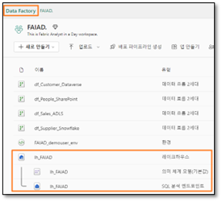

Wenn Sie sich die Daten vor der Erstellung eines Datenmodells genauer ansehen möchten, können Sie dies mit SQL tun. Betrachten wir jetzt zwei Möglichkeiten zur Nutzung von SQL, von denen die erste besonders für Entwickler geeignet ist, die zweite für Analysten.

Angenommen, Sie möchten mithilfe von SQL schnell die von einem Lieferanten verkauften Einheiten ermitteln. Dazu gibt es zwei Möglichkeiten: Sie schreiben eine SQL-Anweisung, oder Sie erstellen diese mit einem visuellen Element.

Beachten Sie, dass Sie links die Tabellen anzeigen können. Wenn Sie diese erweitern, sehen Sie die Spalten der Tabelle. Außerdem lassen sich SQL-Ansichten, Funktionen und gespeicherten Prozeduren erstellen. Wenn Sie bereits Erfahrung mit SQL haben, probieren Sie diese Optionen gerne aus. Schreiben wir nun eine einfache SQL-Abfrage.

4. Wählen Sie im **Menü oben** die Option **Neue SQL-Abfrage** aus, oder klicken Sie **links unten** auf **Abfrage**. Die Ansicht „SQL-Abfrage“ wird geöffnet.

    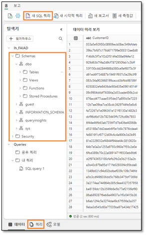

1. Fügen Sie die unten **stehende SQL-Abfrage** in das **Abfragefenster** ein. Mit dieser Abfrage werden die Units by Supplierenname ermittelt. Dazu wird die Tabelle „Sales“ mit den Tabellen „Product“ und „Supplier“ verknüpft.

    ```
    SELECT su.Supplier_Name, SUM(Quantity) as Units
    FROM dbo.Sales s
    JOIN dbo.Product p on p.StockItemID = s.StockItemID
    JOIN dbo.Supplier su on su.SupplierID = p.SupplierID
    GROUP BY su.Supplier_Name
    ```

1. Zeigen Sie die Ergebnisse mit **Ausführen** an.

1. Beachten Sie, dass die Abfrage mit der Option **Als Ansicht speichern** gespeichert werden kann.

1. Die Abfrage wird dann **links** im Bereich **Explorer** unter dem Abschnitt **Abfragen** unter **Meine Abfragen** als **SQL-Abfrage 1** gespeichert. So kann die Abfrage umbenannt und zur späteren Verwendung gespeichert werden. Es ist auch möglich, Abfragen anzuzeigen, die an Sie freigegeben wurden. Öffnen Sie dazu den Ordner **Freigegebene Abfragen**.

    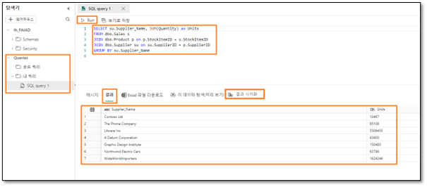

## Aufgabe 2: T-SQL-Ergebnis veranschaulichen

1. Das Ergebnis der Abfrage kann auch bildlich veranschaulicht werden. **Markieren Sie die Abfrage** im Abfragebereich, und wählen Sie erst den Bereich **Ergebnisse** und dann **Visualisieren von Ergebnissen** aus.

    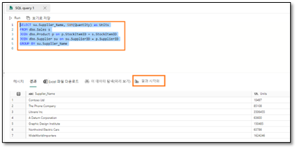

1. Das Dialogfeld „Visualisieren von Ergebnissen“ wird geöffnet. Wählen Sie **Weiter** aus.

    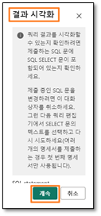

1. Das bereits bekannte Dialogfeld mit der Berichtsansicht wird angezeigt. Erweitern Sie im Bereich **Daten** den Eintrag **SQL-Abfrage 1**.

1. Wählen Sie die Felder **Supplier_Name** und **Units**  aus. Das visuelle Element ist standardmäßig eine Tabelle.

1. Ändern Sie unter **Visualisierung** die Art der Abbildung durch Auswahl des **gestapelten Säulendiagramms**.

1. Ändern Sie die **Größe** des visuellen Elements nach Bedarf. 

    >**Hinweis:** Beachten Sie, dass alle Möglichkeiten zum Formatieren eines visuellen Elements im Power BI-Bericht auch hier funktionieren.

1. Klicken Sie unten rechts auf **Als Bericht speichern**.

1. Das Dialogfeld „Bericht speichern“ wird geöffnet. Geben Sie im Textfeld **Bericht benennen** den Text **Units by Supplier** ein.

1. Überprüfen Sie, dass der Zielarbeitsbereich Ihrem Fabric-Arbeitsbereich **FAIAD\<Benutzername>** entspricht.

1. Klicken Sie auf **Speichern**.

    

## Aufgabe 3: visuelle Abfrage erstellen

Sie werden zur Ansicht von SQL-Analyse-Endpunkten weitergeleitet. Wenn Sie SQL nicht kennen, können Sie eine ähnliche Abfrage mithilfe einer visuellen Abfrage durchführen.

1. Wählen Sie im Menü oben die Option **Neue visuelle Abfrage** aus. Der Bereich für visuelle Abfragen wird geöffnet.

1. Ziehen Sie aus dem Bereich **Explorer** die Tabellen **Sales, Product und Supplier** in den Bereich für visuelle Abfragen.

1. Wählen Sie bei Auswahl der Tabelle **Sales** im Menü des Bereichs für visuelle Abfragen die Option **Kombinieren -> Abfragen zusammenführen** aus.

    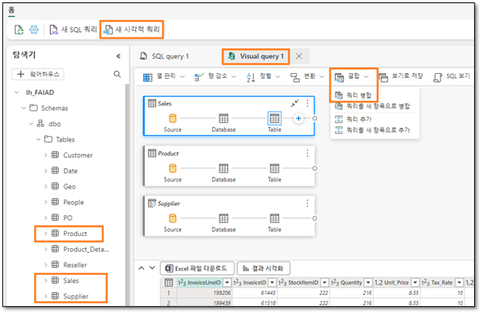

1. Das Dialogfeld zum Zusammenführen wird geöffnet. Wählen Sie in der **Dropdown-Liste Rechte Tabelle zum Zusammenführen** den Eintrag **Produkt** aus.

1. Wählen Sie aus der Tabelle **Sales** und der Tabelle **Product** den Eintrag **StockItemID** aus. Dadurch werden die Tabellen „Product“ und „Sales“ zusammengeführt.

1. Wählen Sie als **Art des Joins** die Option **Linker äußerer** aus.

1. Klicken Sie auf **OK**.

    

1. Klicken Sie unter **Ergebnisse** auf den **Doppelpfeil** neben der Spalte **Product**.

1. Ein Dialogfeld wird geöffnet. Wählen Sie darin **SupplierID** aus.

1. Klicken Sie auf **OK**. Beachten Sie, dass die Schritte **Zusammengeführte Abfragen** und **Erweitert Product** in der Tabelle **Sales** erstellt werden.

    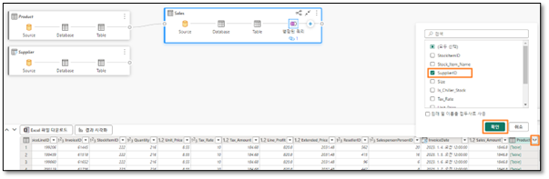

1. Führen wir ebenso die Tabelle „Supplier“ zusammen. Erstellen Sie einen neuen Schritt, indem Sie in der Tabelle **Sales** auf das + (nach „Erweitert Product“) klicken. Ein Dialogfeld wird geöffnet.

1. Wählen Sie darin **Kombinieren -> Abfragen zusammenführen** aus.

    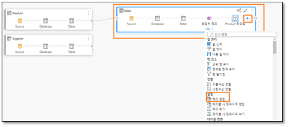

1. Das Dialogfeld zum Zusammenführen wird geöffnet. Wählen Sie in der **Dropdown-Liste Rechte Tabelle zum Zusammenführen** den Eintrag **Supplier** aus.

1. Wählen Sie aus der Tabelle **Sales** und der Tabelle **Supplier** den Eintrag **SupplierID** aus. Dadurch werden die Tabellen „Supplier“ und „Sales“ zusammengeführt.

1. Wählen Sie als **Art des Joins** die Option **Linker äußerer** aus.

1. Klicken Sie auf **OK**.

    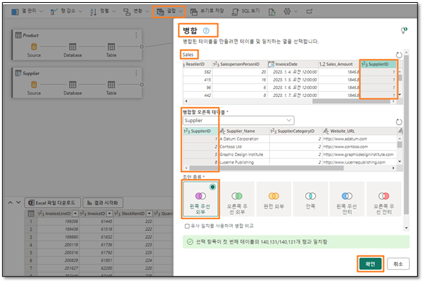

1. Klicken Sie unter **Ergebnisse** auf den **Doppelpfeil** neben der Spalte **Supplier**.

1. Ein Dialogfeld wird geöffnet. Wählen Sie darin **Supplier_Name** aus.

1. Klicken Sie auf **OK**. Beachten Sie, dass in der Tabelle „Sales“ der Eintrag **Zusammengeführte Abfragen** ergänzt und alle **Schritte aufgezeichnet** wurden.

    >**Hinweis:** Siehe hierzu den ersten Screenshot in Aufgabe 4.

## Aufgabe 4: Abfrageergebnisse visualisieren

1. Nachdem die Abfrage nun fertig ist, sehen wir uns das Ergebnis an. Wählen Sie im Ergebnisbereich die Option **Visualisieren von Ergebnissen** aus.

    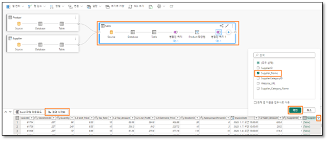

1. Das Dialogfeld „Visualisieren von Ergebnissen“ wird geöffnet. Wählen Sie rechts unter **Daten** die Felder **Supplier_Name** und **Quantity** aus.

1. Wählen Sie unter „Visualisierung“ das **Tabellensymbolaus**, um die Ergebnisse als Tabelle anzuzeigen. Beachten Sie, dass das Ergebnis dem SQL-Abfrageergebnis von vorhin ähnelt. An dieser Stelle können Sie den Bericht speichern. Weil wir zuvor einen ähnlichen Bericht gespeichert haben, klicken wir aber auf **Abbrechen**.

    

## Aufgabe 5: Beziehungen erstellen

Nun können wir das Modell erstellen, Beziehungen zwischen Tabellen festlegen und Measures vorgeben.

1. Klicken Sie **links unten** auf **Modell**. Sie werden feststellen, dass der mittlere Bereich wie die Modellansicht in Power BI Desktop aussieht.

1. Ändern Sie Größe und Position der Tabellen nach Bedarf.

1. Erstellen wir jetzt eine Beziehung zwischen den Tabellen „Sales“ und „Reseller“. Wählen Sie in der Tabelle **Sales** den Eintrag **ResellerID** aus, und ziehen Sie ihn in der Tabelle **Reseller** auf den Eintrag **ResellerID**.

    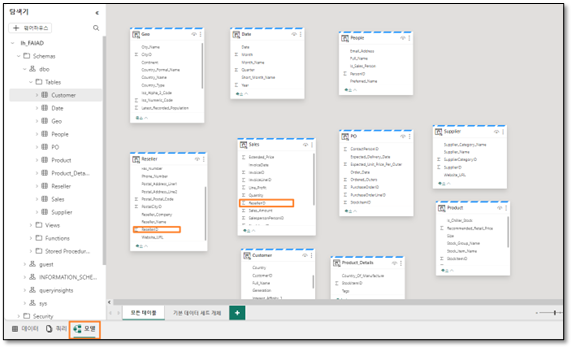

1. Das Dialogfeld „Neue Beziehung“ wird geöffnet. Vergewissern Sie sich, dass unter **Table 1 Sales** und bei **Spalte ResellerID** angegeben ist.

1. Vergewissern Sie sich, dass unter **Table 2 Reseller** und bei **Spalte ResellerID** angegeben ist.

1. Die **Kardinalität** lautet **n:1**.

1. Bei **Kreuzfilterrichtung** muss **Einfach** ausgewählt sein.

1. Klicken Sie auf **OK**.

    

1. Erstellen wir auf diese Weise auch eine Beziehung zwischen den Tabellen „Sales“ und „Date“. Wählen Sie in der Tabelle **Sales** den Eintrag **InvoiceDate** aus, und ziehen Sie ihn in der Tabelle **Date** auf den Eintrag **Date**.

1. Das Dialogfeld „Neue Beziehung“ wird geöffnet. Vergewissern Sie sich, dass unter **Table 1 Sales** und bei **Spalte InvoiceDate** angegeben ist.

1. Vergewissern Sie sich, dass unter **Table 2 Date** und bei **Spalte Date** angegeben ist.

1. Die **Kardinalität** lautet **n:1**.

1. Bei **Kreuzfilterrichtung** muss **Einfach** ausgewählt sein.

1. Klicken Sie auf **OK**.

    

**Überprüfen Sie:** Das Modell muss die zwei Beziehungen zwischen den Tabellen „Sales“ und „Reseller“ sowie den Tabellen „Sales“ und „Date“ aufweisen, wie im folgenden Screenshot gezeigt:

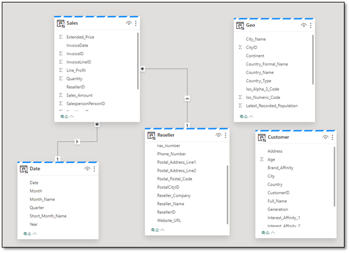

Aus Zeitgründen können wir nicht alle Beziehungen erstellen. Sofern Zeit verbleibt, können Sie den fakultativen Abschnitt am Ende der Übung durcharbeiten. Darin werden die restlichen Beziehungen erstellt.

## Aufgabe 6: Measures erstellen

Ergänzen wir ein paar Measures, die zur Erstellung des Sales-Dashboards benötigt werden.

1. Wählen Sie in der Modellansicht die Tabelle **Sales** aus. Die Measures sollen in dieser Tabelle ergänzt werden.

1. Wählen Sie im Menü oben den Eintrag **Start -> Neues Measure** aus. Die Bearbeitungsleiste wird angezeigt.

1. Geben Sie dort **Sales = SUM(Sales[Sales_Amount])** ein.

1. Klicken Sie links neben der Bearbeitungsleiste auf das **Häkchen**, oder drücken Sie die **Eingabetaste**.

1. Erweitern Sie im Eigenschaftsfenster rechts den Abschnitt **Formatierung**.

1. Wählen Sie in der Dropdown-Liste **Format** den Eintrag **Währung** aus.

1. Legen Sie **Dezimalstellen** auf **0** fest.

    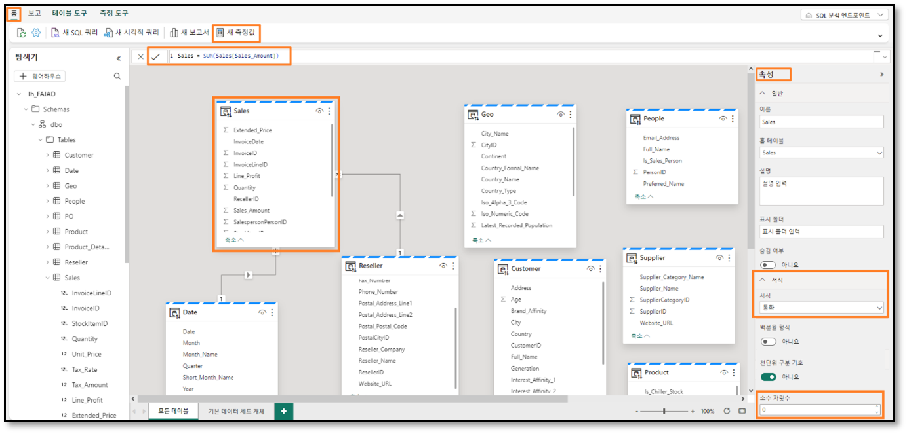

1. Wählen Sie bei Auswahl der Tabelle **Sales** im Menü oben die Option **Start -> Neues Measure** aus. Die Bearbeitungsleiste wird angezeigt.

1. Geben Sie dort **Units = SUM(Sales[Quantity])** ein.

1. Klicken Sie links neben der Bearbeitungsleiste auf das **Häkchen**, oder drücken Sie die **Eingabetaste**.

1. Erweitern Sie im Eigenschaftsfenster rechts den Abschnitt **Formatierung** (es kann einen Moment dauern, bis das Eigenschaftsfenster geladen wird).

1. Wählen Sie in der Dropdown-Liste **Format** den Eintrag **Ganze Zahl** aus.

1. Setzen Sie **Tausendertrennzeichen** auf **Ja**.

    

1. Wählen Sie bei Auswahl der Tabelle **Sales** im Menü oben die Option **Start -> Neues Measure** aus. Die Bearbeitungsleiste wird angezeigt.

1. Geben Sie dort **Orders = DISTINCTCOUNT(Sales[InvoiceID])** ein.

1. Klicken Sie links neben der Bearbeitungsleiste auf das **Häkchen**, oder drücken Sie die **Eingabetaste**.

1. Erweitern Sie im Eigenschaftsfenster rechts den Abschnitt **Formatierung**.

1. Wählen Sie in der Dropdown-Liste **Format** den Eintrag **Ganze Zahl** aus.

1. Setzen Sie **Tausendertrennzeichen** auf **Ja**.

    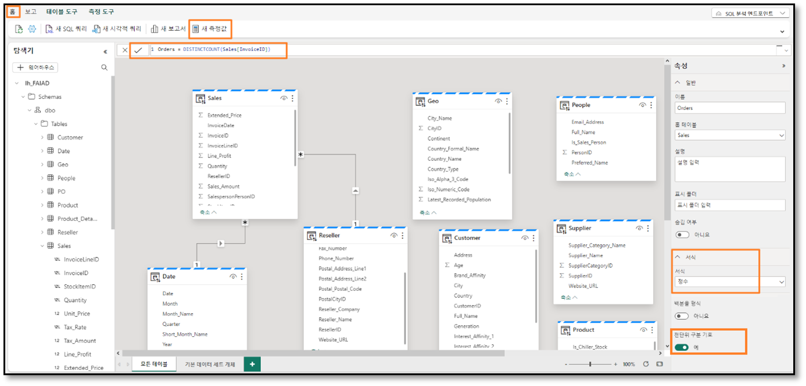

Aus Zeitgründen können wir nicht alle Measures erstellen. Sofern Zeit verbleibt, können Sie den fakultativen Abschnitt am Ende der Übung durcharbeiten. Darin werden die restlichen Measures erstellt.

Nachdem das Datenmodell jetzt erstellt wurde, erstellen wir nun einen Bericht. Dazu arbeiten wir die nächste Übung durch.

## Aufgabe 7: Fakultativer Abschnitt – Beziehungen erstellen

Ergänzen wir die restlichen Beziehungen.

1. Erstellen Sie eine **n:1-Beziehung** zwischen den Tabellen **Sales** und **Product**. Wählen Sie in der Tabelle **Sales** den Eintrag **StockItemID** und in der Tabelle **Product** den Eintrag **StockItemID** aus.

1. Erstellen Sie ebenso eine **n:1-Beziehung** zwischen den Tabellen **Sales** und **People**. Wählen Sie in der Tabelle **Sales** den Eintrag **SalespersonPersonID** und in der Tabelle **People** den Eintrag **PersonID** aus.

    **Überprüfen Sie:** Das Modell sollte so wie im Screenshot unten aussehen.

    

1. Erstellen wir jetzt eine Beziehung zwischen den Tabellen „Product“ und „Supplier“. Wählen Sie in der Tabelle **Product** den Eintrag **SupplierID** aus, und ziehen Sie ihn in der Tabelle **Supplier** auf den Eintrag **SupplierID**.

1. Das Dialogfeld „Neue Beziehung“ wird geöffnet. Vergewissern Sie sich, dass unter **Table 1 Product** und bei **Spalte SupplierID** angegeben ist.

1. Vergewissern Sie sich, dass unter **Table 2 Supplier** und bei **Spalte SupplierID** angegeben ist.

1. Die **Kardinalität** lautet **n:1**.

1. Bei **Kreuzfilterrichtung** muss **Beides** ausgewählt sein.

1. Klicken Sie auf **OK**.

    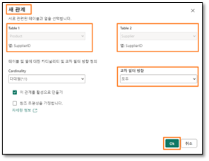

1. Erstellen Sie auf ähnliche Weise eine **n:1-Beziehung** zwischen **Product_Details** und **Product**, wobei die **Kreuzfilterrichtung** auf **Beides** festgelegt wird. Wählen Sie unter **Product_Details** den Eintrag **StockItemID** und unter Product den Eintrag **StockItemID** aus.

1. Erstellen wir jetzt eine Beziehung zwischen den Tabellen „Reseller“ und „Geo“. Wählen Sie in der Tabelle **Reseller** den Eintrag **PostalCityID** aus, und ziehen Sie ihn in der Tabelle **Geo** auf den Eintrag **CityID**.

1. Das Dialogfeld „Neue Beziehung“ wird geöffnet. Vergewissern Sie sich, dass unter **Table 1 Reseller** und bei **Spalte PostalCityID** angegeben ist.

1. Vergewissern Sie sich, dass unter **Table 2 Geo** und bei **Spalte CityID** angegeben ist.

1. Die **Kardinalität** lautet **n:1**.

1. Bei **Kreuzfilterrichtung** muss **Beides** ausgewählt sein.

1. Klicken Sie auf **OK**.

    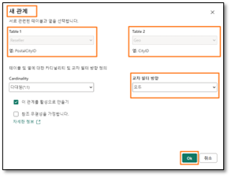

1. Erstellen wir jetzt eine Beziehung zwischen den Tabellen „Customer“ und „Reseller“. Wählen Sie in der Tabelle **Customer** den Eintrag **ResellerID** aus, und ziehen Sie ihn in der Tabelle **Reseller** auf den Eintrag **ResellerID**.

1. Das Dialogfeld „Neue Beziehung“ wird geöffnet. Vergewissern Sie sich, dass unter **Table 1 Customer** und bei **Spalte ResellerID** angegeben ist.

1. Vergewissern Sie sich, dass unter Table 2 Reseller und bei Spalte ResellerID angegeben ist

1. Die **Kardinalität** lautet **n:1**.

1. Bei **Kreuzfilterrichtung** muss **Einfach** ausgewählt sein.

1. Klicken Sie auf **OK**.

    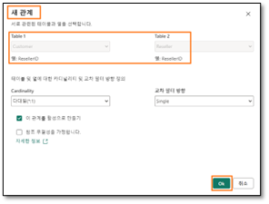

**Überprüfen Sie:** Das Modell sollte so wie im Screenshot unten aussehen.

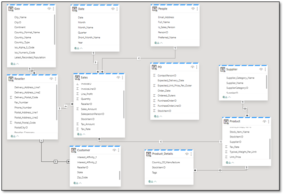

22. Erstellen wir jetzt eine Beziehung zwischen den Tabellen „PO“ und „Date“. Wählen Sie in der Tabelle **PO** den Eintrag **Order_Date** aus, und ziehen Sie ihn in der Tabelle **Date** auf den Eintrag Date.

1. Das Dialogfeld „Neue Beziehung“ wird geöffnet. Vergewissern Sie sich, dass unter **Table 1 PO** und bei **Spalte Order_Date** angegeben ist.

1. Vergewissern Sie sich, dass unter **Table 2 Date** und bei **Spalte Date** angegeben ist.

1. Die **Kardinalität** lautet **n:1**.

1. Bei **Kreuzfilterrichtung** muss **Einfach** ausgewählt sein.

1. Klicken Sie auf **OK**.

    

1. Erstellen Sie ebenso eine **n:1-Beziehung** zwischen den Tabellen **PO** und **Product**. Wählen Sie unter **PO** den Eintrag **StockItemID** und unter **Product** den Eintrag **StockItemID** aus.

1. Erstellen Sie ebenso eine **n:1-Beziehung** zwischen den Tabellen **PO** und People. Wählen Sie unter **PO** den Eintrag **ContactPersonID** und unter People den Eintrag **PersonID** aus. 

Nun sind alle Beziehungen erstellt.

**Überprüfen Sie:** Das Modell sollte so wie im Screenshot unten aussehen.

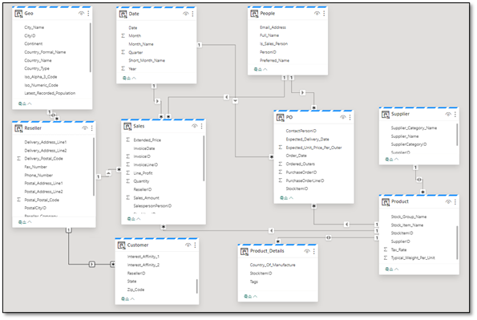

## Aufgabe 8: Fakultativer Abschnitt – Measures erstellen

Ergänzen wir die restlichen Measures.

1. Geben Sie auf der Bearbeitungsleiste den Eintrag **Avg Order = DIVIDE([Sales], [Orders])** ein.

1. Klicken Sie links neben der Bearbeitungsleiste auf das **Häkchen**, oder drücken Sie die Eingabetaste.

1. Sobald das Measure gespeichert ist, sehen Sie im oberen Menü die Option „Measure-Tools“. Klicken Sie auf **Measure-Tools**.

1. Wählen Sie in der Dropdown-Liste für das Format den Eintrag **Währung** aus.

    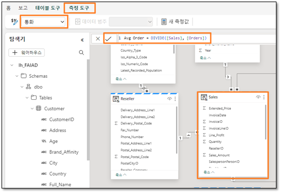

1. Fügen Sie auf gleiche Weise die folgenden Measures hinzu:
    - **GM = SUM(Sales[Line_Profit])** formatiert als **Währung, zwei Dezimalstellen**
    - **GM% = DIVIDE([GM], [Sales])** formatiert als **Prozentsatz, zwei Dezimalstellen**
    - **No of Customers = COUNTROWS(Customer)** formatiert als **Ganze Zahl**

## Referenzen

Bei Fabric Analyst in a Day (FAIAD) lernen Sie einige der wichtigsten Funktionen von Microsoft Fabric kennen. Im Menü des Dienstes finden Sie in der Hilfe (?) Links zu praktischen Informationen.


Nachfolgend finden Sie weitere Angebote zur weiteren Arbeit mit Microsoft Fabric.

- Die vollständige [Ankündigung der allgemeinen Verfügbarkeit von Microsoft Fabric](https://aka.ms/Fabric-Hero-Blog-Ignite23) finden Sie im Blogbeitrag.
- Fabric bei einer [interaktiven Vorstellung](https://aka.ms/Fabric-GuidedTour) kennenlernen
- Zur [kostenlosen Testversion von Microsoft Fabric](https://aka.ms/try-fabric) anmelden
- [Website von Microsoft Fabric](https://aka.ms/microsoft-fabric) besuchen
- Mit Modulen von [Fabric Learning](https://aka.ms/learn-fabric) neue Qualifikationen erwerben
- [Technische Dokumentation zu Fabric](https://aka.ms/fabric-docs) lesen
- [Kostenloses E-Book zum Einstieg in Fabric](https://aka.ms/fabric-get-started-ebook) lesen
- Mitglied der [Fabric-Community](https://aka.ms/fabric-community) werden, um Fragen zu stellen, Feedback zu geben und sich mit anderen auszutauschen

Lesen Sie die detaillierteren Blogs zur Ankündigung der Fabric-Umgebung:

- [Blog zum Data Factory-Funktionsbereich in Fabric](https://aka.ms/Fabric-Data-Factory-Blog)
- [Blog zum Data Engineering-Funktionsbereich von Synapse in Fabric](https://aka.ms/Fabric-DE-Blog) 
- [Blog zum Data Science-Funktionsbereich von Synapse in Fabric](https://aka.ms/Fabric-DS-Blog)
- [Blog zum Data Warehousing-Funktionsbereich von Synapse in Fabric](https://aka.ms/Fabric-DW-Blog)
- [Blog zum Real-Time Analytics-Funktionsbereich von Synapse in Fabric](https://aka.ms/Fabric-RTA-Blog)
- [Blog mit Ankündigungen zu Power BI](https://aka.ms/Fabric-PBI-Blog)
- [Blog zum Data Activator-Funktionsbereich in Fabric](https://aka.ms/Fabric-DA-Blog)
- [Blog zu Verwaltung und Governance in Fabric](https://aka.ms/Fabric-Admin-Gov-Blog)
- [Blog zu OneLake in Fabric](https://aka.ms/Fabric-OneLake-Blog)
- [Blog zur Dataverse- und Microsoft Fabric-Integration](https://aka.ms/Dataverse-Fabric-Blog)

© 2023 Microsoft Corporation. Alle Rechte vorbehalten.

Durch die Verwendung der vorliegenden Demo/Übung stimmen Sie den folgenden Bedingungen zu:

Die in dieser Demo/Übung beschriebene Technologie/Funktionalität wird von der Microsoft Corporation bereitgestellt, um Feedback von Ihnen zu erhalten und Ihnen Wissen zu vermitteln. Sie dürfen die Demo/Übung nur verwenden, um derartige Technologiefeatures und Funktionen zu bewerten und Microsoft Feedback zu geben. Es ist Ihnen nicht erlaubt, sie für andere Zwecke zu verwenden. Es ist Ihnen nicht gestattet, diese Demo/Übung oder einen Teil derselben zu ändern, zu kopieren, zu verbreiten, zu übertragen, anzuzeigen, auszuführen, zu vervielfältigen, zu veröffentlichen, zu lizenzieren, zu transferieren oder zu verkaufen oder aus ihr abgeleitete Werke zu erstellen.

DAS KOPIEREN ODER VERVIELFÄLTIGEN DER DEMO/ÜBUNG (ODER EINES TEILS DERSELBEN) AUF EINEN/EINEM ANDEREN SERVER ODER SPEICHERORT FÜR DIE WEITERE VERVIELFÄLTIGUNG ODER VERBREITUNG IST AUSDRÜCKLICH UNTERSAGT.

DIESE DEMO/ÜBUNG STELLT BESTIMMTE SOFTWARE-TECHNOLOGIE-/PRODUKTFEATURES UND FUNKTIONEN, EINSCHLIESSLICH POTENZIELLER NEUER FEATURES UND KONZEPTE, IN EINER SIMULIERTEN UMGEBUNG OHNE KOMPLEXE EINRICHTUNG ODER INSTALLATION FÜR DEN OBEN BESCHRIEBENEN ZWECK BEREIT. DIE TECHNOLOGIE/KONZEPTE IN DIESER DEMO/ÜBUNG ZEIGEN MÖGLICHERWEISE NICHT DAS VOLLSTÄNDIGE FUNKTIONSSPEKTRUM UND FUNKTIONIEREN MÖGLICHERWEISE NICHT WIE DIE ENDGÜLTIGE VERSION. UNTER UMSTÄNDEN VERÖFFENTLICHEN WIR AUCH KEINE ENDGÜLTIGE VERSION DERARTIGER FEATURES ODER KONZEPTE. IHRE ERFAHRUNG BEI DER VERWENDUNG DERARTIGER FEATURES UND FUNKTIONEN IN EINER PHYSISCHEN UMGEBUNG KANN FERNER ABWEICHEND SEIN.

**FEEDBACK.** Wenn Sie Feedback zu den Technologiefeatures, Funktionen und/oder Konzepten geben, die in dieser Demo/Übung beschrieben werden, gewähren Sie Microsoft das Recht, Ihr Feedback in jeglicher Weise und für jeglichen Zweck kostenlos zu verwenden, zu veröffentlichen und gewerblich zu nutzen. Außerdem treten Sie Dritten kostenlos sämtliche Patentrechte ab, die erforderlich sind, damit deren Produkte, Technologien und Dienste bestimmte Teile einer Software oder eines Dienstes von Microsoft, welche/welcher das Feedback enthält, verwenden oder eine Verbindung zu dieser/diesem herstellen können. Sie geben kein Feedback, das einem Lizenzvertrag unterliegt, aufgrund dessen Microsoft Drittparteien eine Lizenz für seine Software oder Dokumentation gewähren muss, weil wir Ihr Feedback in diese aufnehmen. Diese Rechte bestehen nach Ablauf dieser Vereinbarung fort.
DIE MICROSOFT CORPORATION LEHNT HIERMIT JEGLICHE GEWÄHRLEISTUNGEN UND GARANTIEN IN BEZUG AUF DIE DEMO/ÜBUNG AB, EINSCHLIESSLICH ALLER AUSDRÜCKLICHEN, KONKLUDENTEN ODER GESETZLICHEN GEWÄHRLEISTUNGEN UND GARANTIEN DER HANDELSÜBLICHKEIT, DER EIGNUNG FÜR EINEN BESTIMMTEN ZWECK, DES RECHTSANSPRUCHS UND DER NICHTVERLETZUNG VON RECHTEN DRITTER. MICROSOFT MACHT KEINERLEI ZUSICHERUNGEN BZW. ERHEBT KEINERLEI ANSPRÜCHE IM HINBLICK AUF DIE RICHTIGKEIT DER ERGEBNISSE UND DES AUS DER VERWENDUNG DER DEMO/ÜBUNG RESULTIERENDEN ARBEITSERGEBNISSES BZW. BEZÜGLICH DER EIGNUNG DER IN DER DEMO/ÜBUNG ENTHALTENEN INFORMATIONEN FÜR EINEN BESTIMMTEN ZWECK.

**HAFTUNGSAUSSCHLUSS**

Diese Demo/Übung enthält nur einen Teil der neuen Features und Verbesserungen in Microsoft Power BI. Einige Features können sich unter Umständen in zukünftigen Versionen des Produkts ändern. In dieser Demo/Übung erhalten Sie Informationen über einige, aber nicht über alle neuen Features.
