 
# Sommario
- Introduzione

- Power BI
    - Attività 1 - Creazione automatica del report
    - Attività 2 - Nascondere le tabelle predefinite (metriche)
    - Attività 3 - Configurazione dello sfondo per un nuovo report
    - Attività 4 - Aggiunta dell'intestazione al report
    - Attività 5 - Aggiunta di KPI al report
    - Attività 6 - Aggiunta di un grafico a linee al report
    - Attività 7 - Configurazione della colonna Year nella tabella Date
    - Attività 8 - Configurazione della colonna Short_Month_Name nella tabella Date
    - Attività 9 - Formattazione del grafico a linee
    - Attività 10 - Aggiunta di nuovi dati per simulare la modalità Direct Lake
- Pulizia dell'ambiente lab	

- Riferimenti

# Introduzione 
Abbiamo inserito dati provenienti da diverse origini dati in lakehouse, abbiamo presentato lakehouse, creato un modello di dati e impostato una pianificazione degli aggiornamenti per le origini dati. Ora creeremo un report.

In questo lab si imparerà a:  
- Creare automaticamente un report
- Creare un report iniziando da un canvas vuoto
- Usare la modalità Direct Lake che consente l'aggiornamento automatico dei dati

# Power BI
## Attività 1 - Creazione automatica del report
Iniziamo usando l'opzione di creazione automatica del report. Più avanti nel lab, creeremo nuovamente il report presente in Power BI.

1. Torniamo all'**area di lavoro di Fabric** creata nel lab precedente.
2. Probabilmente ci si trova nella home page di Data Factory. Nella parte inferiore del pannello di sinistra selezionare l'**icona di Data Factory**.
3. Si apre la finestra di dialogo delle esperienze in Fabric. Selezionare **Power BI**. Si aprirà la pagina **Home di Power BI**.

    
 
4. Selezionare **Nuovo report** dal menu in alto.

    
 
5. Si aprirà la schermata **Creare il primo report**. Saranno disponibili opzioni per immettere manualmente e creare un report o selezionare un modello semantico pubblicato. Abbiamo creato un modello semantico nei lab precedenti, che useremo ora. Selezionare l'opzione **Scegli un modello semantico pubblicato**.

    
 
6. Scegliere un set di dati da usare nella pagina del report che si apre. Notare che sono presenti quattro opzioni. **Selezionare lh_FAIAD:**

    a. **lh_FAIAD:** questo è il lakehouse con il set di dati che abbiamo creato e che vogliamo usare per il report.
    
    b. **Unità per fornitore:** questo è il set di dati che abbiamo creato mediante T-SQL.
    
    c. **DataflowsStagingWarehouse:** questo è il warehouse di staging creato per impostazione predefinita che non abbiamo usato poiché non effettuiamo lo staging dei dati.
    
    d. **DataflowsStagingLakehouse:** questo è il lakehouse di staging creato per impostazione predefinita che non abbiamo usato poiché non effettuiamo lo staging dei dati.

7. Fare clic sulla **freccia accanto al pulsante di Crea automaticamente il report**. Notare che vi sono due opzioni: Crea automaticamente il report e Crea un report vuoto. Vogliamo provare la creazione automatica, quindi selezioniamo **Crea automaticamente il report**.

    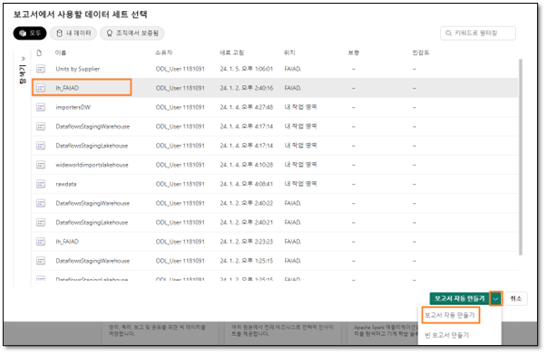

 
8. Power BI avvierà la creazione automatica del report. Notare che è presente un'opzione che ci consente di preselezionare i dati, se lo desideriamo. Quando il report è pronto, in alto a destra nella schermata viene visualizzata una finestra di dialogo. Selezionare **Visualizza report ora**.

    
 
**Checkpoint:** il report sarà simile a quello illustrato nello screenshot seguente. Sono presenti alcuni KPI e alcuni oggetti visivi sulle tendenze. Questo è buon inizio se si sta analizzando un nuovo modello ed è necessario un iniziare rapidamente.

**Nota:** nel menu in alto sono presenti opzioni per modificare il report o visualizzare i dati sotto forma di tabelle. Esplorare liberamente queste opzioni.

9. Quando si è pronti, **comprimere** tutte le tabelle nella sezione **Dati** sulla destra. Notare che sono presenti cinque nuove tabelle che non fanno parte del modello che abbiamo creato. Queste sono tabelle predefinite aggiunte per aiutare ad analizzare le prestazioni. A breve le rimuoveremo dalla visualizzazione del report.
10. Salviamo il report. Nel menu in alto selezionare **Salva**.
11. Si apre la finestra di dialogo Salva report. Assegnare al report il nome **rpt_Sales_Auto_Report**

**Nota:** all'inizio del nome del report aggiungiamo il prefisso rpt, ossia l'abbreviazione di report.

12. Assicurarsi che il report sia salvato in **<nome della propria area di lavoro>**.

13. Selezionare **Salva**.

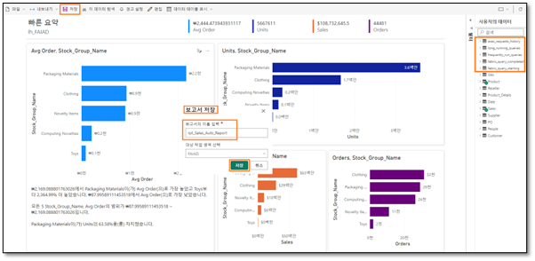
 
## Attività 2 - Nascondere le tabelle predefinite (metriche)
Creiamo un report come quello presente in Power BI Desktop. A tale fine, iniziamo da un canvas vuoto. Prima di iniziare a creare un report, rimuoviamo le tabelle predefinite (screenshot precedente) dalla visualizzazione del report. Eseguiamo questa operazione nella sezione di modellazione del lakehouse.

1. Nella parte inferiore del pannello di sinistra selezionare l'icona di **Power BI**. Si apre la finestra di dialogo di Fabric.
2. Selezionare **Data Engineering**. Si apre la home page di Data Engineering.

    
 
3. Scorrere verso il basso fino alla sezione **Accesso rapido**.
4. Selezionare **lh_FAIAD -> Endpoint di analisi SQL**. Ci troviamo nella vista Dati del lakehouse.
5. Nella **parte inferiore del pannello di sinistra** selezionare **Modello** per passare alla vista Modello.

Nel canvas di progettazione si troveranno le tabelle predefinite (può essere necessario scorrere a destra o verso il basso per visualizzarle).

 
6. Fare clic con il pulsante destro del mouse sulla tabella **long_running_queries** e selezionare **Nascondi in visualizzazione Report**.

    
 
7. Allo stesso modo, selezionare l'opzione **Nascondi in visualizzazione Report** per le tabelle seguenti:
    
    a.	fabric_query_starting
    
    b.	fabric_query_completed

    c.	exec_requests_history
    
    d.	frequently_run_queries

## Attività 3 - Configurazione dello sfondo per un nuovo report
1. Possiamo iniziare a creare un nuovo report dalla vista del modello. Nel menu in alto selezionare **Home -> Nuovo report**. Si aprirà il canvas del report di Power BI in nuova finestra o scheda del browser.

    
 
2. Se non lo si è ancora aperto, aprire il file **FAIAD.pbix** contenuto nella cartella **Report** sul **Desktop** dell'ambiente lab. 

Useremo questo report come riferimento. Inizieremo aggiungendo lo sfondo del canvas. Creeremo l'intestazione del report, aggiungeremo un paio di KPI e creeremo il grafico a linee Sales over time. Per risparmiare tempo, presupponendo che si abbia esperienza nella creazione di oggetti visivi in Power BI Desktop, non creeremo tutti gli oggetti visivi. 

 
3. Tornare al **Power BI canvas** nel browser.

4. Selezionare l'icona **Formatta pagina** nel riquadro Visualizzazioni.

5. Espandere la sezione **Sfondo canvas**.

6. Selezionare **Sfoglia** dall'opzione **Immagine**. Si apre la finestra di dialogo Esplora file.

7. Andare alla cartella  Report sul Desktop dell'ambiente lab. 

8. Selezionare **Summary Background.png**.

9. Impostare il menu a discesa **Adattamento immagine** su **Adatta**.

10. Impostare la trasparenza allo **0%**.

    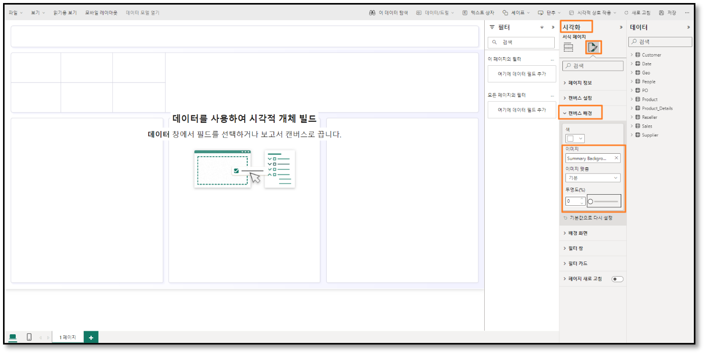
 
## Attività 4 - Aggiunta dell'intestazione al report
1. Aggiungiamo l'intestazione sul margine superiore. Nel **menu** selezionare Casella di testo.
2. Immettere **Fabrikam Company** come prima riga nella casella di testo.
3. Immettere **Report vendite** come seconda riga nella casella di testo.
4. Evidenziare **Fabrikam Company** e impostare **Tipo di carattere** su **Segoe UI** e **Dimensioni carattere** su **18, grassetto**.
5. Evidenziare **Report vendite** e impostare **Tipo di carattere** su **Segoe UI** e **Dimensioni carattere** su **14**.
6. Con la **casella di testo selezionata**, nel riquadro Formato sulla destra espandere **Effetti**.
7. Usare il dispositivo di scorrimento **Sfondo** su **Disattivato**.
8. Ridimensionare la **casella di testo per adattarla al margine superiore**.

    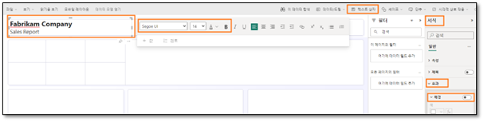
 

## Attività 5 - Aggiunta di KPI al report
1. Aggiungiamo l'indicatore KPI delle vendite. Selezionare lo **spazio vuoto** nel canvas per spostare lo stato attivo fuori dalla casella di testo.
2. Nella sezione **Visualizzazioni** selezionare l'oggetto visivo **Scheda con più righe**.
3. Nella sezione **Dati** espandere la tabella **Sales**.
4. Selezionare la **misura Sales**.

    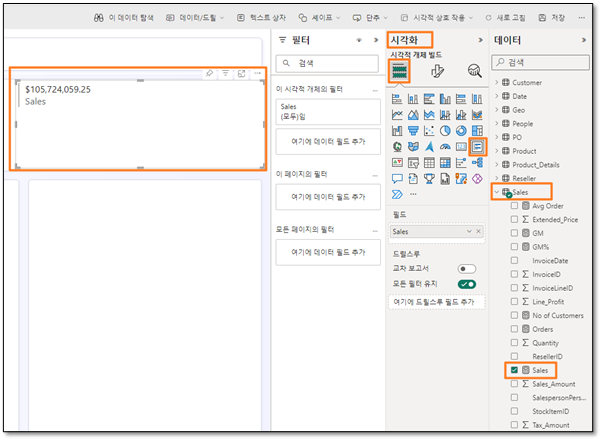
 
5. Con l'**oggetto visivo Scheda con più righe selezionato**, selezionare l'icona **Formatta oggetto visivo** dalla sezione Visualizzazioni.
6. Espandere la sezione **Etichette categoria**.
7. Aumentare la **dimensione del carattere** a **14**.
8. Selezionare il menu a discesa **Colore**. Si apre la finestra di dialogo Tavolozza dei colori.
9. Impostare il valore hex su **#004753**.

    
 
10. Espandere la sezione **Schede**.
11. Impostare il dispositivo di scorrimento **Barra evidenziatore** su **Disattivato**.

    
 
12. Selezionare **Generale** nel riquadro Visualizzazioni.
13. Espandere la sezione **Effetti**.
14. Usare il dispositivo di scorrimento **Sfondo** su **Disattivato**.
15. Ridimensionare l'**oggetto visivo** e spostarlo nella **casella di sinistra come illustrato nello screenshot**.

    
 
16. Aggiungiamo un altro indicatore KPI. Selezionare la **scheda con più righe Sales** appena creata. **Copiare** l'oggetto visivo premendo **CTRL+C** sulla tastiera.
17. **Incollare** l'oggetto visivo premendo **CTRL+V** sulla tastiera. Notare che l'oggetto visivo viene incollato nel canvas.
18. Con il **nuovo oggetto visivo evidenziato**, in **riquadro Visualizzazioni -> Compila oggetto visivo -> Campi** rimuovere la misura **Sales**.
19. Nella sezione **Dati** espandere la tabella **Sales** e selezionare la misura **Units**.
20. Ridimensionare l'**oggetto visivo e posizionarlo nella casella sotto all'oggetto visivo Sales**.

    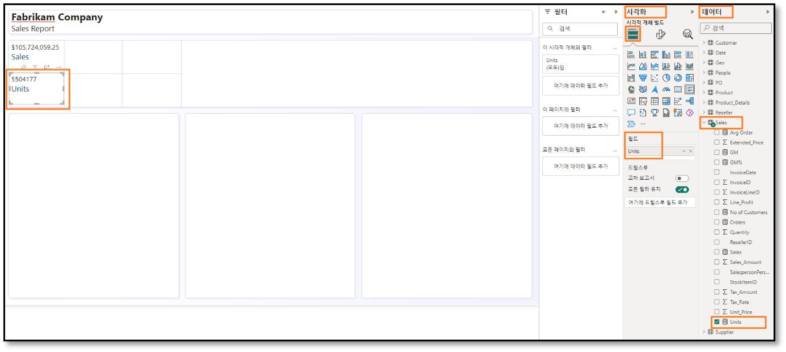
 

## Attività 6 - Aggiunta di un grafico a linee al report
Creiamo un grafico a linee per visualizzare le vendite nel tempo per azienda rivenditrice.

1. Selezionare lo **spazio vuoto** nel canvas per spostare lo stato attivo fuori dall'oggetto visivo scheda con più righe.
2. Nella sezione **Visualizzazioni** selezionare **Grafico a linee**.
3. Nella sezione **Dati** espandere la tabella **Date**.
4. Selezionare il campo **Year**. Notare che Year viene sommato per impostazione predefinita e aggiunto all'asse Y. Correggiamo questo aspetto.

    
  

## Attività 7 - Configurazione della colonna Year nella tabella Date
1. Passare alla scheda del browser con la **vista modello del lakehouse**.
2. Nel riquadro Explorer di sinistra espandere **lhFAIAD -> Schemi -> dbo -> Tables -> Date**.
3. Selezionare la colonna **Year**.
4. Nel riquadro **Proprietà** a destra espandere la sezione **Avanzate**.
5. Nel menu a discesa **Riepiloga per** selezionare **Nessuno**.

    
 
6. Tornare alla scheda del browser con il **canvas di Power BI**.
7. Nel menu in alto selezionare **Aggiorna**. Notare che Year non è un campo di somma. 
8. Con l'**oggetto visivo grafico a linee selezionato, rimuovere Somma di Year** dall'asse Y.
9. Selezionare il campo **Year** per aggiungerlo all'**asse X**.
10. Espandere la tabella **Sales** e selezionare la **misura Sales**.

    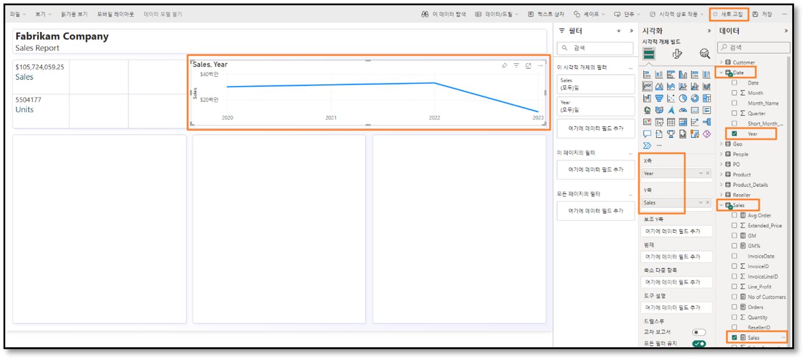
 

## Attività 8 - Configurazione della colonna Short_Month_Name nella tabella Date
1. Aggiungiamo il mese al grafico. Nella tabella Date trascinare il campo **Short_Month_Name** sotto **Year** sull'**asse X**. Notare che l'oggetto visivo è ordinato in base a Sales. Ordiniamolo in base a Short_Month_Name.
2. Selezionare i **puntini di sospensione (…)** nell'angolo superiore destro dell'oggetto visivo.
3. Selezionare **Ordina asse -> Year Short_Month_Name**.
4. Selezionare i **puntini di sospensione (…)** nell'angolo superiore destro dell'oggetto visivo.
5. Selezionare **Ordina asse -> Ordinamento crescente**.

    
 
**Nota:** i mesi sono ordinati in ordine alfabetico. Correggiamo questo aspetto.

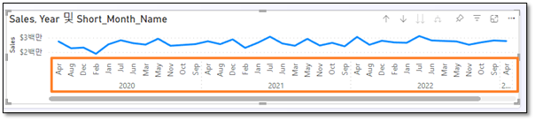
 
6. Passare alla scheda del browser con la **vista modello del lakehouse**.
7. Nel riquadro Explorer di sinistra espandere **lhFAIAD -> Schemi -> dbo -> Tables -> Date**.
8. Selezionare la colonna **Short_Month_Name**.
9. Nel riquadro **Proprietà** a destra espandere la sezione **Avanzate**.
10. Nel menu a discesa **Ordina per colonna** selezionare **Month**.

    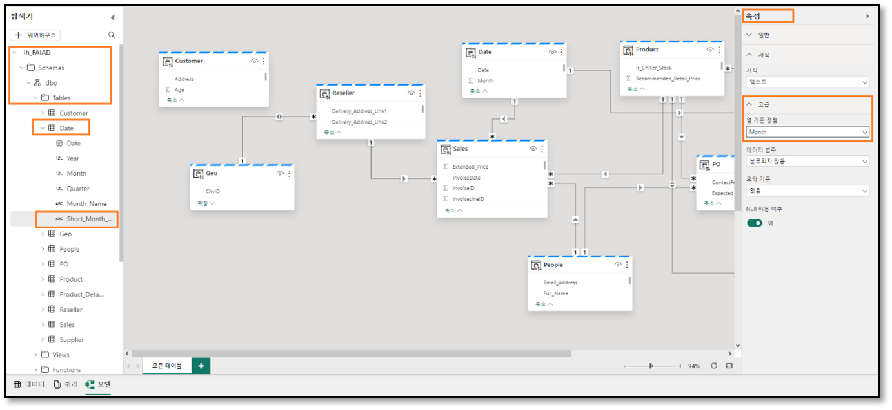
 
11. Tornare alla scheda del browser con il **canvas di Power BI**.
12. Nel menu in alto selezionare **Aggiorna**. Notare che i mesi vengono ordinati correttamente.

    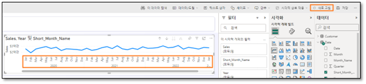
  

## Attività 9 - Formattazione del grafico a linee
È molto semplice aggiornare il modello semantico durante la creazione dei report. Ciò fornisce un'interazione fluida come Power BI Desktop.
1. Con l'**oggetto visivo grafico a linee selezionato**, nella sezione **Dati** espandere la tabella **Reseller**.
2. Trascinare il campo **Reseller -> Reseller Company** nella sezione **Legenda**.

    
 
3. Con l'**oggetto visivo grafico a linee selezionato**, nella sezione **Visualizzazioni** selezionare l'icona **Formatta oggetto visivo -> Generale**.
4. Espandere la sezione **Titolo**.
5. Impostare il testo di **Titolo** su **Sales over time**.
6. Espandere la sezione **Effetti**.
7. Usare il dispositivo di scorrimento **Sfondo** su **Disattivato**.

    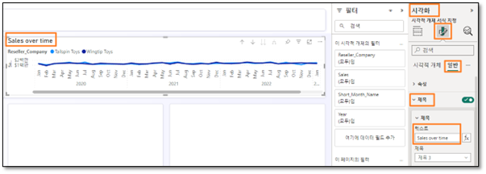
 
8. Nella sezione **Visualizzazioni** selezionare l'icona **Formatta oggetto visivo -> Oggetto visivo**.
9. Espandere la sezione **asse X**.
10. Impostare il dispositivo di scorrimento **Titolo** su **Disattivato**.
11. Espandere la sezione **Righe**.
12. Espandere la sezione **Colori**.
13. Impostare il colore di **Wingtip Toys** su **#004753**
14. Impostare il colore di **Tailspin Toys** su **#F17925**
15. Ridimensionare l'**oggetto visivo** e spostarlo nella **casella in alto a destra come illustrato nello screenshot**.
16. Scorrere verso destra l'oggetto visivo e **notare che sono presenti dati fino ad aprile 2023**.

    
 
17. Per salvare il report, nel menu selezionare **File -> Salva**.
18. Si apre la finestra di dialogo Salva report. Assegnare al report il nome **rpt_Sales_Report** 

**Nota:** all'inizio del nome del report aggiungiamo il prefisso rpt, ossia l'abbreviazione di report.

19. Assicurarsi che il report sia salvato in **<nome della propria area di lavoro>**.
20. Selezionare **Salva**.

    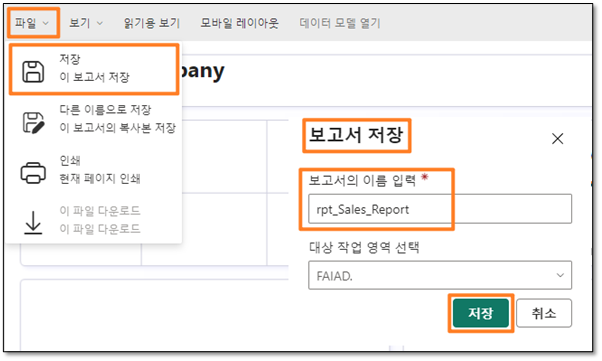
 
Come indicato in precedenza, non creeremo tutti gli oggetti visivi in questo lab. Se si desidera, aggiungere ulteriori oggetti visivi. 

## Attività 10 - Aggiunta di nuovi dati per simulare la modalità Direct Lake
In genere, in modalità Import, dopo aver aggiornato i dati nell'origine è necessario aggiornare il modello di Power BI dopodiché vengono aggiornati i dati nel report. Con la modalità Direct Query, quando i dati vengono aggiornati nell'origine sono disponibili nel report Power BI. Tuttavia, la modalità Direct Query è in genere lenta. Per risolvere questo problema, Microsoft Fabric ha introdotto la modalità Direct Lake. Direct Lake è un percorso rapido per caricare i dati dal lake al motore di Power BI per poter procedere immediatamente con l'analisi. Vediamolo.

In uno scenario reale, i dati vengono aggiornati nell'origine. Poiché ci troviamo in un ambiente di formazione, simuleremo questo comportamento collegando un file Parquet con dati relativi a maggio 2023. 

1. Passare alla scheda del browser con la **vista modello del lakehouse**.
2. Selezionare **<nome della propria area di lavoro>** dal pannello di sinistra.
3. Selezionare **df_Sales_ADFS** per poter modificare il flusso di dati aggiungendo il nuovo file Parquet.

    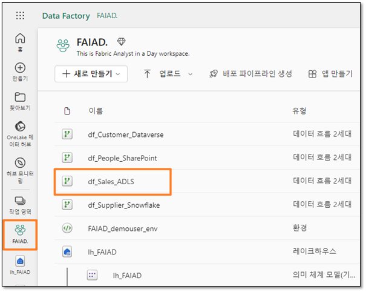
 
4. Se non lo si è ancora aperto, aprire il file **FAIAD.pbix** contenuto nella cartella **Report** sul **Desktop** dell'ambiente lab.

    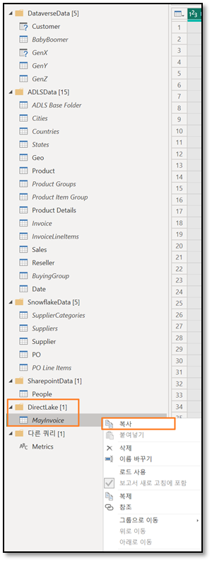

5. Nella barra multifunzione selezionare **Home -> Trasforma dati**. Si apre la finestra Power Query.
6. Dal pannello di sinistra, nella cartella **DirectLake** selezionare la query **MayInvoice**.
7. **Fare clic con il pulsante destro del mouse** e selezionare **Copia**.

    
 
8. Tornare alla schermata **Flusso di dati** nel browser.
9. Nel riquadro Flusso di dati premere **CTRL+V** (l'opzione Incolla del menu del pulsante destro non è attualmente supportata).

Ora rimuoviamo il riferimento a ADLS Base Folder (2) e usiamo ADLS Base Folder.

10. Selezionare la query **MayInvoice**.
11. Nel pannello di destra, in **Passaggi applicati**, selezionare **Source**.
12. Nella barra della formula modificare **#"ADLS Base Folder (2)"** in  **#"ADLS Base Folder"**.
13. Selezionare il **segno di spunta** accanto alla barra della formula o premere INVIO.

    
 
14. Nel pannello di sinistra, nella sezione Query, fare clic con il pulsante destro del mouse sulla **query ADLS Base Folder (2)** e selezionare **Elimina**.
15. Si apre la finestra di dialogo **Elimina** query. Selezionare Elimina per confermare.

    
 
16. Ora aggiungiamo i dati della fattura di maggio alla tabella Invoice. Selezionare la query **Invoice** dalla sezione Query.
17. Nella barra multifunzione selezionare **Home -> Accoda query**.
18. Si apre la finestra di dialogo Accoda. Nel menu a discesa **Tabella da accodare** selezionare MayInvoice.
19. Selezionare **OK**.

    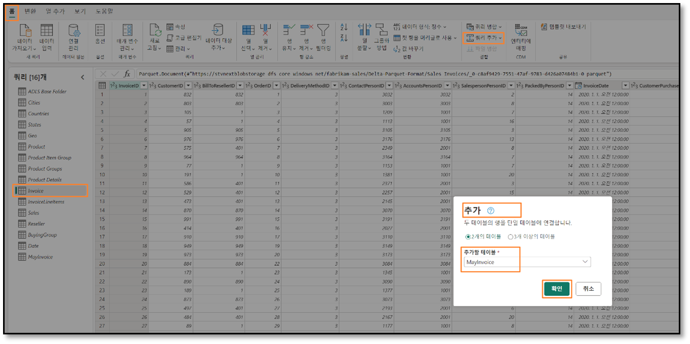
 
20. Selezionare **Pubblica** nell'angolo inferiore destro per salvare e pubblicare gli aggiornamenti.

    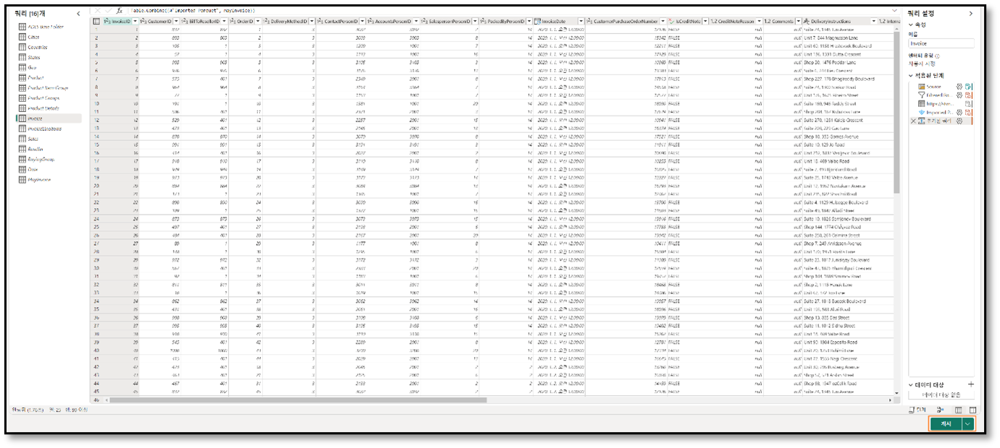
 
**Nota:** una volta pubblicato, il flusso di dati verrà aggiornato. Questa operazione potrebbe richiedere alcuni minuti.

21. Tornare alla scheda del browser con il **canvas di Power BI**.
22. Nel menu in alto selezionare **Aggiorna**. Notare che ora nel grafico a linee sono presenti dati per maggio 2023. Inoltre, notare che il valore in dollari delle vendite è aumentato.

    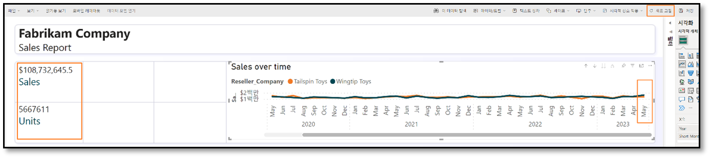
 
Man mano che ogni flusso di dati creato nei lab precedenti viene aggiornato secondo pianificazione, i dati vengono inseriti nel lakehouse. Il modello di dati nel lakehouse e i report vengono aggiornati. Non è necessario aggiornare il modello di dati e il report quando ciascun flusso di dati viene aggiornato. Questo è il vantaggio di Direct Lake.

Ricontrolliamo le problematiche elencate nell'esposizione del problema:

- **È necessario aggiornare il set di dati almeno tre volte al giorno per adattarsi ai diversi tempi di aggiornamento delle diverse origini dati**.

Abbiamo risolto questo problema usando Direct Lake. Ogni singolo flusso di dati viene aggiornato in base alla propria pianificazione. Non è necessario aggiornare il set di dati e il report.
- **Gli aggiornamenti richiedono molto tempo in quanto è necessario eseguire un aggiornamento completo ogni volta per acquisire eventuali aggiornamenti dei sistemi di origine**.

Abbiamo risolto anche questo problema usando Direct Lake. Ogni singolo flusso di dati viene aggiornato in base alla propria pianificazione. Non è necessario aggiornare il set di dati e il report, perciò non è richiesto un aggiornamento completo. 
- **Se si verificano errori in qualsiasi delle origini dati da cui si estraggono i dati, l'aggiornamento del set di dati si interrompe. Spesso il file dei dipendenti non viene caricato in tempo e ciò causa l'interruzione dell'aggiornamento del set di dati**.

Pipeline di dati aiuta a risolvere questo problema, consentendo di provare più volte a eseguire l'aggiornamento a intervalli diversi.
- **Eventuali modifiche al modello di dati richiedono molto tempo in quanto Power Query richiede molto tempo per l'aggiornamento delle anteprime, date le dimensioni elevate dei dati e le trasformazioni complesse**.

Abbiamo notato che i flussi di dati sono efficienti e facili da modificare. In genere, il caricamento dell'anteprima nei flussi di dati non richiede molto tempo.
- **È necessario un PC Windows per usare Power BI Desktop anche se lo standard aziendale è Mac**.

Microsoft Fabric è un'offerta SaaS. Tutto ciò di cui abbiamo bisogno è un browser per accedere al servizio. Non dobbiamo installare alcun software nei nostri desktop.

# Pulizia dell'ambiente lab
Quando si è pronti a eseguire la pulizia dell'ambiente lab, effettuare i passaggi seguenti.
1. Tornare alla scheda del browser con il **canvas di Power BI. Chiudere questa scheda**.
2. Passare alla scheda con la **vista modello del lakehouse**.
3. Selezionare **<nome della propria area di lavoro>** dal pannello di sinistra per andare alla home page.

    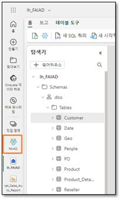
 
4. Nel menu in alto selezionare i **puntini di sospensione (…)** accanto a Gestisci accesso e selezionare **Impostazioni area di lavoro**.

    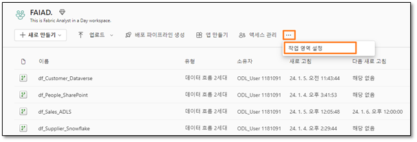
 
5. Si apre la finestra di dialogo Impostazioni area di lavoro. Nel menu a sinistra selezionare **Altro**.
6. Selezionare **Rimuovere questa area di lavoro**.
7. Si apre la finestra di dialogo Elimina area di lavoro. Selezionare **Elimina**.

In questo modo si elimineranno l'area di lavoro e tutti gli elementi che contiene.

 

# Riferimenti
Fabric Analyst in a Day (FAIAD) presenta alcune delle funzionalità chiave disponibili in Microsoft Fabric. Nel menu di servizio, la sezione Guida (?) include collegamenti ad alcune risorse utili.

 
Di seguito sono riportate ulteriori risorse utili che consentiranno di progredire nell'uso di Microsoft Fabric.

- Vedere il post di blog per leggere l'[annuncio completo sulla disponibilità generale di Microsoft Fabric](https://aka.ms/Fabric-Hero-Blog-Ignite23)
- Esplorare Fabric attraverso la [Presentazione guidata](https://aka.ms/Fabric-GuidedTour)
- Iscriversi alla versione di [valutazione gratuita di Microsoft Fabric](https://aka.ms/try-fabric)
- Visitare il [sito Web di Microsoft Fabric](https://aka.ms/microsoft-fabric)
- Acquisire nuove competenze esplorando i [moduli di apprendimento su Fabric](https://aka.ms/learn-fabric)
- Consultare la [documentazione tecnica di Fabric](https://aka.ms/fabric-docs)
- Leggere l'[e-book gratuito introduttivo a Fabric](https://aka.ms/fabric-get-started-ebook)
- Unirsi alla [community di Fabric](https://aka.ms/fabric-community) per pubblicare domande, condividere feedback e imparare dagli altri

Leggere i blog di annunci più approfonditi sull'esperienza in Fabric:

- [Blog sull'esperienza Data Factory in Fabric](https://aka.ms/Fabric-Data-Factory-Blog) 
- [Blog sull'esperienza Synapse Data Engineering in Fabric](https://aka.ms/Fabric-DE-Blog) 
- [Blog sull'esperienza Synapse Data Science in Fabric](https://aka.ms/Fabric-DS-Blog) 
- [Blog sull'esperienza Synapse Data Warehousing in Fabric](https://aka.ms/Fabric-DW-Blog) 
- [Blog sull'esperienza Synapse Real-Time Analytics in Fabric](https://aka.ms/Fabric-RTA-Blog)
- [Blog di annunci di Power BI](https://aka.ms/Fabric-PBI-Blog)
- [Blog sull'esperienza Data Activator in Fabric ](https://aka.ms/Fabric-DA-Blog)
- [Blog su amministrazione e governance in Fabric](https://aka.ms/Fabric-Admin-Gov-Blog)
- [Blog su OneLake in Fabric](https://aka.ms/Fabric-OneLake-Blog)
- [Blog sull'integrazione di Dataverse e Microsoft Fabric](https://aka.ms/Dataverse-Fabric-Blog)

© 2023 Microsoft Corporation. Tutti i diritti sono riservati.

L'uso della demo/del lab implica l'accettazione delle seguenti condizioni:

La tecnologia/le funzionalità descritte nella demo/nel lab sono fornite da Microsoft Corporation allo scopo di ottenere feedback dall'utente e offrire un'esperienza di apprendimento. L'utilizzo della demo/del lab è consentito solo per la valutazione delle caratteristiche e delle funzionalità di tale tecnologia e per l'invio di feedback a Microsoft. L'utilizzo per qualsiasi altro scopo non è consentito. È vietato modificare, copiare, distribuire, trasmettere, visualizzare, eseguire, riprodurre, pubblicare, concedere in licenza, usare per la creazione di lavori derivati, trasferire o vendere questa demo/questo lab o parte di essi.

SONO ESPLICITAMENTE PROIBITE LA COPIA E LA RIPRODUZIONE DELLA DEMO/DEL LAB (O DI QUALSIASI PARTE DI ESSI) IN QUALSIASI ALTRO SERVER O IN QUALSIASI ALTRA POSIZIONE PER ULTERIORE RIPRODUZIONE O RIDISTRIBUZIONE.

QUESTA DEMO/QUESTO LAB RENDONO DISPONIBILI TECNOLOGIE SOFTWARE/FUNZIONALITÀ DI PRODOTTO SPECIFICHE, INCLUSI NUOVI CONCETTI E NUOVE FUNZIONALITÀ POTENZIALI, IN UN AMBIENTE SIMULATO, CON UN'INSTALLAZIONE E UNA CONFIGURAZIONE PRIVE DI COMPLESSITÀ, PER GLI SCOPI DESCRITTI IN PRECEDENZA. LA TECNOLOGIA/I CONCETTI RAPPRESENTATI IN QUESTA DEMO/IN QUESTO LAB POTREBBERO NON CONTENERE LE FUNZIONALITÀ COMPLETE E IL LORO FUNZIONAMENTO POTREBBE NON ESSERE LO STESSO DELLA VERSIONE FINALE. È ANCHE POSSIBILE CHE UNA VERSIONE FINALE DI TALI FUNZIONALITÀ O CONCETTI NON VENGA RILASCIATA. L'ESPERIENZA D'USO DI TALI CARATTERISTICHE E FUNZIONALITÀ PUÒ INOLTRE RISULTARE DIVERSA IN UN AMBIENTE FISICO.

**FEEDBACK.** L'invio a Microsoft di feedback sulle caratteristiche, sulle funzionalità e/o sui concetti della tecnologia descritti in questa demo/questo lab implica la concessione a Microsoft, a titolo gratuito, del diritto di utilizzare, condividere e commercializzare tale feedback in qualsiasi modo e per qualsiasi scopo. Implica anche la concessione a titolo gratuito a terze parti del diritto di utilizzo di eventuali brevetti necessari per i loro prodotti, le loro tecnologie e i loro servizi al fine di utilizzare o interfacciarsi ai componenti software o ai servizi Microsoft specifici che includono il feedback. L'utente si impegna a non inviare feedback la cui inclusione all'interno di software o documentazione Microsoft imponga a Microsoft di concedere in licenza a terze parti tale software o documentazione. Questi diritti sussisteranno anche dopo la scadenza del presente contratto.

CON LA PRESENTE MICROSOFT CORPORATION NON RICONOSCE ALCUNA GARANZIA O CONDIZIONE RELATIVAMENTE ALLA DEMO/AL LAB, INCLUSE TUTTE LE GARANZIE E CONDIZIONI DI COMMERCIABILITÀ, DI FATTO ESPRESSE, IMPLICITE O PRESCRITTE DALLA LEGGE, ADEGUATEZZA PER UNO SCOPO SPECIFICO, TITOLARITÀ E NON VIOLABILITÀ. MICROSOFT NON OFFRE GARANZIE O RAPPRESENTAZIONI IN RELAZIONE ALL'ACCURATEZZA DEI RISULTATI E DELL'OUTPUT DERIVANTI DALL'USO DELLA DEMO/DEL LAB O ALL'ADEGUATEZZA DELLE INFORMAZIONI CONTENUTE NELLA DEMO/NEL LAB PER QUALSIASI SCOPO.

**CLAUSOLA DI RESPONSABILITÀ**

Questa demo/questo lab contiene solo una parte delle nuove funzionalità e dei miglioramenti in Microsoft Power BI. Alcune funzionalità potrebbero cambiare nelle versioni future del prodotto. In questa demo/in questo lab si apprendono alcune delle nuove funzionalità, ma non tutte.
